# vLLM Chat Agent 架构

> 最后同步：2026-08-01
>
> 架构源码：`web/src/`
>
> 使用说明：[`README_chat.md`](./README_chat.md)
>
> Memory 专题：[`MEMORY_ARCHITECTURE.md`](./MEMORY_ARCHITECTURE.md)

## 1. 系统定位

本项目是一个浏览器端 vLLM Chat / Agent 应用：

- 通过 OpenAI 兼容 API 直连 vLLM；
- 普通模式支持文字、图片和 SSE 流式输出；
- Agent 模式使用文本协议实现 ReAct 工具循环；
- Memory 按 session 隔离，Skills 和用户配置保存在浏览器本地；
- 本地语义模型通过 Web Worker + ONNX/WASM 运行；
- 不依赖业务后端、云端数据库或独立向量数据库。

## 2. 部署拓扑

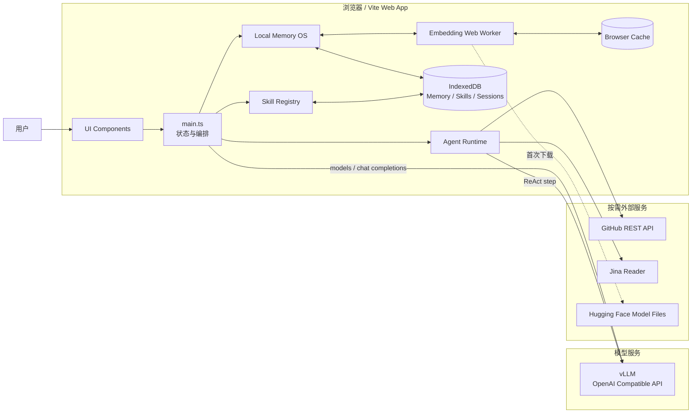

运行时边界：

| 边界 | 责任 |
|---|---|
| 浏览器 | UI、状态、Agent、Memory、Skills、工具编排 |
| vLLM | 模型列表、普通对话、Agent step、后台 Memory 抽取 |
| IndexedDB | Memory 与自定义/覆盖 Skill 的持久化 |
| Web Worker | 本地 multilingual-e5 embedding |
| 外部服务 | GitHub 查询和通用网页搜索，按工具调用触发 |

## 3. 代码分层

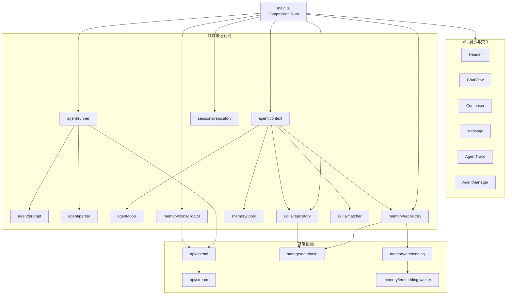

依赖规则：

1. `ui/*` 不直接调用 vLLM、IndexedDB 或工具实现。
2. `agent/runner.ts` 不操作 DOM，只通过 `AgentEvent` 输出状态。
3. `memory/*` 与 `skills/*` 不依赖 UI。
4. `api/*` 只处理 OpenAI 兼容协议和 SSE。
5. `main.ts` 是唯一 Composition Root，负责装配和可变应用状态。
6. Tool 权限必须由本次激活 Skills 生成的注册表控制，不能只依赖 prompt。

## 4. 应用状态

`main.ts` 持有页面生命周期内的唯一应用状态：

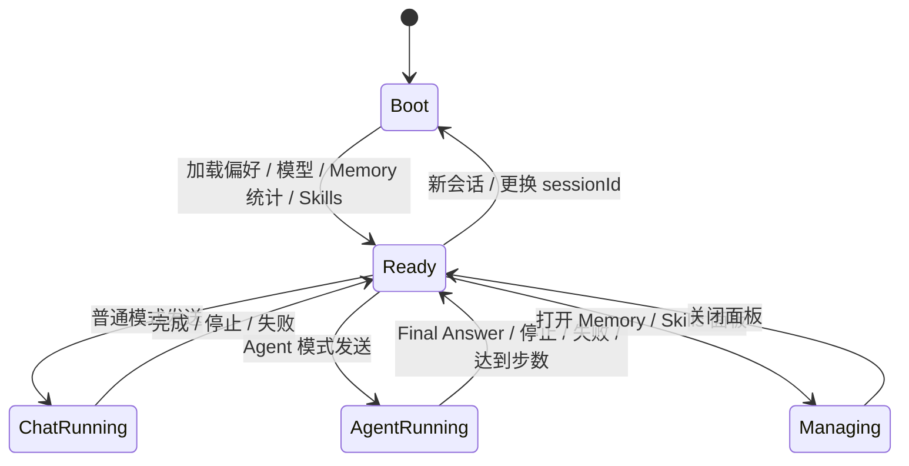

`AppState` 主要字段：

| 字段 | 含义 | 持久化 |
|---|---|---|
| `baseUrl` | OpenAI 兼容服务地址 | localStorage |
| `currentModel` | 当前模型 | localStorage |
| `agentMode` | 普通/Agent 模式 | localStorage |
| `sessionId` | 当前会话及 Memory namespace | localStorage |
| `sessions` | 历史会话列表 | IndexedDB 派生 |
| `history` | 当前会话对话历史 | IndexedDB `sessions` |
| `attachments` | 待发送图片 Data URL | 内存 |
| `memoryCount` | 当前有效 Memory 数量 | IndexedDB 派生 |
| `skillCount` | 当前启用 Skill 数量 | 内置清单 + IndexedDB 派生 |
| `running` | 是否正在生成 | 内存 |
| `status` | 连接与运行状态 | 内存 |

## 5. 普通聊天链路

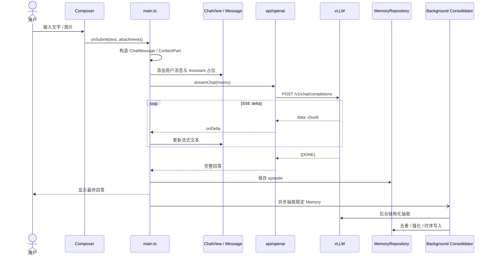

普通模式特点：

- 图片只在普通模式发送；
- `<think>` 与最终回答分区渲染；
- 用户点击停止时通过 `AbortController` 中断；
- 后台巩固不阻塞最终答案展示。

## 6. Agent Context 组装

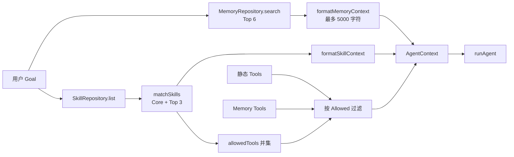

`prepareAgentContext()` 并行执行 Memory 检索与 Skill 加载，然后生成：

- `memories`：召回结果及相关性分数；
- `skills`：本次激活的 Skill；
- `tools`：本次唯一可执行的工具注册表；
- `memoryPrompt`：格式化后的长期记忆；
- `skillPrompt`：Skill 指令、触发词和工具权限。

## 7. ReAct Agent 循环

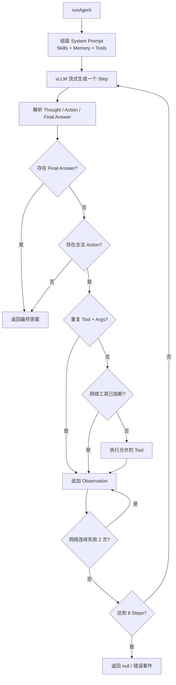

Runner 的硬约束：

- 每个 step 只执行一个 Action；
- 相同 `tool + normalized args` 不重复执行；
- 未被 Skill 允许的工具不可执行；
- 网络工具连续失败 2 次后熔断；
- 最多运行 8 个 step；
- 所有 UI 更新通过判别联合 `AgentEvent` 推送。

## 8. 工具体系

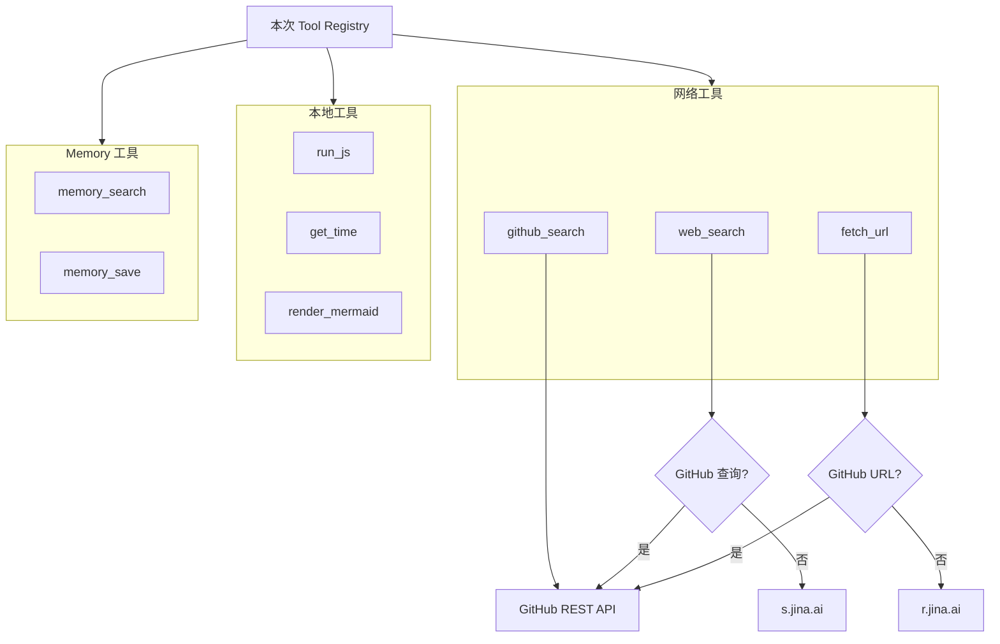

| 工具 | 执行位置 | 说明 |
|---|---|---|
| `web_search` | 浏览器网络请求 | GitHub 查询自动路由 GitHub API，否则使用 Jina |
| `github_search` | 浏览器网络请求 | 仓库、tag、release、更新时间 |
| `fetch_url` | 浏览器网络请求 | GitHub URL 自动转 API，否则使用 Jina Reader |
| `run_js` | 浏览器主线程 | `new Function`，无 DOM/网络注入 |
| `get_time` | 浏览器主线程 | 当前时间与时区 |
| `render_mermaid` | 浏览器动态 import | Mermaid SVG |
| `memory_search` | IndexedDB + 本地 embedding | 主动检索长期 Memory |
| `memory_save` | IndexedDB | 保存偏好或事实 |

## 9. Memory 读取链路

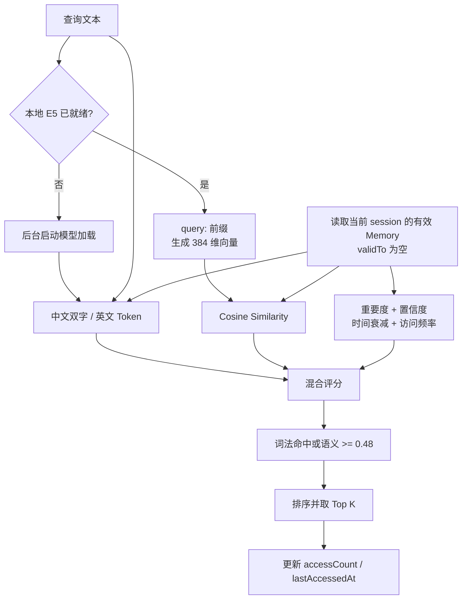

评分规则：

```text
semantic ready:
score = semantic * 0.58 + lexical * 0.27 + support * 0.15

fallback:
score = lexical * 0.78 + support * 0.22
```

## 10. Memory 写入与时序更新

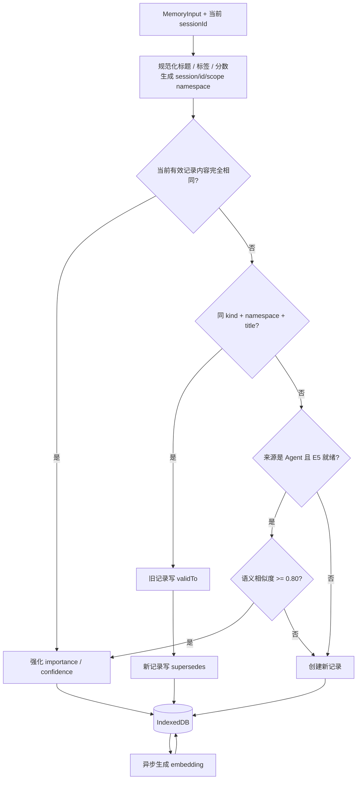

### 后台 Memory 巩固

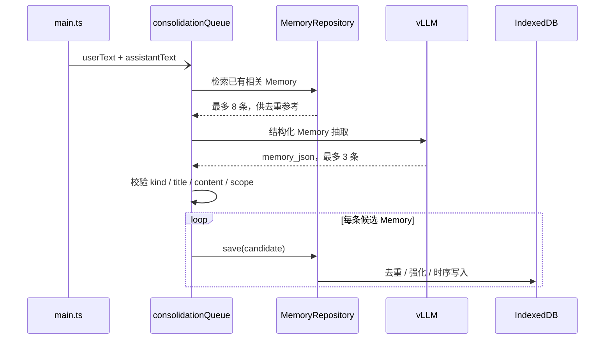

后台抽取拒绝保存：

- 公开网页或工具返回的通用事实；
- 问候、一次性问题、临时计算；
- 密码、token、私钥和其他凭据；
- 已被现有 Memory 更准确表达的重复内容。

## 11. 本地 Embedding

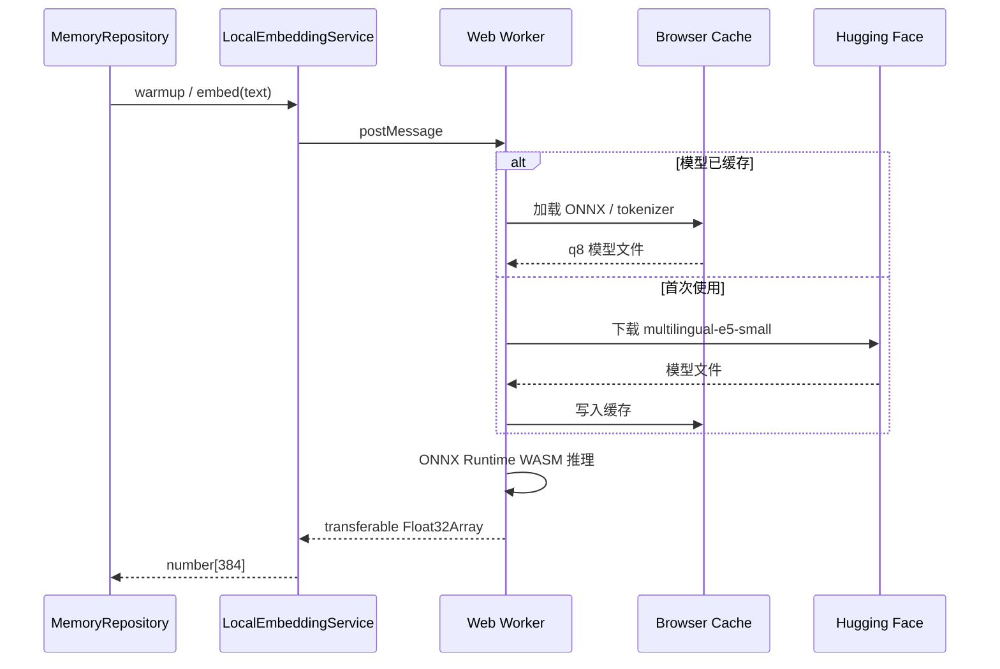

设计目的：

- embedding 推理不阻塞 UI；
- 首次下载后可复用浏览器缓存；
- 模型失败时 Memory 自动退化为词法检索；
- embedding 模型版本保存在每条记录中，支持重建索引。

## 12. Skills 架构

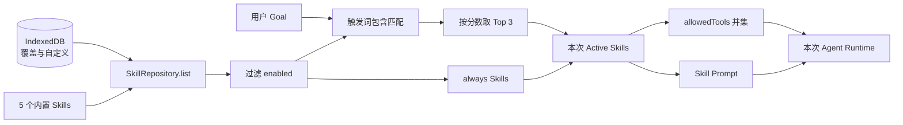

内置 Skills：

| Skill | 激活方式 | 主要工具 |
|---|---|---|
| Core Agent | 始终激活 | `get_time`、`run_js`、Memory 工具 |
| GitHub Research | GitHub/release/tag 等触发词 | `github_search`、`fetch_url` |
| Web Research | 搜索/网页/latest 等触发词 | `web_search`、`fetch_url` |
| Data Analysis | 计算/统计/分析等触发词 | `run_js` |
| Diagramming | 图/流程/架构/Mermaid 等触发词 | `render_mermaid` |

Skill Manifest：

```ts
type SkillManifest = {
  id: string;
  name: string;
  description: string;
  version: string;
  triggers: string[];
  prompt: string;
  allowedTools: string[];
  enabled: boolean;
  builtin: boolean;
  always?: boolean;
  createdAt: string;
  updatedAt: string;
};
```

## 13. 本地数据模型

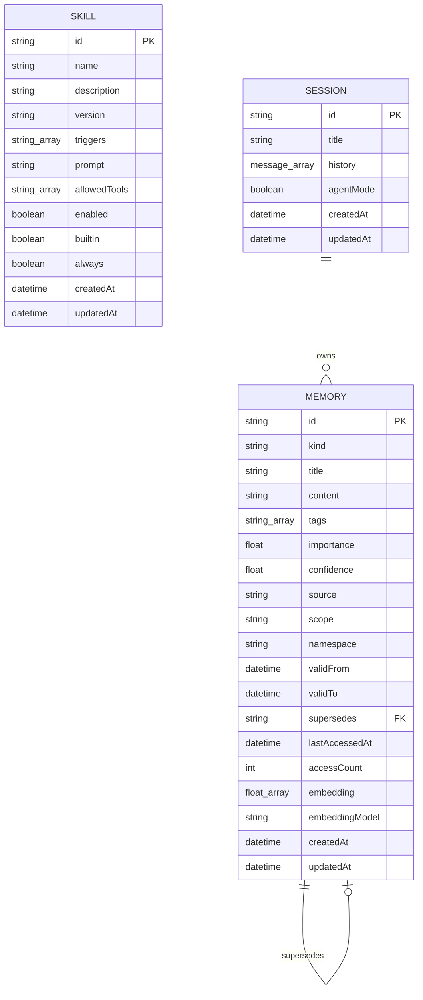

IndexedDB：

| 配置 | 值 |
|---|---|
| 数据库 | `vllm-agent` |
| 当前版本 | `3` |
| Object Store | `memories`、`skills`、`sessions` |
| Memory 索引 | `kind`、`updatedAt`、`namespace`、`validTo` |
| Skill 索引 | `enabled`、`updatedAt` |
| Session 索引 | `updatedAt` |

注意：IndexedDB 按 origin 隔离。`127.0.0.1:8899` 和 `127.0.0.1:8900` 拥有不同的数据。

同一 origin 内，Memory 进一步按 `session/{sessionId}/{scope}` 隔离：

- localStorage 保存当前 `sessionId`，刷新不创建新会话；
- “新会话”生成新 UUID；页头下拉框可切换历史会话；
- Session store 保存标题、聊天历史、Agent 模式和更新时间；
- 切换时恢复聊天内容和对应的 Memory namespace；
- Memory 的读取、写入、检索、去重、统计和清空只作用于当前 session；
- 后台 consolidation 捕获发起时的 session，避免异步跨会话写入；
- Skills 是全局能力配置，不按 session 复制。

## 14. UI 组件关系

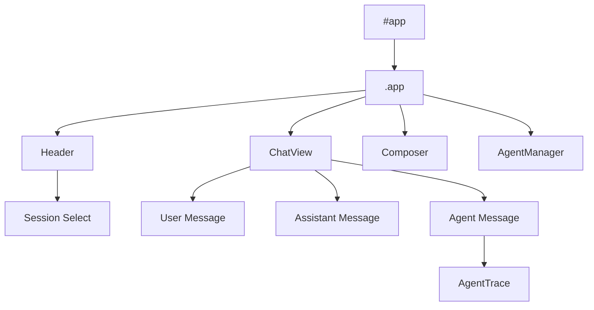

组件约定：

- 组件使用 `create*()` 工厂函数创建；
- 返回 `{ el, update, ...actions }`；
- 组件通过 callback 向 `main.ts` 上报用户事件；
- `main.ts` 修改状态后调用 `render()` 单向刷新；
- AgentTrace 只消费 `AgentEvent`，不访问 Runner 内部状态。

## 15. 构建与运行

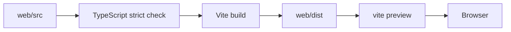

命令：

```bash
cd web
npm install
npm run dev
npm run build
npm run preview
```

生产构建输出包含：

- 主应用 JS/CSS；
- 独立 embedding Worker；
- ONNX Runtime WASM；
- Mermaid 按图类型拆分的懒加载 chunks；
- source map。

`web/dist/` 是生成目录，不应手工编辑。所有修改必须落在 `web/src/`。

## 16. 失败处理

| 场景 | 行为 |
|---|---|
| vLLM 不可达 | Header 显示连接失败 |
| SSE 异常 | 当前消息显示错误，恢复可发送状态 |
| 用户停止 | `AbortController.abort()` |
| Jina 超时 | 返回工具 Error；连续网络失败触发熔断 |
| GitHub Release 不存在 | 回退到稳定 tag |
| Tool JSON 非法 | Observation 返回解析错误 |
| 重复 Tool 调用 | Runner 阻止执行 |
| 未授权 Tool | Runner 返回 not permitted |
| embedding 未就绪 | 启动后台加载，当前查询走词法检索 |
| embedding 加载失败 | 保留词法检索能力 |
| Memory 后台抽取失败 | 记录 warning，不影响前台回答 |
| 新会话时旧巩固仍在队列 | 使用捕获的旧 session namespace 写入 |
| IndexedDB 升级被阻塞 | 抛出明确错误 |

## 17. 扩展点

### 新增 Tool

1. 在 `web/src/agent/tools.ts` 添加 `ToolDefinition`；
2. 在适用 Skill 的 `allowedTools` 中授权；
3. 如属于网络工具，加入 Runner 的网络熔断集合；
4. 更新本文“工具体系”。

### 新增 Skill

1. 内置 Skill：修改 `web/src/skills/builtins.ts`；
2. 自定义 Skill：通过 UI 创建并写入 IndexedDB；
3. 保持 trigger、prompt、allowedTools 三者语义一致；
4. 更新本文“Skills 架构”。

### 替换 Memory 后端

保持 `MemoryRepository` 的公开接口：

- `list`
- `save`
- `update`
- `remove`
- `clear`
- `search`
- `stats`
- `rebuildEmbeddings`

即可将 IndexedDB 替换为 SQLite、Postgres、Qdrant 或远端 Memory 服务。

### 引入图记忆

当出现多实体、多跳或时间点查询需求时，可在 `prepareAgentContext()` 前增加 Graphiti/Neo4j 适配层，并将图检索结果合并到 `MemoryMatch[]`。当前版本不包含实体图。

## 18. 架构同步清单

发生以下变化时必须同步更新本文：

- 新增或删除 `web/src` 一级模块；
- 改变普通聊天或 Agent 主链路；
- 修改 `AgentEvent`、`MemoryRecord`、`SkillManifest`；
- 新增 Tool 或内置 Skill；
- 修改 Memory 评分、去重或时序规则；
- 修改 IndexedDB schema/version；
- 引入新的外部服务或运行进程；
- 修改构建方式或部署端口。

架构文档以源码为准；`web/dist/` 和 source map 不作为架构来源。
