# vLLM Chat Agent 架构

> 最后同步：2026-08-31
>
> 架构源码：`web/src/`
>
> 使用说明：[`README_chat.md`](./README_chat.md)
>
> Memory 专题：[`MEMORY_ARCHITECTURE.md`](./MEMORY_ARCHITECTURE.md)

## 1. 系统定位

本项目是一个浏览器端 vLLM Chat / Agent 应用：

- 通过 OpenAI 兼容 API 直连 vLLM；
- 普通模式支持文字、图片和 SSE 流式输出；
- Agent 模式使用文本协议实现 ReAct 工具循环；
- Dynamic Flow 可由 Planner 生成受控任务 DAG，并行调度多个 Agent 后统一汇总；
- Memory 按 session 隔离，Skills 和用户配置保存在浏览器本地；
- 可选的本地 RAG 知识库支持自动分块、索引、检索和引用；
- 本地语义模型通过 Web Worker + ONNX/WASM 运行；
- 不依赖业务后端、云端数据库或独立向量数据库。

## 2. 部署拓扑

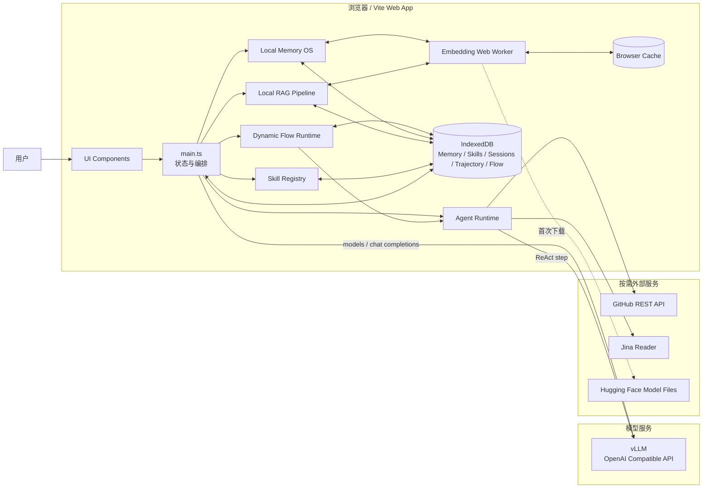

运行时边界：

| 边界 | 责任 |
|---|---|
| 浏览器 | UI、状态、Agent、Memory、RAG、Skills、工具编排 |
| vLLM | 模型列表、普通对话、Agent step、后台 Memory 抽取 |
| IndexedDB | Memory、RAG 文档/chunk、会话、Skill、Trajectory 与 Dynamic Flow 运行状态的持久化 |
| Web Worker | 本地 multilingual-e5 embedding |
| 外部服务 | GitHub 查询和通用网页搜索，按工具调用触发 |

## 3. 代码分层

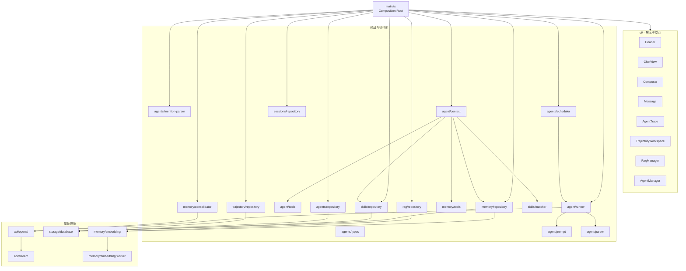

依赖规则：

1. `ui/*` 不直接调用 vLLM、IndexedDB 或工具实现。
2. `agent/runner.ts` 不操作 DOM，只通过 `AgentEvent` 输出状态。
3. `memory/*` 与 `skills/*` 不依赖 UI。
4. `api/*` 只处理 OpenAI 兼容协议和 SSE。
5. `main.ts` 是唯一 Composition Root，负责装配和可变应用状态。
6. Tool 权限必须由本次激活 Skills 生成的注册表控制，不能只依赖 prompt。

`agents/mention-parser.ts` 和 `agents/scheduler.ts` 是无 UI、无存储依赖的基础层；`agents/repository.ts` 负责 Agent Profile 的 IndexedDB 持久化。

## 4. 应用状态

`main.ts` 持有页面生命周期内的唯一应用状态：

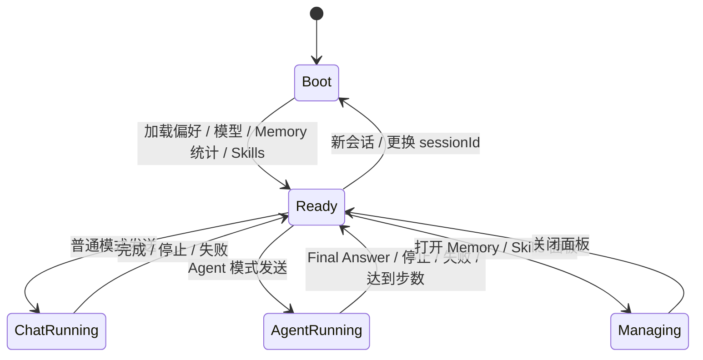

`AppState` 主要字段：

| 字段 | 含义 | 持久化 |
|---|---|---|
| `baseUrl` | OpenAI 兼容服务地址 | localStorage |
| `currentModel` | 当前模型 | localStorage |
| `agentMode` | 普通/Agent 模式 | localStorage |
| `flowEnabled` | 是否由 Planner 生成并执行动态 DAG | localStorage |
| `ragEnabled` | 是否自动检索并注入 RAG 知识库 | localStorage |
| `sessionId` | 当前会话及 Memory namespace | localStorage |
| `sessions` | 历史会话列表 | IndexedDB 派生 |
| `history` | 当前会话对话历史 | IndexedDB `sessions` |
| `attachments` | 待发送图片 Data URL | 内存 |
| `memoryCount` | 当前有效 Memory 数量 | IndexedDB 派生 |
| `ragCount` | 全局 RAG 文档数量 | IndexedDB 派生 |
| `skillCount` | 当前启用 Skill 数量 | 内置清单 + IndexedDB 派生 |
| `running` | 是否正在生成 | 内存 |
| `status` | 连接与运行状态 | 内存 |

## 5. 普通聊天链路

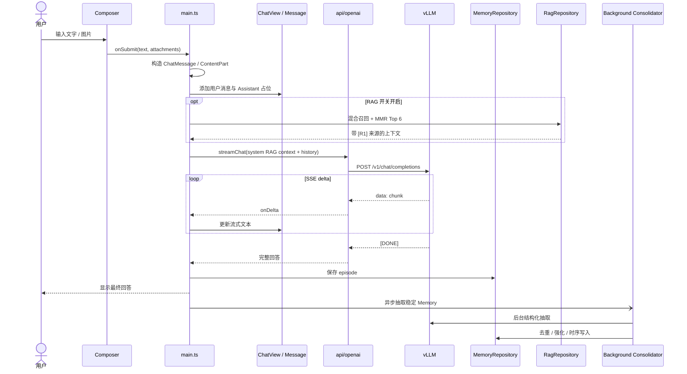

普通模式特点：

- 图片只在普通模式发送；
- `<think>` 与最终回答分区渲染；完整回答使用 `marked` 解析 GFM，并经
  `DOMPurify` 消毒后写入 DOM，流式阶段保持纯文本；
- 用户点击停止时通过 `AbortController` 中断；
- 后台巩固不阻塞最终答案展示。

## 6. Agent Context 组装

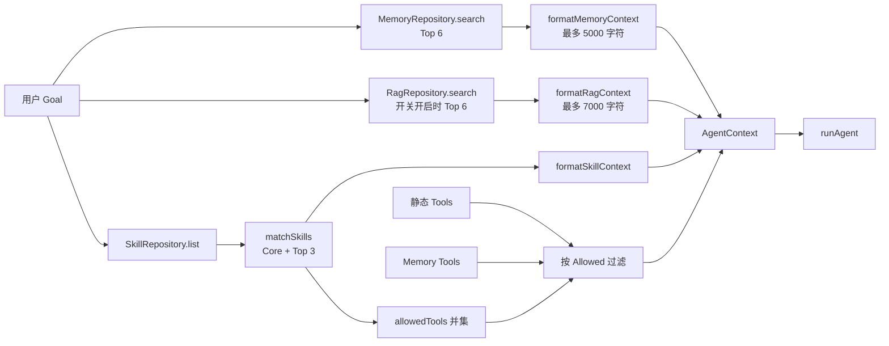

`prepareAgentContext()` 并行执行 Memory 检索与 Skill 加载，然后生成：

- `memories`：召回结果及相关性分数；
- `ragMatches`：开关开启时召回的知识库 chunk；
- `skills`：本次激活的 Skill；
- `tools`：本次唯一可执行的工具注册表；
- `memoryPrompt`：格式化后的长期记忆；
- `ragPrompt`：带 `[R1]` 来源标签的知识库上下文；
- `skillPrompt`：Skill 指令、触发词和工具权限。

### 多 Agent 基础模块

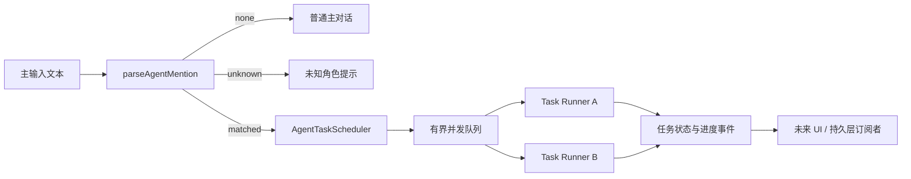

当前已实现：

- `agents/types.ts`：`AgentProfile`、`AgentTask`、进度和 Scheduler 事件契约；
- `agents/builtins.ts`：研究员、代码员、评审员和极简 Agent 四个内置角色；
- `agents/repository.ts`：内置覆盖、自定义角色、启停、删除和 IndexedDB 持久化；
- `agents/mention-parser.ts`：只解析消息开头的路由 mention，支持角色名称、显示名、别名、`@/＠` 和 `:/：`；
- `agents/scheduler.ts`：默认并发上限 3，每任务独立 `AbortController`，支持排队、进度、订阅、取消、清理和等待空闲；
- Scheduler 通过 `AgentTaskRunner` 注入执行器，不直接依赖 ReAct runner。

Agent Profile 管理 UI 已接入页头 `Agents` 入口；Composer 输入 `@` 时使用 `suggestAgentProfiles()` 展示和过滤角色候选。发送 `@角色 任务` 后，`parseAgentMention()` 将任务提交给 Scheduler，Scheduler 注入独立 `runAgent()` 并由 TaskWorkspace 展示进度。
`@minimal` 只允许 `get_time` 与 `run_js`，用于对照测试模型在最小工具面下的表现。

运行约束：

- Scheduler 默认最多并行 3 个任务，超出后排队；
- 每个任务有独立 `AbortController`、角色 Prompt、最大步数和工具白名单；
- TaskWorkspace 每秒刷新运行耗时，并将模型流式 token 节流为可见心跳；连续 15 秒无事件时标记“无新输出”；
- 任务捕获提交时的 `sessionId`，Memory 不随主会话切换而串写；
- 成功结果幂等发布到任务所属会话的主聊天历史；若用户已切换会话，则通过 SessionRepository 原子追加到原会话；
- 子 Agent 不修改主聊天 `running` 状态，Composer 可继续提交其他任务；
- Scheduler 的队列与任务状态只保存在页面内存中，刷新后不恢复；执行过程会作为
  append-only Trajectory 持久化，可在刷新后查看和回放。

### Dynamic Flow

Dynamic Flow 采用 LangGraph/AutoGen GraphFlow 中的显式状态图和确定性执行模式：

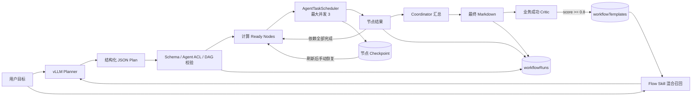

约束与语义：

- Planner 生成 `summary/description/triggerExamples/nodes[]`，使用 vLLM JSON Object 结构化输出；格式或 Schema
  校验失败时最多修复一次；
- 每个节点固定
  `id/title/goal/agentId/requiredSkillIds/requiredTools/dependsOn`；Agent 必须来自启用的
  Profile，且显式声明的 Skill/Tool 能力必须满足；
- 最多 8 个节点、依赖深度最多 4，拒绝未知依赖、自依赖和循环依赖；
- 规划前使用 E5 语义分、词法分、质量分和历史成功次数混合召回 Flow Skill，Top 20
  候选经过 MMR 后最多向 Planner 注入 3 个模板；
- 模板只作为规划示例，Planner 必须替换任务参数、按当前 Agent metadata 重新绑定能力并重新校验 DAG；
- 无依赖或依赖已全部完成的节点进入 ready 集合，同层节点通过 Scheduler 并行执行；
- 每次 Flow 或节点状态变化都会递增 `checkpointSeq` 并持久化完整状态；
- 页面重新加载时，遗留的 `planning/running` 状态转换为 `interrupted`；恢复操作保留
  `completed` 节点结果，仅将 `interrupted/pending` 节点重新加入调度；
- 恢复前重新校验模型及 Agent 的显式 Skill/Tool 能力，手动取消的 Flow 不参与恢复；
- 中断节点可能已经触发外部副作用，因此恢复必须由用户手动确认，写操作仍需具备幂等性；
- 下游节点只接收直接依赖节点的结果，并受 6000 字符预算限制；
- 上游失败时后继节点标记为 `skipped`，不继续错误传播；
- 停止 Flow 会取消所有正在运行的子任务；
- 最终 Coordinator 在 18000 字符结果预算内统一汇总，不向聊天区发布中间子 Agent 答案；
- 完成后由独立 Critic 根据目标、节点证据和最终答案判断业务是否真正成功；只有
  `score >= 0.8` 的 Flow 才进入模板库；
- `workflowRuns` 保存计划、召回来源、节点状态、质量判断和最终答案；
  `workflowTemplates` 保存可复用描述、触发示例、DAG 示例、显式能力约束和成功次数；
- Flow Workspace 提供“运行记录 / Flow Skills”两个视图，可跨刷新检查召回与学习证据。

## 7. ReAct Agent 循环

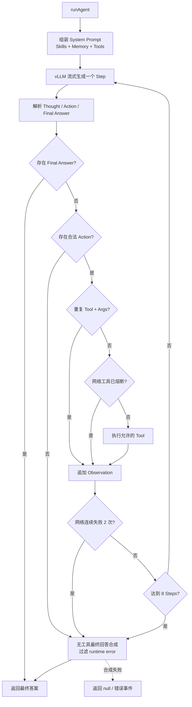

Runner 的硬约束：

- 每个 step 只执行一个 Action；
- duplicate 等本地策略拦截不计入网络失败，只有真正执行且失败的网络请求参与熔断计数；
- 熔断、重复调用或格式异常进入独立最终回答合成，禁止把原始 Observation/runtime error 当作答案；
- 相同 `tool + normalized args` 不重复执行；
- 未被 Skill 允许的工具不可执行；
- 网络工具连续失败 2 次后熔断；
- 最多运行 8 个 step；
- 所有 UI 更新通过判别联合 `AgentEvent` 推送；
- `metrics` 事件报告 step、工具调用、模型/工具耗时、估算输出 token 和估算 tokens/s；
- token 指标由输出字符数近似计算，不冒充服务端精确 usage。

### Trajectory 持久化与回放

主 Agent 和子 Agent 都通过 `TrajectoryWriter` 顺序追加以下事件：

```text
run-start → context → step-start → step-end → metrics
          → observation / ... → final|error → run-end
```

- 事件按 `runId + sequence` 形成稳定主键，写入后不原地修改；
- 高频 `stream` 事件不落库，避免逐 token 写 IndexedDB；稳定的 step 快照完整保留轨迹；
- Context 事件保留实际注入的 Memory/Skill/Tool，但移除 Memory embedding；
- Observation 不持久化 HTML，只保留模型看到的文本；
- `TrajectoryWorkspace` 按 session 列出主/子 Agent 运行，并可从事件流定时回放 `AgentTrace`。

## 8. 工具体系

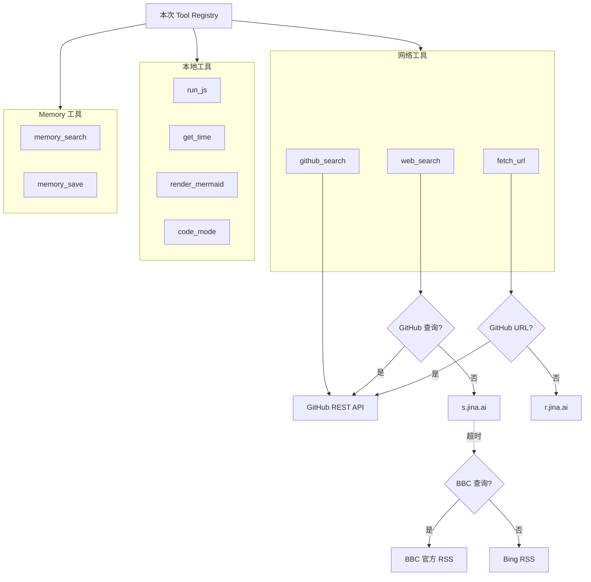

| 工具 | 执行位置 | 说明 |
|---|---|---|
| `web_search` | 浏览器网络请求 + Vite 固定代理 | GitHub 查询走 GitHub API；Jina 超时后回退 BBC/Bing RSS |
| `github_search` | 浏览器网络请求 | 仓库、tag、release、更新时间 |
| `fetch_url` | 浏览器网络请求 | GitHub URL 自动转 API，否则使用 Jina Reader |
| `run_js` | 浏览器主线程 | `new Function`，无 DOM/网络注入 |
| `get_time` | 浏览器主线程 | 当前时间与时区 |
| `render_mermaid` | 浏览器动态 import | Mermaid SVG |
| `code_mode` | 浏览器主线程 | 单次 Action 顺序执行最多 4 个已授权本地工具；支持结构化结果引用 |
| `memory_search` | IndexedDB + 本地 embedding | 主动检索长期 Memory |
| `memory_save` | IndexedDB | 保存偏好或事实 |

`code_mode` 只嵌套 `run_js`、`get_time`、`memory_search`、`render_mermaid`。
它不执行任意 TypeScript，不递归调用自身，也不嵌套网络工具或 `memory_save`，
因此不会绕过网络熔断和写入权限。

## 9. Memory 读取链路

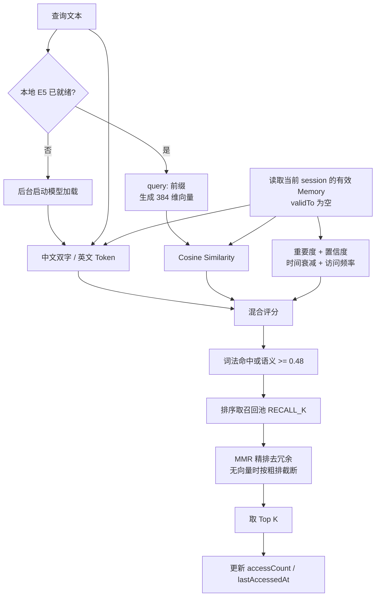

评分规则：

```text
semantic ready:
score = semantic * 0.58 + lexical * 0.27 + support * 0.15

fallback:
score = lexical * 0.78 + support * 0.22
```

检索分两阶段：

- 阶段一（召回）：按上面的混合评分排序，取较大候选池 `RECALL_K`（默认 20）。
- 阶段二（精排 rerank）：本地向量就绪且候选多于 limit 时，用 MMR
  `mmr = λ * semantic - (1 - λ) * max_redundancy`（默认 `λ = 0.7`）在相关性与多样性间平衡，
  去掉高度同质的记忆，避免挤占注入预算；向量未就绪时安全降级为按粗排截断。
- rerank 仅复用已有 e5 向量做余弦计算，无额外模型与网络；阶段二被隔离成单点，
  未来可平滑替换为 cross-encoder。

### RAG 自动工作流

RAG 与 Memory 使用同一个本地 E5 服务，但数据和检索策略相互独立：

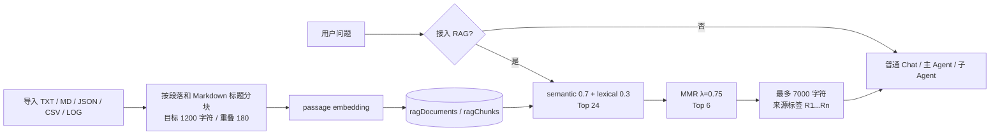

- 知识库对同一 origin 下的所有会话全局共享；
- 开关保存在 localStorage，关闭时不查询 RAG store，也不调用 query embedding；
- 候选必须词法命中或语义相似度不低于 `0.45`；
- 注入文本被明确标记为“不可信参考数据”，不能覆盖系统指令；
- 模型被要求使用 `[R1]` 等标签引用依据，知识库不足时明确说明；
- 当前只处理文本格式，不解析 PDF、Office 或图片 OCR。

RAG 面板提供两层质量检测：

1. 单查询召回调试器：选择 Top-K 后展示最终排名、文档、chunk 编号、
   semantic、lexical、hybrid score，并可展开检查原始 chunk。
2. 持久化测试问题集：每个问题人工指定一个期望文档，批量执行后计算：

```text
Recall@K = Top-K 命中期望文档的问题数 / 问题总数
MRR      = Σ(1 / 首次命中排名) / 问题总数，未命中记为 0
```

评测采用确定性的检索结果，不使用 LLM 充当裁判。当前相关性标注粒度为“文档”，
即同一文档的任意 chunk 进入 Top-K 都视为命中。

## 10. Memory 写入与时序更新

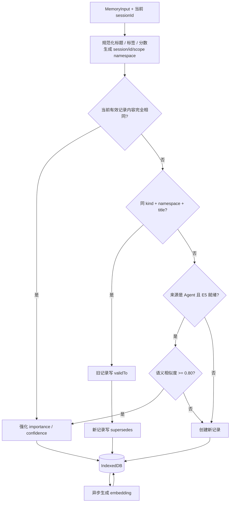

### 后台 Memory 巩固

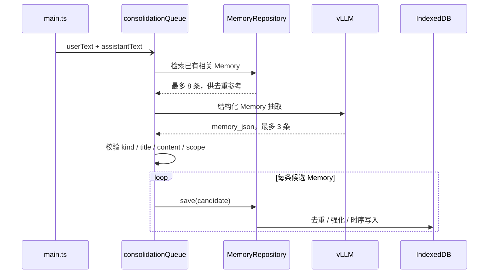

后台抽取拒绝保存：

- 公开网页或工具返回的通用事实；
- 问候、一次性问题、临时计算；
- 密码、token、私钥和其他凭据；
- 已被现有 Memory 更准确表达的重复内容。

## 11. 本地 Embedding

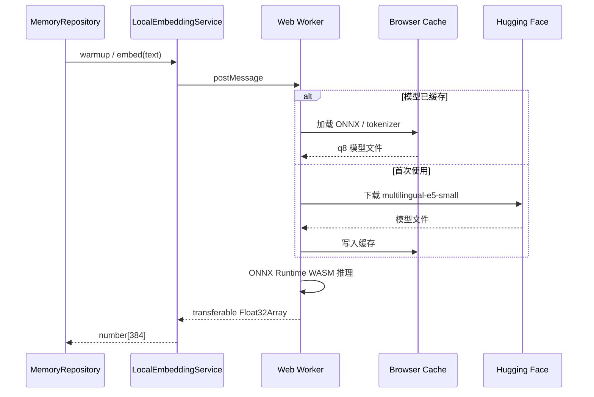

设计目的：

- embedding 推理不阻塞 UI；
- 首次下载后可复用浏览器缓存；
- 模型失败时 Memory 自动退化为词法检索；
- embedding 模型版本保存在每条记录中，支持重建索引。

## 12. Skills 架构


内置 Skills：

| Skill | 激活方式 | 主要工具 |
|---|---|---|
| Core Agent | 始终激活 | `get_time`、`run_js`、`code_mode`、Memory 工具 |
| Engineering Discipline | 代码/实现/修复/review 等触发词 | `run_js`、`code_mode`、`memory_search` |
| GitHub Research | GitHub/release/tag 等触发词 | `github_search`、`fetch_url` |
| Web Research | 搜索/网页/latest 等触发词 | `web_search`、`fetch_url` |
| Data Analysis | 计算/统计/分析等触发词 | `run_js` |
| Diagramming | 图/流程/架构/Mermaid 等触发词 | `render_mermaid` |

Skill Manifest：

```ts
type SkillManifest = {
  id: string;
  name: string;
  description: string;
  version: string;
  triggers: string[];
  prompt: string;
  allowedTools: string[];
  enabled: boolean;
  builtin: boolean;
  always?: boolean;
  createdAt: string;
  updatedAt: string;
};
```

## 13. 本地数据模型

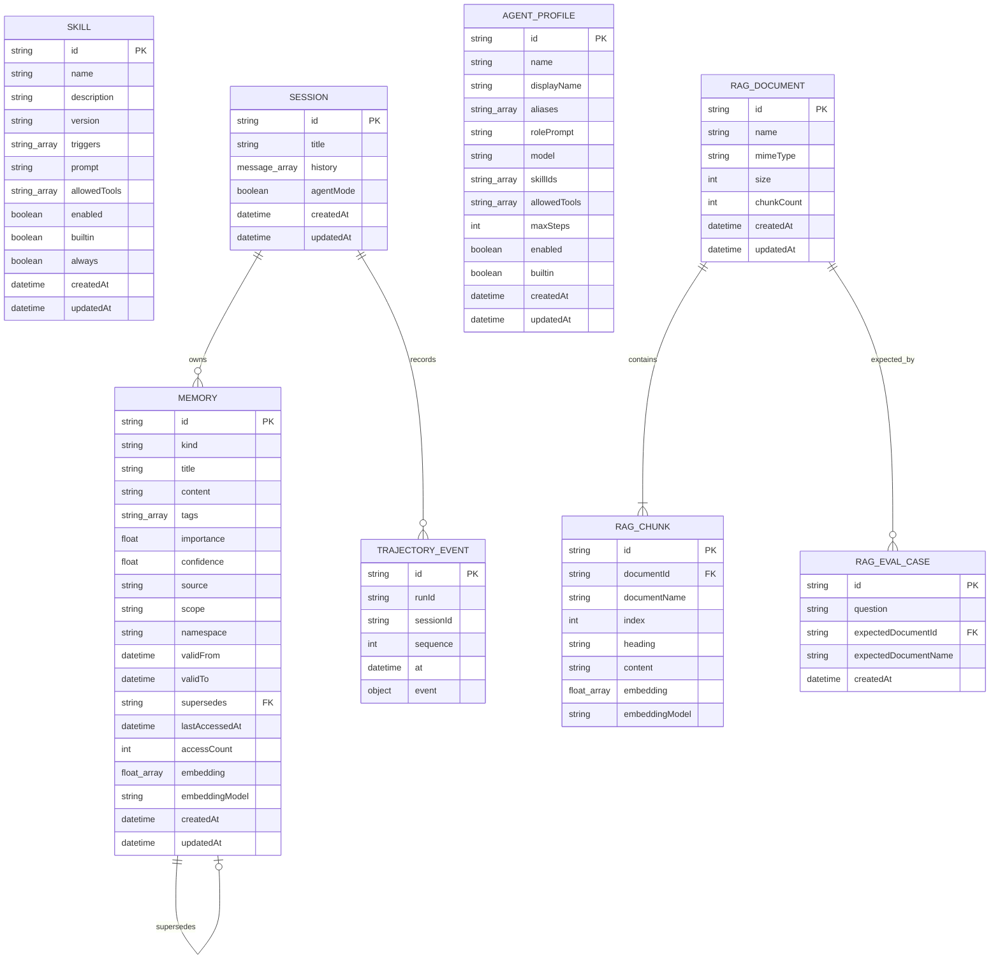

IndexedDB：

| 配置 | 值 |
|---|---|
| 数据库 | `vllm-agent` |
| 当前版本 | `9` |
| Object Store | `memories`、`skills`、`sessions`、`agentProfiles`、`trajectoryEvents`、`ragDocuments`、`ragChunks`、`ragEvalCases`、`workflowRuns`、`workflowTemplates` |
| Memory 索引 | `kind`、`updatedAt`、`namespace`、`validTo` |
| Skill 索引 | `enabled`、`updatedAt` |
| Session 索引 | `updatedAt` |
| Agent Profile 索引 | `enabled`、`updatedAt` |
| Trajectory 索引 | `sessionId`、`runId`、`at` |
| RAG 索引 | Document `updatedAt`；Chunk `documentId` |
| RAG 评测索引 | `expectedDocumentId`、`createdAt` |
| Dynamic Flow 索引 | `sessionId`、`updatedAt` |
| Flow Skill 索引 | `enabled`、`sourceRunId`、`updatedAt` |

注意：IndexedDB 按 origin 隔离。`127.0.0.1:8899` 和 `127.0.0.1:8900` 拥有不同的数据。

同一 origin 内，Memory 进一步按 `session/{sessionId}/{scope}` 隔离：

- localStorage 保存当前 `sessionId`，刷新不创建新会话；
- “新会话”生成新 UUID；页头下拉框可切换历史会话；
- Session store 保存标题、聊天历史、Agent 模式和更新时间；
- 切换时恢复聊天内容和对应的 Memory namespace；
- Memory 的读取、写入、检索、去重、统计和清空只作用于当前 session；
- 后台 consolidation 捕获发起时的 session，避免异步跨会话写入；
- Skills 是全局能力配置，不按 session 复制。
- Trajectory 按 session 查询、按 runId 回放，采用 append-only 事件记录。
- RAG 文档与 chunk 全局共享，由独立开关决定是否参与当前请求。
- Dynamic Flow 运行按 session 查询；节点任务轨迹继续写入 `trajectoryEvents`。
- Flow Skills 是全局可复用模板，不按 session 隔离；只有通过 Critic 的成功 Flow 才会写入。

## 14. UI 组件关系

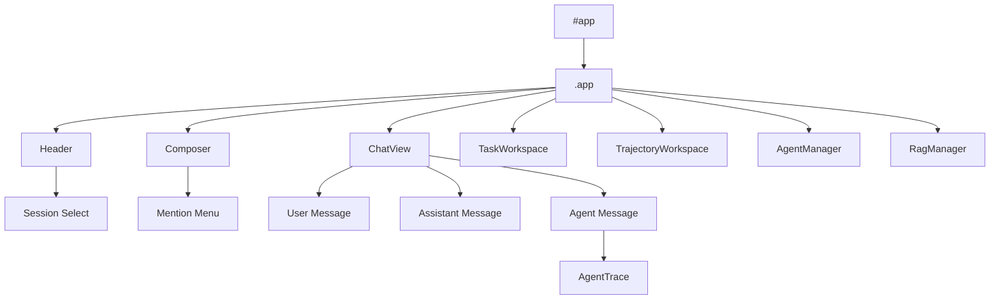

组件约定：

- 组件使用 `create*()` 工厂函数创建；
- 返回 `{ el, update, ...actions }`；
- 组件通过 callback 向 `main.ts` 上报用户事件；
- `main.ts` 修改状态后调用 `render()` 单向刷新；
- AgentTrace 只消费 `AgentEvent`，不访问 Runner 内部状态。
- TrajectoryWorkspace 从 IndexedDB 读取历史事件，并复用 AgentTrace 做回放。
- RagManager 负责文本导入、索引进度、召回调试、测试集评估、文档统计和删除，
  不直接调用模型服务。

## 15. 构建与运行

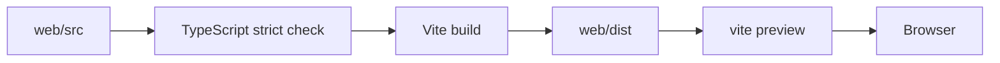

命令：

```bash
cd web
npm install
npm run dev
npm run build
npm run preview
```

生产构建输出包含：

- 主应用 JS/CSS；
- 独立 embedding Worker；
- ONNX Runtime WASM；
- Mermaid 按图类型拆分的懒加载 chunks；
- source map。

`web/dist/` 是生成目录，不应手工编辑。所有修改必须落在 `web/src/`。

## 16. 失败处理

| 场景 | 行为 |
|---|---|
| vLLM 不可达 | Header 显示连接失败 |
| SSE 异常 | 当前消息显示错误，恢复可发送状态 |
| 用户停止 | `AbortController.abort()` |
| Jina 超时 | 返回工具 Error；连续网络失败触发熔断 |
| GitHub Release 不存在 | 回退到稳定 tag |
| Tool JSON 非法 | Observation 返回解析错误 |
| 重复 Tool 调用 | Runner 阻止执行 |
| 未授权 Tool | Runner 返回 not permitted |
| embedding 未就绪 | 启动后台加载，当前查询走词法检索 |
| embedding 加载失败 | 保留词法检索能力 |
| Memory 后台抽取失败 | 记录 warning，不影响前台回答 |
| 新会话时旧巩固仍在队列 | 使用捕获的旧 session namespace 写入 |
| IndexedDB 升级被阻塞 | 抛出明确错误 |

## 17. 扩展点

### 新增 Tool

1. 在 `web/src/agent/tools.ts` 添加 `ToolDefinition`；
2. 在适用 Skill 的 `allowedTools` 中授权；
3. 如属于网络工具，加入 Runner 的网络熔断集合；
4. 更新本文“工具体系”。

### 新增 Skill

1. 内置 Skill：修改 `web/src/skills/builtins.ts`；
2. 自定义 Skill：通过 UI 创建并写入 IndexedDB；
3. 保持 trigger、prompt、allowedTools 三者语义一致；
4. 更新本文“Skills 架构”。

### 替换 Memory 后端

保持 `MemoryRepository` 的公开接口：

- `list`
- `save`
- `update`
- `remove`
- `clear`
- `search`
- `stats`
- `rebuildEmbeddings`

即可将 IndexedDB 替换为 SQLite、Postgres、Qdrant 或远端 Memory 服务。

### 引入图记忆

当出现多实体、多跳或时间点查询需求时，可在 `prepareAgentContext()` 前增加 Graphiti/Neo4j 适配层，并将图检索结果合并到 `MemoryMatch[]`。当前版本不包含实体图。

## 18. 架构同步清单

发生以下变化时必须同步更新本文：

- 新增或删除 `web/src` 一级模块；
- 改变普通聊天或 Agent 主链路；
- 修改 `AgentEvent`、`MemoryRecord`、`SkillManifest`；
- 新增 Tool 或内置 Skill；
- 修改 Memory 评分、去重或时序规则；
- 修改 IndexedDB schema/version；
- 引入新的外部服务或运行进程；
- 修改构建方式或部署端口。

架构文档以源码为准；`web/dist/` 和 source map 不作为架构来源。
