# 从 vLLM Chat 到多 Agent Runtime：浏览器端智能体工程实践课

**中文** | [English](./CLASS_README_EN.md)

> 基于本仓库源码设计的项目制课程  
> 建议课时：12 章，26 至 30 学时  
> 技术栈：TypeScript、Vite、vLLM、SSE、IndexedDB、Web Worker、Transformers.js、Mermaid

## 课程简介

这不是一套只讲 Prompt 的课程，而是一套以真实工程为主线的 Agent 系统开发课。

学习者将从一个最小的 OpenAI 兼容聊天请求出发，逐步实现流式对话、ReAct 工具循环、运行时权限、Memory、Skills、会话隔离、多 Agent 调度和可视化任务面板。课程最终产物就是本仓库中的浏览器端多 Agent Runtime。

课程强调三个原则：

1. **模型只负责推理，代码负责约束。** 工具白名单、重复调用拦截、超时、熔断和并发限制都由 Runtime 实现。
2. **先建立清晰边界，再增加能力。** UI、协议、Agent、Memory、Skills 和存储分别演进。
3. **每个概念都必须能够运行、观察和验证。** 每章都有源码入口、实验步骤和验收标准。

## 你将学会什么

完成课程后，学习者应能独立解释并实现：

- 区分模型权重、Tokenizer、vLLM 推理引擎和 Web App；
- 解释 Prefill、Decode、KV Cache、TTFT 和吞吐；
- 根据显存与负载理解 vLLM 的上下文、精度和并行参数；
- 根据任务、硬件、许可证和实测结果选择本地模型与部署方式；
- OpenAI 兼容 `/models` 与 `/chat/completions` 协议；
- SSE 增量解析和浏览器端流式渲染；
- 文本协议版 ReAct 循环；
- Tool Registry、超时、中止、去重和网络熔断；
- Skill Manifest 与 capability-based 工具门控；
- IndexedDB 版本化存储；
- 本地 embedding、混合检索、Memory 巩固和时序事实；
- 单用户多会话的数据隔离；
- `@角色` 路由、Agent Profile 和有界并发 Scheduler；
- 事件驱动的 Tasks 可观察界面；
- 面向真实故障的 Agent 降级策略。

## 适合人群

- 掌握 JavaScript 或 TypeScript 基础的前端工程师；
- 希望理解 Agent Runtime，而不只会调用框架 API 的开发者；
- 需要连接本地或私有 vLLM 的 AI 应用开发者；
- 希望学习 Memory、Skills 和多 Agent 工程边界的架构师。

建议先修知识：

- Promise、`async/await`、Fetch API；
- TypeScript 类型与 discriminated union；
- DOM 事件和基本 CSS；
- HTTP、JSON 和浏览器存储基础；
- 不要求预先掌握 vLLM；下文会从 token、推理和模型服务开始解释。

## 课程成果预览

### 角色选择

输入 `@` 后，Composer 根据 Agent Profile 提供角色候选：

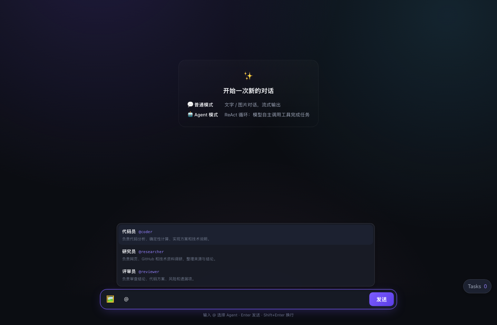

### 多 Agent 并行任务

多个子 Agent 在独立 Scheduler 中运行，不占用主对话的生成状态：

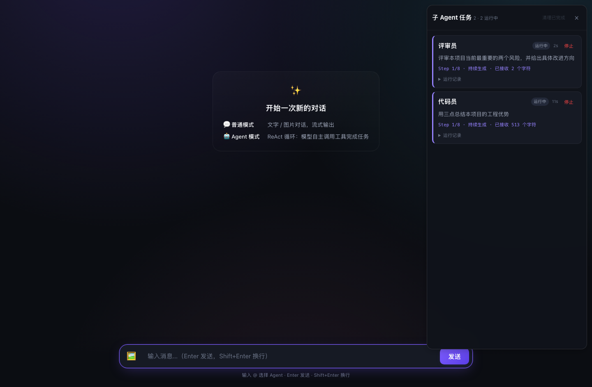

### 结果回写

子 Agent 完成后，最终答案会写回任务发起时的会话：

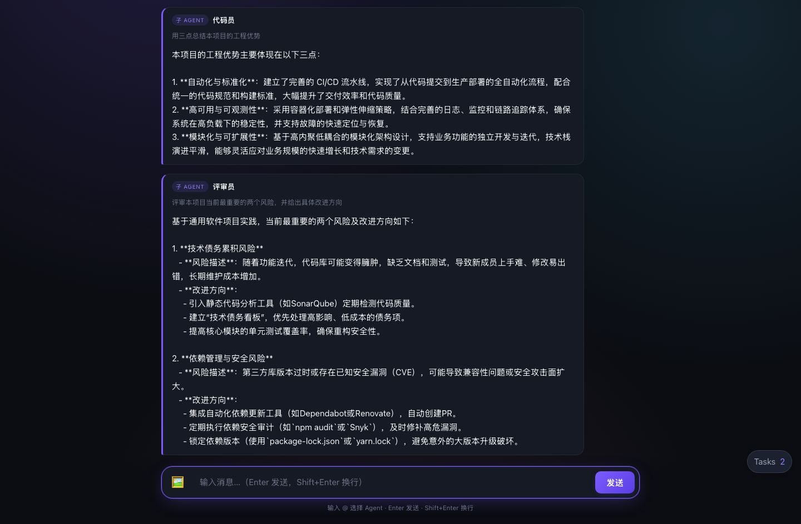

## 学习路线

```mermaid
flowchart LR
    A[第 1 章<br/>运行项目] --> B[第 2 章<br/>工程分层]
    B --> C[第 3 章<br/>OpenAI API 与 SSE]
    C --> D[第 4 章<br/>多模态聊天 UI]
    D --> E[第 5 章<br/>ReAct Runtime]
    E --> F[第 6 章<br/>Tools 与可靠性]
    F --> G[第 7 章<br/>Skills 权限门控]
    G --> H[第 8 章<br/>Memory OS]
    H --> I[第 9 章<br/>会话隔离]
    I --> J[第 10 章<br/>多 Agent 调度]
    J --> K[第 11 章<br/>可观察性与故障处理]
    K --> L[第 12 章<br/>综合项目]
```

## 课程安排

| 章节 | 主题 | 建议学时 | 核心产物 |
|---|---|---:|---|
| 1 | vLLM 基础、模型服务与项目运行 | 3 | 可访问的本地 Chat 页面 |
| 2 | Vite + TypeScript 分层架构 | 2 | 模块依赖图 |
| 3 | OpenAI 兼容 API 与 SSE | 2 | 流式文本客户端 |
| 4 | 多模态消息与无框架 UI | 2 | 文字/图片聊天界面 |
| 5 | ReAct Agent Runtime | 3 | 可执行工具循环 |
| 6 | Tools、安全与可靠性 | 2 | 可中止、有熔断的工具层 |
| 7 | Skills 与能力门控 | 2 | Skill 驱动的工具白名单 |
| 8 | Local Memory OS | 3 | 本地混合检索与记忆巩固 |
| 9 | Sessions 与数据隔离 | 1.5 | 可恢复的历史会话 |
| 10 | `@角色` 与多 Agent Scheduler | 2.5 | 并行子 Agent |
| 11 | 可观察性与故障诊断 | 1.5 | Tasks 进度与降级回答 |
| 12 | 综合项目与评审 | 1.5 | 自定义角色、Skill 和工具 |

---

## vLLM 新手预备课：先理解“模型服务”

这一节不要求机器学习背景。目标是先建立一张清晰的地图，避免把“大模型”“vLLM”“OpenAI API”和“聊天网页”混为一谈。

### 1. 大模型、vLLM 和本工程分别是什么

可以把整个系统类比为餐厅：

| 技术概念 | 类比 | 实际职责 |
|---|---|---|
| 模型权重 | 菜谱和厨师掌握的知识 | 决定模型能理解和生成什么 |
| Tokenizer | 切菜规则 | 把文字或图片相关输入转换为模型可处理的数字 |
| vLLM | 后厨与出餐系统 | 加载模型、管理 GPU、安排请求并逐 token 推理 |
| OpenAI 兼容 API | 点餐窗口 | 用统一 HTTP/JSON 格式接收请求 |
| 本工程 Web App | 前台与服务员 | 收集输入、展示流式回答、执行 Agent 工具和管理 Memory |

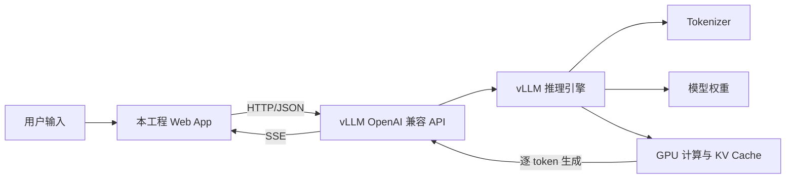

几个必须先记住的结论：

1. **模型文件本身不是服务。** 下载模型后，还需要推理引擎加载它。
2. **vLLM 不是模型。** 它是高性能大模型推理和服务框架。
3. **本工程不负责训练模型。** 它消费 vLLM 暴露的推理 API，并在浏览器中实现 Agent Runtime。
4. **OpenAI 兼容不代表请求发送给 OpenAI。** 它只说明 HTTP 路径和 JSON 结构采用相似协议。
5. **模型能力和服务能力不是一回事。** 模型是否理解图片取决于模型及其处理器；服务还必须正确启用多模态输入。

### 2. 什么是“推理”

训练是让模型从数据中学习参数，推理是使用已经训练好的参数回答问题。本课程只涉及推理。

一次最简文本推理包含：

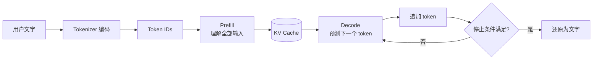

#### Token 是什么

模型不直接读取字符串，而是读取 token ID。一个 token 可能是：

- 一个英文单词；
- 单词的一部分；
- 一个中文字符或常见词片段；
- 标点、空格或特殊控制符。

因此，“100 个汉字”等于多少 token 并没有固定答案，必须由当前模型的 tokenizer 决定。

Token 数量直接影响：

- 请求是否超过上下文窗口；
- Prefill 需要多久；
- KV Cache 占用多少显存；
- API 计量和吞吐统计；
- Agent Trace 能保留多少历史。

#### Prefill 与 Decode

**Prefill** 一次处理已有输入，通常更偏向大规模并行计算。输入越长，Prefill 越慢。

**Decode** 每次预测一个新 token，并不断复用 KV Cache。用户看到的流式输出主要来自 Decode 阶段。

这解释了一个常见现象：

```text
发送长文档 -> 等一段时间才出现第一个字 -> 后续文字持续流出
```

等待第一个字的时间通常称为 **TTFT（Time To First Token）**；后续 token 之间的平均时间常用 **TPOT（Time Per Output Token）** 描述。

### 3. vLLM 为什么比“直接运行模型”更适合作为服务

最简单的推理脚本通常一次只处理一个请求。真实服务会同时收到多个长度不同的请求，如果简单串行执行，GPU 利用率和用户体验都会很差。

vLLM 主要解决以下工程问题：

- 高效管理 KV Cache；
- 对不同请求进行连续批处理；
- 在吞吐、延迟和显存之间进行调度；
- 暴露 OpenAI 兼容 HTTP 服务；
- 支持多 GPU 张量并行；
- 支持流式输出、模型别名和服务参数。

#### KV Cache 是什么

Transformer 在生成第 N 个 token 时，需要参考前面的 token。若每次都从头计算，成本很高。KV Cache 保存前文中间结果，使 Decode 可以复用它们。

KV Cache 的特点：

- 上下文越长，占用越大；
- 并发请求越多，占用越大；
- 可用显存越多，通常能容纳更多并发序列；
- 请求结束后，对应缓存可以被回收。

vLLM 的 PagedAttention 思路类似虚拟内存分页：把 KV Cache 分成块管理，降低连续大块分配带来的浪费和碎片。新手不需要先掌握其数学细节，但要理解它解决的是**推理服务中的显存管理问题**。

#### Continuous Batching 是什么

传统静态 batch 必须等整批请求完成，短请求会被长请求拖住。Continuous Batching 会在解码迭代之间动态加入新请求、移除完成请求。

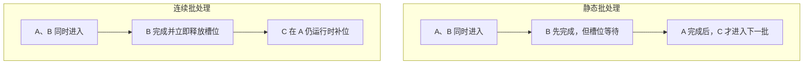

真实调度比图中复杂，但核心目标相同：减少 GPU 空闲，提高总吞吐。

### 4. 新手必须掌握的词汇

| 术语 | 新手解释 | 在本工程中的位置 |
|---|---|---|
| Prompt | 发送给模型的输入 | 普通消息或 ReAct system prompt |
| Message | 带 `role` 的一段内容 | `system`、`user`、`assistant` |
| Token | 模型处理的离散单位 | 受 tokenizer 影响 |
| Context Window | 单次请求能容纳的 token 总量 | 输入、历史、Trace 和输出共享 |
| Sampling | 从候选 token 中选择下一个 token | 由 temperature 等参数影响 |
| Streaming | 生成一部分就立即发送 | 本工程通过 SSE 接收 |
| SSE | Server-Sent Events，服务端沿一个 HTTP 响应持续推送事件 | vLLM 流式返回 `data:` |
| Throughput | 单位时间处理的总 token 或请求数 | 服务整体处理能力 |
| Latency | 一个请求等待和生成所需时间 | 用户直接感受到的速度 |
| KV Cache | 为历史 token 保存的中间状态 | 占用 GPU 显存 |
| Chat Template | 把 messages 转成模型实际 prompt 的模板 | 由模型/tokenizer 配置决定 |
| Served Model Name | API 对外暴露的模型名称 | `/models` 返回并用于请求 |

### 5. 上下文窗口不是“无限记忆”

假设服务的最大模型长度为 `N`：

```text
系统 Prompt
+ 用户和 Assistant 历史
+ 相关 Memory
+ Skill 指令
+ Agent Trace 与 Observation
+ 本轮计划生成的 token
<= N
```

需要注意：

- `max_model_len` 是服务允许的上下文上限，不代表每次请求都会使用满；
- `max_tokens` 限制本轮最多生成多少 token；
- 输入已经很长时，可用输出空间会减少；
- Agent 每一步都携带 Trace，通常比普通聊天增长更快；
- 浏览器显示的字符数不等于 token 数。

本工程通过 [`web/src/config.ts`](./web/src/config.ts) 控制：

```ts
AGENT_MAX_STEPS = 8
AGENT_STEP_TOKENS = 1200
CHAT_TOKENS = 2048
```

这些是客户端上限，服务端仍会执行自己的模型长度和生成限制。

### 6. 从零启动一个 vLLM 服务

vLLM 通常运行在 Linux + NVIDIA GPU 环境。macOS 开发者常见做法是让 Web App 在本机运行，把 vLLM 部署在带 GPU 的 Linux 主机上。

下面是教学用最小流程。CUDA、PyTorch、驱动和 vLLM 的兼容关系会随版本变化，实际安装应以所用 vLLM 版本的官方文档为准。

```bash
nvidia-smi
python3 -m venv .venv
source .venv/bin/activate
pip install vllm
```

优先选择带 Instruct 或 Chat 标识的指令模型。Base 模型主要学习“续写文本”，未必能稳定遵循 system/user 对话指令。

某些模型需要先接受许可证或登录模型仓库。访问 token 只应放在受保护的环境变量或本机凭据存储中，不能写入启动脚本、README 或 Git。

使用 Hugging Face 模型 ID：

```bash
vllm serve your-org/your-instruct-model \
  --served-model-name course-model \
  --host 0.0.0.0 \
  --port 8000
```

使用已经下载到本机的模型目录：

```bash
vllm serve /path/to/model \
  --served-model-name course-model \
  --host 0.0.0.0 \
  --port 8000
```

`0.0.0.0` 表示服务监听所有网卡，不是浏览器应该访问的主机名。本机客户端使用 `127.0.0.1`，其他机器使用服务器的可达域名或地址。对外监听前必须结合防火墙、反向代理和鉴权评估暴露风险。

启动成功后，先不要打开网页，先用命令行验证：

```bash
curl -s http://127.0.0.1:8000/v1/models
```

预期响应结构类似：

```json
{
  "object": "list",
  "data": [
    {
      "id": "course-model",
      "object": "model"
    }
  ]
}
```

`id` 是客户端请求体中的 `model`。它可能是 `--served-model-name`，不一定等于磁盘目录名。

### 7. 常见启动参数怎么理解

不同版本的参数名和默认值可能调整，执行 `vllm serve --help` 查看当前安装版本。

| 参数 | 新手解释 | 主要影响 |
|---|---|---|
| 模型 ID 或路径 | 要加载的权重和配置 | 模型能力、显存需求 |
| `--served-model-name` | API 对外显示的别名 | `/models` 和请求中的 `model` |
| `--host` | 服务监听的网卡地址 | 其他机器能否访问 |
| `--port` | HTTP 端口 | 客户端 Base URL |
| `--dtype` | 权重/计算精度，如 auto、float16、bfloat16 | 兼容性、显存、精度 |
| `--tensor-parallel-size` | 用多少张 GPU 切分同一个模型 | 单卡是否装得下、通信开销 |
| `--max-model-len` | 服务允许的最大上下文长度 | KV Cache 显存和长文本能力 |
| `--gpu-memory-utilization` | vLLM 可使用的 GPU 显存比例目标 | KV Cache 容量和 OOM 风险 |
| `--enforce-eager` | 使用 eager 执行，关闭部分图优化 | 兼容性更直接，性能可能下降 |
| `--trust-remote-code` | 允许模型仓库中的自定义 Python 代码 | 某些模型必需，但有安全风险 |
| `--limit-mm-per-prompt` | 限制单请求图片等多模态输入数量 | 显存与滥用保护 |

#### `dtype` 怎么选

- `auto`：优先让 vLLM 根据模型配置选择，适合首次尝试；
- `float16`：许多 GPU 支持，常见于较早或消费级 GPU；
- `bfloat16`：动态范围更好，但需要硬件支持；
- 若启动时报 dtype 或硬件能力错误，应先确认 GPU 架构和模型要求，不要盲目修改。

#### `tensor-parallel-size` 怎么选

当模型无法放进一张 GPU 时，可以把模型张量切分到多张 GPU：

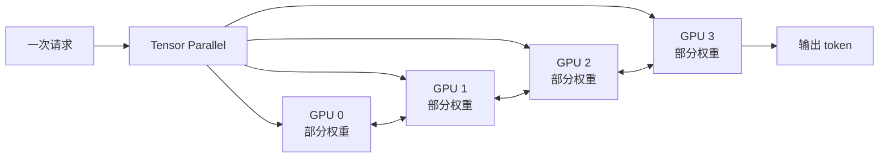

它不是“每张 GPU 独立处理一个请求”，而是多张 GPU 协作完成同一个模型的计算。更多 GPU 不一定线性加速，因为 GPU 之间还需要通信。

#### `max-model-len` 为什么不能盲目调大

更长的上限会为长上下文和 KV Cache 带来更高显存压力。模型声称支持长上下文，也不代表当前硬件能在高并发下经济地使用该长度。

建议调试顺序：

1. 先使用模型默认或较保守长度启动；
2. 确认单请求正常；
3. 再逐步增加上下文；
4. 同时观察显存、TTFT 和并发能力；
5. 不要只验证“能启动”，还要验证目标负载。

#### `gpu-memory-utilization` 不是绝对安全线

它是 vLLM 的显存规划目标之一，不等于进程永远不会超过该比例。模型加载、CUDA context、临时张量、图捕获和其他进程都可能占用显存。

### 8. 显存主要花在哪里

新手常误以为“模型文件大小小于显存就一定能运行”。实际显存至少包含：

```text
模型权重
+ KV Cache
+ CUDA / 通信开销
+ 激活值与临时工作区
+ 图捕获或编译相关缓存
```

粗略理解：

- 模型越大，权重显存越大；
- 上下文越长，KV Cache 越大；
- 并发越高，同时存在的 KV Cache 越多；
- 多模态输入还会增加视觉编码开销；
- 量化可能降低权重占用，但需要模型、硬件和推理后端共同支持。

### 9. 第一次调用 Chat API

先使用非流式请求，便于新手观察完整 JSON：

```bash
curl -s http://127.0.0.1:8000/v1/chat/completions \
  -H 'Content-Type: application/json' \
  -d '{
    "model": "course-model",
    "messages": [
      {"role": "user", "content": "请用一句话解释 vLLM"}
    ],
    "temperature": 0.2,
    "max_tokens": 128,
    "stream": false
  }'
```

再改成流式请求：

```bash
curl -N http://127.0.0.1:8000/v1/chat/completions \
  -H 'Content-Type: application/json' \
  -d '{
    "model": "course-model",
    "messages": [
      {"role": "user", "content": "请用三点解释流式输出"}
    ],
    "temperature": 0.2,
    "max_tokens": 256,
    "stream": true
  }'
```

`curl -N` 会关闭客户端输出缓冲，便于观察 SSE：

```text
data: {"choices":[{"delta":{"content":"第一"}}]}
data: {"choices":[{"delta":{"content":"点"}}]}
...
data: [DONE]
```

SSE 全称是 **Server-Sent Events**。它让服务端保持一个 HTTP 响应不结束，并在同一连接上持续发送事件。上面的每一行不是一次新的 HTTP 请求。第 3 章会从报文格式、拆包和浏览器 API 开始完整解释。

### 10. 请求参数如何影响回答

#### `messages`

常见 role：

- `system`：定义总体行为和协议；
- `user`：用户输入；
- `assistant`：模型历史回答。

vLLM 会结合模型的 Chat Template，把结构化 messages 转成模型真正看到的 token 序列。

#### `temperature`

`temperature` 控制采样分布的随机程度。直观上：

- 较低：更稳定、更确定，适合代码、抽取和 Agent 协议；
- 较高：更多样，适合创意生成；
- 它不等于“正确率旋钮”，也不能修复模型知识不足。

本工程 Agent 更强调格式稳定，因此使用较低 temperature。

#### `max_tokens`

限制最多生成多少 token。它不是回答必须达到的长度，模型可以因为结束符、stop 条件或服务限制提前停止。

#### `stop`

遇到指定字符串时停止生成。本工程 ReAct Step 使用 `Observation:` 作为 stop 条件，防止模型自己伪造工具结果。

#### `stream`

- `false`：等待完整回答后返回一个 JSON；
- `true`：通过 SSE 逐步返回 delta。

流式输出主要改善用户感知延迟，不一定缩短完整生成时间。

### 11. Chat Template 为什么重要

不同模型训练时使用的对话格式不同，例如 role 标记、起止 token 和 assistant 前缀。Chat Template 的职责是把统一的：

```json
{"role":"user","content":"你好"}
```

转换成该模型熟悉的内部格式。

模板不匹配可能表现为：

- 模型重复用户问题；
- role 混乱；
- 无法正常停止；
- 输出大量特殊 token；
- 指令遵循明显变差。

因此，API 兼容只统一了外部请求，不会自动让所有模型的内部行为完全一致。

### 12. 推理模型的“思考内容”

部分模型会输出 `<think>...</think>` 或其他 reasoning 内容。本工程会把推理块和最终回答分开渲染。

需要区分：

- vLLM 负责传输模型生成的 token；
- 是否生成 reasoning 主要由模型、模板和请求参数决定；
- “让模型只回答一句话”不保证模型不会先输出思考内容；
- 应用不能把隐藏思考当作稳定 API 协议，真正的 Agent 协议仍需 parser 和 Runtime 保护。

### 13. 多模态输入不等于图片生成

本工程的“图片支持”指把图片作为输入，让视觉语言模型理解图片：

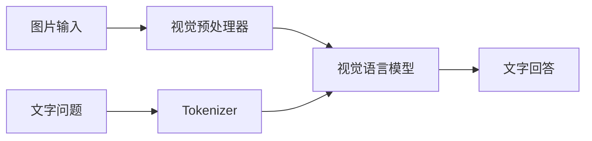

它不意味着模型可以生成图片。图片生成通常需要扩散模型或专门的图像生成模型与 API。

要让图片输入成功，需要同时满足：

1. 模型本身支持视觉；
2. vLLM 版本支持该模型的多模态架构；
3. 服务启动时未禁用图片输入；
4. 请求 content 格式正确；
5. 图片大小和数量未超过限制。

### 14. 性能应该看哪些指标

| 指标 | 含义 | 用户感受 |
|---|---|---|
| TTFT | 从发送请求到第一个 token | “多久开始回答” |
| TPOT | 输出 token 之间的平均耗时 | “打字速度” |
| Throughput | 每秒总输出 token 或完成请求 | 服务整体承载能力 |
| Queue Time | 请求在调度队列中等待时间 | 高并发时是否拥堵 |
| GPU Memory | 权重、KV Cache 等占用 | 是否能提高上下文和并发 |
| Error Rate | 超时、OOM、格式等失败比例 | 服务稳定性 |

优化时要先明确目标：

- 单用户交互更关心 TTFT 和 TPOT；
- 批量离线任务更关心吞吐；
- 多 Agent 并发会同时提高请求数和 KV Cache 压力；
- 不能只看 GPU 利用率判断体验。

### 15. vLLM 常见故障排查

| 现象 | 常见原因 | 新手排查顺序 |
|---|---|---|
| `Connection refused` | 服务没启动、host/port 错误 | 查进程、监听端口和启动日志 |
| `/models` 404 | Base URL 缺少或重复 `/v1` | 检查最终请求 URL |
| 页面请求被 CORS 拦截 | 服务未允许页面 Origin | 看浏览器 Console，不要只看服务日志 |
| `Address already in use` | 端口已有进程监听 | 查占用端口的 PID，避免重复启动 |
| CUDA/驱动错误 | 驱动、CUDA、PyTorch/vLLM 不兼容 | 核对版本矩阵和启动环境变量 |
| 启动时 OOM | 模型权重或初始化开销过大 | 降低并行/长度规划，检查其他 GPU 进程 |
| 运行时 OOM | 并发、长上下文或多模态输入过大 | 降低上下文、并发或输入限制 |
| 请求提示长度超限 | 输入 + 预留输出超过上限 | 缩短历史、Trace、Memory 或 `max_tokens` |
| 模型名不存在 | 请求 model 与 served name 不一致 | 以 `/models` 返回的 `id` 为准 |
| 第一次请求很慢 | 模型加载、图捕获或缓存预热 | 查看日志并区分冷启动和稳定状态 |
| 回答乱码或 role 异常 | Chat Template 不匹配 | 检查模型 tokenizer/template 配置 |
| 图片请求失败 | 模型或服务不支持当前多模态格式 | 先验证纯文本，再验证单张小图 |

排障原则：

1. 先验证 `/models`，再验证非流式 chat；
2. 非流式成功后再验证 SSE；
3. 纯文本成功后再验证图片；
4. 单请求成功后再增加上下文和并发；
5. 记录完整启动命令和环境变量，避免“同一个模型今天能跑、明天不能跑”。

### 16. vLLM 与本工程的参数映射

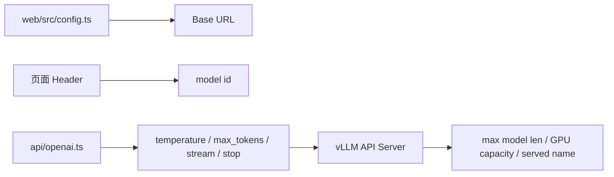

| 本工程字段 | 发往 vLLM | 服务端对应概念 |
|---|---|---|
| `baseUrl` | 请求 URL 前缀 | `host`、`port` 和 `/v1` |
| `currentModel` | `model` | served model name |
| `CHAT_TOKENS` | `max_tokens` | 最大输出长度约束 |
| `AGENT_STEP_TOKENS` | 每个 ReAct Step 的 `max_tokens` | 单步生成预算 |
| `stop` | stop strings | 服务生成停止条件 |
| `AbortSignal` | 客户端取消 HTTP | 客户端停止等待；服务端释放速度还受代理和断连检测影响 |

### 17. vLLM 预备课实验

#### 实验 A：认识 token 和上下文

1. 分别发送一句话和一篇长文本；
2. 比较 TTFT；
3. 将 `max_tokens` 从 64 改为 512；
4. 观察它改变的是“上限”还是“固定输出长度”；
5. 记录字符数与 token 数为什么不能直接等同。

#### 实验 B：非流式与流式

1. 用 `curl` 发送 `stream: false`；
2. 保存完整 JSON 并定位 `choices[0].message.content`；
3. 改成 `stream: true` 和 `curl -N`；
4. 找到 delta 和 `[DONE]`；
5. 解释为什么浏览器端需要 SSE buffer。

#### 实验 C：参数与稳定性

1. 对同一问题分别使用低温和高温；
2. 重复请求三次；
3. 比较输出一致性；
4. 解释为什么 Agent 协议倾向较低 temperature。

#### 实验 D：服务容量

在有权限的教学环境中逐步增加：

- 输入长度；
- 并发请求数；
- 输出上限。

记录 TTFT、TPOT、GPU 显存和错误率。不要在共享生产服务上进行压力实验。

### 18. 预备课验收问题

学习者应能不用术语堆砌地回答：

1. vLLM 和模型权重有什么区别？
2. 为什么输出是逐 token 生成的？
3. Prefill 和 Decode 分别做什么？
4. KV Cache 为什么同时受上下文和并发影响？
5. `/models` 返回的 ID 为什么比磁盘目录名更重要？
6. `max_tokens` 和 `max_model_len` 有什么区别？
7. Tensor Parallel 为什么不一定线性加速？
8. 流式输出为什么改善 TTFT 感受，却不保证缩短总生成时间？
9. 图片理解和图片生成为什么是两种能力？
10. 为什么排障要先非流式、后流式，先文本、后图片？

---

## 本地模型选型与部署指南

本地部署最常见的错误，是先下载一个“听说很强”的模型，再尝试让现有机器装下它。更可靠的顺序是：

```text
业务任务
-> 输入输出形式
-> 质量与延迟目标
-> 数据和许可证边界
-> 硬件预算
-> 模型候选
-> 本地评测
-> 容量测试
-> 确定部署方式
```

模型选型不是只比较排行榜分数，部署也不是“服务能启动”就结束。最终目标是：在目标数据、目标并发和目标硬件上，以可接受的成本稳定完成任务。

### 1. 先写需求，不要先看模型榜单

先回答以下问题。

#### 任务是什么

| 任务 | 重点能力 | 常见模型方向 |
|---|---|---|
| 日常问答与总结 | 指令遵循、语言质量 | Instruct/Chat 模型 |
| 中文知识助手 | 中文理解、事实质量 | 中文能力经过验证的 Instruct 模型 |
| 代码助手 | 代码生成、补全、调试 | Code Instruct 模型 |
| Agent 工具调用 | 格式遵循、JSON、工具选择 | 指令稳定、工具调用评测较好的模型 |
| 复杂推理 | 数学、规划、多步分析 | Reasoning 或推理强化模型 |
| 图片理解 | 视觉编码、OCR、图文问答 | VLM，多模态模型 |
| 文本向量 | 语义检索 | Embedding 模型，不是 Chat 模型 |
| 文档重排 | 检索结果排序 | Reranker 模型 |
| 图片生成 | 文生图 | 扩散或图像生成模型，不是 VLM |

本工程的主接口是 `/v1/chat/completions`，因此至少需要一个能稳定进行对话的 Instruct/Chat 模型。若要上传图片，还必须选择 vLLM 当前版本支持的 VLM。

#### 输入是什么

- 主要是中文、英文还是多语言？
- 单轮问题还是长对话？
- 是否包含代码、表格、JSON、图片或扫描件？
- 单次输入通常有多长？
- 是否必须支持 32K、64K 或更长上下文？

不要因为模型标称 128K 上下文，就默认业务需要 128K。长上下文会增加 Prefill 时间和 KV Cache 压力，检索或摘要可能更经济。

#### 输出要求是什么

- 允许创意发挥，还是必须稳定可复现？
- 是否必须输出严格 JSON？
- 是否需要遵循 ReAct 的 `Thought/Action/Action Input` 协议？
- 是否允许显示 reasoning 内容？
- 答案必须多快开始出现？
- 一次最多生成多少 token？

#### 负载是什么

- 只有一名开发者，还是多个并发用户？
- 普通聊天和多 Agent 是否同时运行？
- 峰值并发是多少？
- 每分钟大约多少请求？
- 更重视单请求延迟，还是总吞吐？

本工程默认 Scheduler 最多并行 3 个子 Agent。再加上主对话和后台 Memory 巩固，一个浏览器就可能同时产生多个模型请求。

#### 有哪些硬约束

- 可用 GPU 型号、数量和显存；
- 主机内存和磁盘空间；
- 是否允许联网下载模型；
- 数据是否可以离开本机或内网；
- 模型许可证是否允许目标用途；
- 是否允许执行模型仓库中的 remote code；
- 预算、功耗和运维能力。

### 2. 认识不同模型类型

#### Base 模型

Base 模型主要从大规模文本中学习“下一个 token”。它适合继续训练和研究，但不一定能稳定按照聊天指令回答。

#### Instruct 或 Chat 模型

这类模型经过指令微调或偏好优化，更适合：

- system/user/assistant 对话；
- 问答、总结和改写；
- 格式化输出；
- Agent 工具协议。

本课程优先选择 Instruct/Chat 版本。

#### Reasoning 模型

Reasoning 模型更偏向多步分析，但通常需要考虑：

- 输出 token 较多；
- TTFT 或完整响应时间可能更长；
- reasoning 格式可能需要专门解析；
- 简单任务的成本可能高于收益；
- 不一定比同规模 Instruct 模型更擅长格式遵循。

#### Code 模型

代码模型针对代码语料、仓库上下文或补全任务增强。选型时不能只测算法题，还要测本项目真实需要的：

- TypeScript；
- API 使用；
- 多文件修改；
- 错误定位；
- JSON 和工具参数生成。

#### VLM

视觉语言模型接收图片并输出文字。需要同时验证：

- vLLM 是否支持该架构；
- 模型处理器是否能加载；
- 图片数量和分辨率限制；
- OCR、图表和自然图像中的实际效果；
- 多模态请求对显存和延迟的影响。

#### Embedding 与 Reranker 模型

它们不是聊天模型：

- Embedding 把文本映射为向量，用于召回；
- Reranker 对候选文档重新打分；
- Chat 模型根据上下文生成答案。

本工程使用浏览器端 multilingual-e5 生成 Memory embedding，不需要让主 Chat 模型兼任向量模型。

### 3. 参数规模、Dense 和 MoE 怎么看

#### 参数规模不是绝对质量

参数更多通常意味着更高容量，也意味着更高的：

- 权重显存；
- 加载时间；
- 推理成本；
- 多卡通信需求。

但模型数据、训练方法、任务适配和量化质量同样重要。一个更小但针对目标任务优化的模型，可能优于更大的通用模型。

#### Dense 模型

Dense 模型每次推理通常使用全部网络参数。模型标注的参数规模与每个 token 的主要计算量关系更直接。

#### MoE 模型

Mixture of Experts 模型包含多个专家，每个 token 只激活其中一部分。模型卡可能同时给出：

- 总参数量；
- 活跃参数量。

必须区分：

- **计算量**更接近活跃参数；
- **权重加载显存**通常仍受总参数量影响；
- MoE 还可能产生专家路由和跨 GPU 通信开销。

不能看到“每 token 只激活 3B”，就按 Dense 3B 的权重显存准备机器。

### 4. 先做粗略显存估算

模型能否部署，先看权重，再为 KV Cache 和运行开销留空间。

#### 权重显存的第一近似

```text
权重字节数 ≈ 参数量 × 每参数字节数
```

常见粗略值：

| 精度 | 每参数大约字节数 | 说明 |
|---|---:|---|
| FP32 | 4 | 推理很少选择，显存高 |
| FP16/BF16 | 2 | 常见未量化推理精度 |
| INT8/FP8 | 约 1 | 还会有 scale、元数据和实现开销 |
| INT4 | 约 0.5 | 实际文件和显存通常高于理论值 |

仅按 BF16/FP16 权重粗估：

| 参数规模 | 仅权重理论值 | 部署含义 |
|---:|---:|---|
| 3B | 约 6 GB | 仍需给 KV Cache 和运行时留空间 |
| 7B | 约 14 GB | 16 GB 卡通常非常紧张 |
| 14B | 约 28 GB | 常需要更大显存或量化 |
| 32B | 约 64 GB | 常见为高显存单卡或多卡 |
| 70B | 约 140 GB | 通常需要多张高显存 GPU 或量化 |

这张表不能直接当作采购结论，因为实际还需要：

```text
模型权重
+ KV Cache
+ 激活与临时张量
+ CUDA context
+ 通信缓冲区
+ CUDA Graph 或编译缓存
+ 多模态编码器开销
```

#### 为什么“刚好装下权重”仍然不能服务

如果 24 GB 显存中权重已经占用 23 GB，剩余空间很难支撑：

- 长上下文；
- 多个并发序列；
- 临时工作区；
- 图捕获；
- 视觉输入。

本地选型应保留安全余量，并在真实并发和真实上下文下测试。

#### KV Cache 为什么难用一张通用表估算

KV Cache 取决于：

- 模型层数；
- hidden/head 结构；
- KV head 数量；
- KV cache dtype；
- token 数；
- 并发序列数；
- vLLM 的缓存和调度配置。

可靠方法是：

1. 查模型配置和 vLLM 启动日志；
2. 使用目标 `max-model-len` 启动；
3. 观察 vLLM 报告的 KV Cache 容量；
4. 用目标并发和长度进行压力验证。

### 5. 除了 GPU，还要检查什么

| 资源 | 为什么重要 |
|---|---|
| 系统内存 | 下载、加载、反序列化或 CPU offload 可能需要 |
| 磁盘容量 | 模型权重、多个量化版本和缓存会快速增长 |
| 磁盘速度 | 影响模型首次加载与容器启动 |
| PCIe/NVLink | 影响多 GPU 通信 |
| 网络 | 影响远程 Web 调用和模型下载 |
| 电源与散热 | 持续推理是高负载工作 |
| 驱动/CUDA | 决定 PyTorch 和 vLLM 是否兼容 |

部署前至少记录：

```bash
nvidia-smi
df -h
free -h
python3 --version
```

macOS 没有 NVIDIA CUDA 环境时，通常将 vLLM 部署到 Linux GPU 主机。本工程只要求模型端暴露 OpenAI 兼容 API，因此也可以连接其他本地兼容服务；但不同推理引擎的参数和性能特征不同。

### 6. 什么时候考虑量化

量化用更低位宽表示权重，主要收益是降低权重显存和内存带宽压力。

#### 量化可能带来的收益

- 更大的模型能装进现有 GPU；
- 为 KV Cache 留出更多空间；
- 某些硬件上可能提升吞吐；
- 减少磁盘与加载压力。

#### 量化不是免费午餐

- 可能降低准确率或格式稳定性；
- 不同任务对量化敏感度不同；
- 量化格式必须被当前 vLLM 和 GPU 支持；
- 某些 kernel 在特定硬件上反而更慢；
- 多模态模块可能没有完全量化；
- 在线动态量化和预量化模型的行为不同。

常见格式包括 AWQ、GPTQ、FP8 等。选择时应查看当前 vLLM 版本的支持矩阵，不要只因为模型文件名含有 `4bit` 就假设可以直接加载。

#### 新手推荐顺序

1. 有条件时先用 BF16/FP16 建立质量基线；
2. 优先选择发布者提供的、说明完整的预量化版本；
3. 对同一测试集比较原精度和量化版本；
4. 同时记录质量、TTFT、TPOT、吞吐和显存；
5. 只有实测达到目标，才采用量化版本。

### 7. 上下文长度和并发必须一起选

模型选型不能只问“最大支持多少 K”，还要问“目标并发下能稳定支持多少 K”。

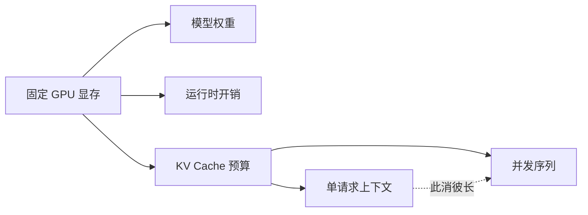

在模型和硬件固定时，通常存在以下权衡：

- 上下文更长，单请求 KV Cache 更大；
- 并发更多，总 KV Cache 更大；
- 输出越长，请求占用调度槽位越久；
- Multi-Agent 会放大并发与上下文需求。

按业务设计目标，而不是按模型宣传值配置：

| 场景 | 更应优先 |
|---|---|
| 单人长文分析 | 上下文与 TTFT |
| 多人短问答 | 并发与吞吐 |
| 代码仓库分析 | 检索、上下文和代码能力 |
| 多 Agent 调研 | 并发、工具格式稳定性和总输出预算 |
| 图片问答 | 视觉能力、图片限制和显存 |

### 8. 许可证、安全和兼容性筛选

#### 模型许可证

下载前阅读 Model Card 和 LICENSE：

- 是否允许商业使用；
- 是否限制特定用途；
- 是否要求署名或保留通知；
- 是否限制再分发或提供托管服务；
- 微调和衍生模型是否有附加条款。

“可以下载”不等于“可以用于任何产品”。

#### vLLM 兼容性

确认：

- 当前 vLLM 版本支持模型架构；
- tokenizer 和 Chat Template 完整；
- 量化格式受支持；
- 多模态处理器受支持；
- 是否需要 `--trust-remote-code`；
- 是否有已知 kernel、dtype 或驱动限制。

#### `trust_remote_code`

启用后，模型仓库中的自定义 Python 代码可能在服务器上执行。只对可信来源使用，并固定 revision、审查代码、限制运行权限。

#### 数据安全

本地部署降低了数据发送到第三方服务的需求，但不自动等于安全：

- 服务端口可能暴露到公网；
- 日志可能记录 Prompt；
- 浏览器 Memory 可能保留敏感内容；
- 工具调用可能访问外部网络；
- 模型本身可能输出不安全内容。

### 9. 三阶段模型选择法

#### 第一阶段：硬约束筛选

排除以下候选：

- 许可证不符合用途；
- 当前硬件无法承载；
- vLLM 不支持架构或量化格式；
- 不支持必要输入类型；
- 上下文不足；
- 必须联网执行不可信 remote code。

#### 第二阶段：建立 2 到 4 个候选

不要一次评测十几个模型。候选应覆盖不同取舍：

- 小模型低延迟；
- 中等模型质量与成本平衡；
- 更大模型质量上限；
- 一个量化版本用于容量对照。

#### 第三阶段：用本地任务集实测

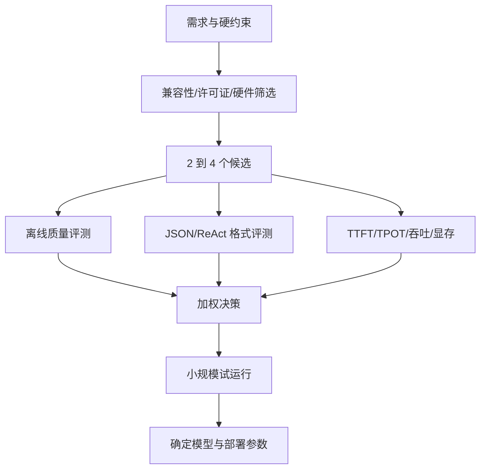

### 10. 为本工程设计评测集

通用榜单只能提供线索，本工程更关心真实工作流。

建议准备 30 到 100 条固定用例，版本化保存，但不要包含真实凭据或敏感业务数据。

| 类别 | 示例目标 | 评价 |
|---|---|---|
| 中文问答 | 清晰、准确地解释概念 | 正确性、表达 |
| 长文本摘要 | 提炼事实且不遗漏限制 | 召回、幻觉 |
| TypeScript | 修改或解释实际模块 | 可运行性 |
| JSON | 严格输出 schema | 解析成功率 |
| ReAct | 生成合法 Action Input | 协议成功率 |
| 工具选择 | GitHub 问题选择正确工具 | 路由准确率 |
| 错误恢复 | 工具失败后诚实降级 | 鲁棒性 |
| 多轮对话 | 正确利用历史且不串话 | 上下文能力 |
| 图片理解 | OCR、图表或界面描述 | 多模态质量 |
| 安全边界 | 拒绝泄漏敏感信息 | 安全性 |

#### 不只打“感觉分”

记录可量化指标：

```text
任务成功率
严格 JSON 解析成功率
ReAct 协议完成率
重复工具调用率
平均工具步数
TTFT P50/P95
TPOT P50/P95
请求吞吐
峰值显存
错误率
```

#### 一个简单的决策表

| 维度 | 权重示例 | 候选 A | 候选 B | 候选 C |
|---|---:|---:|---:|---:|
| 任务质量 | 35% |  |  |  |
| Agent 格式稳定性 | 20% |  |  |  |
| 延迟 | 15% |  |  |  |
| 吞吐 | 10% |  |  |  |
| 显存成本 | 10% |  |  |  |
| 许可证与运维 | 10% |  |  |  |

权重应由业务决定。例如离线文档分析可以降低延迟权重，交互式代码助手应提高 TTFT 权重。

### 11. 部署方式一：单 GPU 原精度

适合模型权重、KV Cache 和运行开销能在一张 GPU 中稳定容纳的情况。

```bash
vllm serve /path/to/instruct-model \
  --served-model-name local-chat \
  --host 127.0.0.1 \
  --port 8000 \
  --dtype auto \
  --max-model-len 8192 \
  --gpu-memory-utilization 0.85
```

教学阶段先监听 `127.0.0.1`，避免无意暴露服务。远程客户端需要访问时，应通过受控内网地址或带鉴权的反向代理开放。

启动策略：

1. 使用较保守的 `max-model-len`；
2. 使用 `dtype auto` 建立基线；
3. 先验证文本单请求；
4. 再提高上下文和并发；
5. 最后验证多 Agent 负载。

### 12. 部署方式二：多 GPU Tensor Parallel

当单卡无法容纳模型或需要更多 KV Cache 空间时，可以使用多卡：

```bash
vllm serve /path/to/instruct-model \
  --served-model-name local-chat \
  --host 127.0.0.1 \
  --port 8000 \
  --tensor-parallel-size 4 \
  --dtype bfloat16 \
  --max-model-len 16384 \
  --gpu-memory-utilization 0.85
```

需要确认：

- GPU 数量与 `tensor-parallel-size` 一致；
- 每张卡状态正常；
- GPU 间拓扑和带宽满足需要；
- 模型的 attention head 等结构可以被该并行度合理切分；
- 多卡通信库和驱动环境正确。

多卡的首要价值经常是“装下更大模型并提供足够缓存”，不应默认吞吐或延迟按 GPU 数量线性改善。

### 13. 部署方式三：量化模型

量化参数因格式和版本而异。以下仅表示命令结构：

```bash
vllm serve /path/to/quantized-model \
  --served-model-name local-chat-quantized \
  --host 127.0.0.1 \
  --port 8000 \
  --quantization FORMAT_NAME \
  --max-model-len 8192
```

将 `FORMAT_NAME` 替换为当前 vLLM 和模型共同支持的格式。有些预量化模型可以从模型配置中自动识别格式，不需要显式 `--quantization`。应以模型发布说明和当前 `vllm serve --help` 为准。

上线前必须重新执行质量评测，特别关注：

- JSON 格式错误；
- ReAct 标签缺失；
- Action Input 无法解析；
- 代码精度下降；
- 长上下文事实遗漏；
- 多模态质量变化。

### 14. 部署方式四：Docker

Docker 适合固定运行环境和简化机器迁移。使用官方镜像时应固定经过验证的版本，不要在生产环境无条件跟随 `latest`。

```bash
docker run --rm \
  --gpus all \
  --ipc=host \
  -p 127.0.0.1:8000:8000 \
  -v /path/to/model:/models/local-chat:ro \
  vllm/vllm-openai:TESTED_VERSION \
  --model /models/local-chat \
  --served-model-name local-chat \
  --host 0.0.0.0 \
  --port 8000
```

将 `TESTED_VERSION` 替换为已经验证的镜像版本。这里容器内监听 `0.0.0.0`，但宿主机端口只绑定到 `127.0.0.1`。

Docker 额外检查：

- NVIDIA Container Toolkit；
- `--ipc=host` 或足够的共享内存；
- 模型目录只读挂载；
- 容器日志轮转；
- 镜像版本和 digest；
- 容器用户权限；
- GPU device 可见性。

### 15. 部署方式五：远程 GPU，本地 Web

开发机没有合适 GPU 时，可以采用：

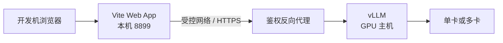

本机启动 Web：

```bash
cd web
VITE_VLLM_BASE_URL=https://your-model-domain.example/v1 npm run dev
```

不要把未鉴权的 vLLM 端口直接暴露到公网。至少考虑：

- TLS；
- 身份认证；
- 请求大小限制；
- 并发和速率限制；
- CORS allowlist；
- 访问日志脱敏；
- 网络工具出口控制。

### 16. 如果只有 CPU 或 Apple Silicon

vLLM 的主流部署路径以受支持的加速硬件为目标。纯 CPU 或 Apple Silicon 本地开发常使用其他推理引擎。

由于本工程调用的是 OpenAI 兼容 API，只要替代引擎提供兼容的：

```text
GET  /v1/models
POST /v1/chat/completions
```

就可以进行基础连接。但必须重新验证：

- SSE chunk 格式；
- 多模态 content 格式；
- stop 参数；
- Chat Template；
- 最大上下文；
- 并发和取消行为。

“API 路径相同”不代表所有边界行为完全一致。

### 17. 从开发命令到生产服务

开发环境中的一个 shell 命令，不具备生产服务所需的生命周期管理。

生产部署至少需要：

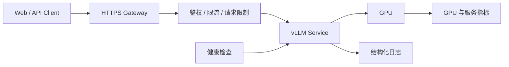

需要补齐：

- systemd、容器编排或其他进程守护；
- 崩溃自动重启，但避免无限快速重启；
- 启动超时和优雅停止；
- 模型预热；
- 健康检查；
- 日志采集和脱敏；
- GPU、队列、延迟和错误率监控；
- 版本回滚；
- 模型权重校验；
- 访问控制和 TLS。

#### 健康检查分层

| 层级 | 检查 | 能发现什么 |
|---|---|---|
| 进程 | PID 是否存在 | 进程已退出 |
| 端口 | 8000 是否监听 | 网络服务未启动 |
| API | `/v1/models` | HTTP 路由和模型注册 |
| 推理 | 最小 chat completion | 模型能否真正生成 |
| 业务 | ReAct/图片 smoke test | 目标能力是否正常 |

只检查端口不够。端口存在时，模型可能仍在加载或推理已经失败。

### 18. 使用本仓库的 Smoke Test

[`test_vllm_server.py`](./test_vllm_server.py) 只使用 Python 标准库，可以验证模型列表、文本聊天和图片输入。

文本与视觉：

```bash
VLLM_BASE_URL=http://127.0.0.1:8000/v1 \
python3 test_vllm_server.py
```

仅文本：

```bash
VLLM_BASE_URL=http://127.0.0.1:8000/v1 \
python3 test_vllm_server.py --skip-vision
```

指定模型和超时：

```bash
python3 test_vllm_server.py \
  --base-url http://127.0.0.1:8000/v1 \
  --model local-chat \
  --timeout 120
```

验证顺序：

1. `/models` 返回至少一个模型；
2. 使用返回的 `id` 发送文本请求；
3. 文本成功后再发送图片；
4. 记录耗时和完整错误；
5. 最后再接入 Web 和 Agent。

### 19. 容量调优顺序

一次只调整一类变量：

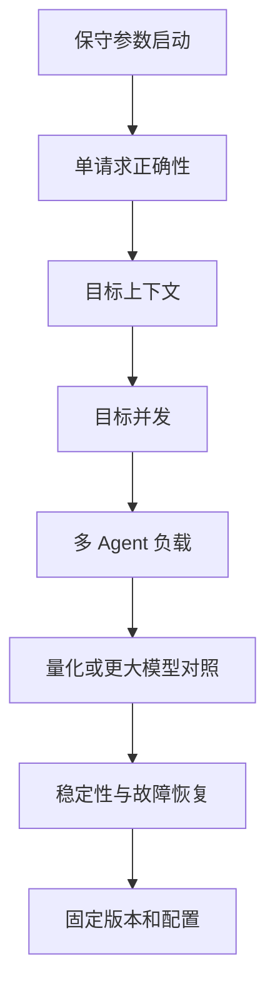

建议记录每次实验：

```text
模型与 revision
vLLM / PyTorch / 驱动版本
GPU 型号和数量
dtype 与量化格式
tensor parallel size
max model len
gpu memory utilization
输入/输出 token
并发
TTFT / TPOT / throughput
峰值显存
错误和日志
```

若不记录版本和负载，两个模型的性能数据没有可比性。

### 20. 典型选择示例

#### 场景 A：个人中文开发助手

优先级：

1. 中文和代码质量；
2. 低 TTFT；
3. 一张 GPU 可承载；
4. ReAct 和 JSON 稳定；
5. 8K 到 32K 的实际上下文。

策略：先从能以原精度稳定运行的中小 Instruct/Code 模型建立基线，再比较更大或量化候选。

#### 场景 B：本地多 Agent 调研

优先级：

1. 工具选择和协议格式；
2. 3 个以上并发请求的稳定性；
3. 足够 KV Cache；
4. 网络失败后的降级质量；
5. 总吞吐。

策略：不能只用单轮问答榜单。必须运行 `@researcher`、`@coder`、`@reviewer` 并发测试。

#### 场景 C：图片与文档问答

优先级：

1. VLM 架构兼容；
2. OCR、图表和界面理解；
3. 图片尺寸与数量；
4. 视觉编码延迟；
5. 文本回答质量。

策略：使用真实图片样本评测，不要用一张简单图片证明“视觉能力可用”。

#### 场景 D：低显存设备

优先级：

1. 服务能稳定运行；
2. 小模型或受支持量化；
3. 保守上下文；
4. 低并发；
5. 必要时更换推理引擎或使用远程 GPU。

策略：不要用极端 offload 强行运行远超硬件能力的模型并期待交互式体验。

### 21. 最终决策检查表

#### 模型

- [ ] 是 Instruct/Chat，而不是误选 Base；
- [ ] 目标语言、代码或视觉能力经过本地测试；
- [ ] ReAct 和 JSON 格式成功率满足要求；
- [ ] 上下文长度满足真实任务；
- [ ] 模型许可证允许目标用途；
- [ ] Chat Template 和 tokenizer 完整；
- [ ] vLLM 支持当前架构和量化格式；
- [ ] remote code 风险已评估。

#### 硬件

- [ ] 权重不是刚好塞满显存；
- [ ] KV Cache 能支持目标上下文和并发；
- [ ] 系统内存和磁盘足够；
- [ ] 多卡互联和并行度经过验证；
- [ ] 驱动、CUDA、PyTorch 和 vLLM 版本匹配；
- [ ] 功耗和散热能够承受持续负载。

#### 部署

- [ ] 固定模型 revision 和 vLLM 版本；
- [ ] 保存可复现的启动参数；
- [ ] `/models`、文本、流式和视觉 smoke test 通过；
- [ ] 有进程守护、日志和监控；
- [ ] 对外服务具备 TLS、鉴权、限流和 CORS 限制；
- [ ] Prompt 和日志中的敏感信息得到保护；
- [ ] 有升级、回滚和故障恢复方案。

#### 本工程

- [ ] `VITE_VLLM_BASE_URL` 指向正确的 `/v1`；
- [ ] 页面模型名来自 `/models`；
- [ ] 普通聊天流式正常；
- [ ] Agent 可完成至少一个工具调用；
- [ ] 三个子 Agent 并发时服务稳定；
- [ ] Memory 后台巩固不会压垮主请求；
- [ ] `npm run build` 通过。

---

## 第 1 章：跑通模型与 Web 工程

### 学习目标

- 理解浏览器、Vite 应用和 vLLM 的部署关系；
- 验证 OpenAI 兼容模型服务；
- 启动开发服务器并完成第一次聊天。

### 系统拓扑

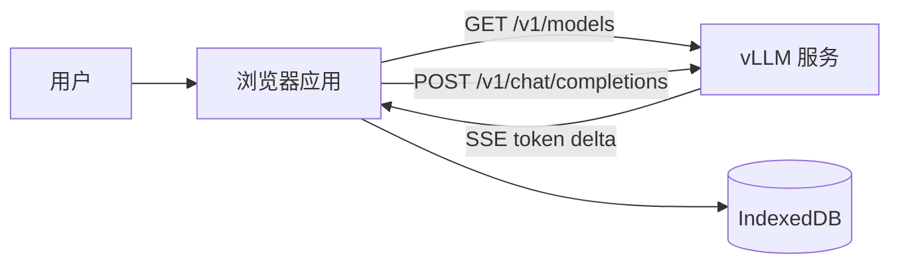

这里没有额外业务后端。浏览器直接请求 vLLM，因此需要确保模型服务允许当前 Web Origin 的 CORS 请求。

### 环境准备

- Node.js 18 或更高版本；
- npm；
- 一个可访问的 OpenAI 兼容 vLLM 服务；
- 支持 IndexedDB、Web Worker 和 WASM 的现代浏览器。

### 启动项目

```bash
cd web
npm install
npm run dev
```

默认 Web 地址为 `http://127.0.0.1:8899/`，默认模型地址为 `http://127.0.0.1:8000/v1`。

也可以在启动时指定服务地址：

```bash
VITE_VLLM_BASE_URL=http://your-vllm-host:8000/v1 npm run dev
```

验证模型服务：

```bash
curl -s "${VLLM_BASE_URL:-http://127.0.0.1:8000/v1}/models"
```

### 源码入口

- [`web/src/config.ts`](./web/src/config.ts)：默认地址、token 和步数限制；
- [`web/vite.config.ts`](./web/vite.config.ts)：开发服务器与代理；
- [`web/src/main.ts`](./web/src/main.ts)：应用启动和依赖装配。

### 课堂实验

1. 启动 vLLM 和 Vite。
2. 打开页面，确认状态变为已连接。
3. 从模型下拉框中选择模型。
4. 关闭 Agent 模式，发送“只回复连接成功”。
5. 打开浏览器 Network 面板，找到 `/models` 和 `/chat/completions`。

### 验收标准

- 页面能获取模型列表；
- 回答以流式方式出现；
- Network 面板中能看到 `stream: true`；
- 停止按钮能够中断生成。

### 思考题

1. 浏览器直连 vLLM 相比增加业务后端，优势和风险分别是什么？
2. 为什么生产环境通常不应把带权限的模型密钥直接放进浏览器？

---

## 第 2 章：理解工程分层与 Composition Root

### 学习目标

- 识别 UI、领域逻辑和基础设施层；
- 理解 `main.ts` 为什么是唯一 Composition Root；
- 学会用依赖方向控制复杂度。

### 目录结构

```text
web/src/
├── api/          # OpenAI 协议与 SSE
├── agent/        # 单 Agent ReAct Runtime
├── agents/       # Agent Profile、mention 和 Scheduler
├── memory/       # Memory 检索、向量和巩固
├── sessions/     # 会话历史
├── skills/       # Skill Manifest、匹配和持久化
├── storage/      # IndexedDB 基础设施
├── ui/           # DOM 组件
├── styles/       # tokens、base、layout、components
└── main.ts       # 状态、装配和跨模块编排
```

### 分层关系

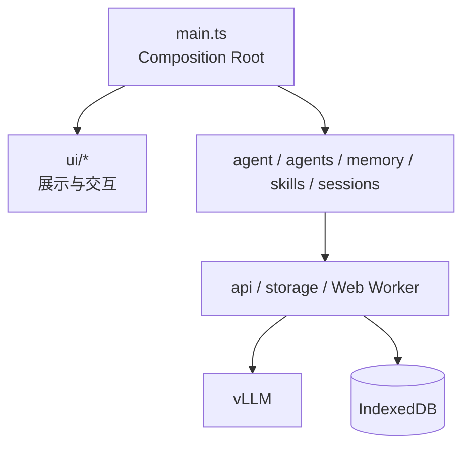

关键依赖规则：

1. UI 不直接请求模型或操作 IndexedDB；
2. `agent/runner.ts` 不操作 DOM，只发出 `AgentEvent`；
3. Memory 和 Skills 不依赖 UI；
4. API 层只处理协议；
5. `main.ts` 负责组装对象、维护页面状态和连接事件。

### 为什么不使用大型前端框架

本项目用 `create*() -> { el, update }` 的工厂函数构造组件。这使课程可以直接观察状态、事件和 DOM 的关系，而不被框架生命周期隐藏。真实大型项目也可以把领域层原样迁移到 React、Vue 或 Svelte。

### 课堂实验

绘制一次“点击发送”调用链，至少标出：

```text
Composer -> main.ts -> streamChat -> readContentDeltas -> ChatView
```

然后尝试回答：

- 哪一层知道当前选择的模型？
- 哪一层知道 SSE 的 `data:` 格式？
- 哪一层负责更新 DOM？

### 验收标准

学习者能解释为什么不能在 `AgentTaskScheduler` 中直接操作任务面板 DOM。

---

## 第 3 章：OpenAI 兼容 API 与 SSE 流式输出

### 学习目标

- 构造 OpenAI 兼容请求；
- 正确处理跨 chunk 的 SSE 行；
- 使用 `AbortSignal` 中止请求。

### 核心接口

[`web/src/api/openai.ts`](./web/src/api/openai.ts) 提供两个边界函数：

```ts
listModels(baseUrl, signal): Promise<string[]>
streamChat(baseUrl, options): Promise<string>
```

`streamChat()` 发送：

```json
{
  "model": "your-model",
  "messages": [],
  "stream": true,
  "temperature": 0.3,
  "max_tokens": 1500
}
```

### SSE 到底是什么

SSE 全称 **Server-Sent Events**，中文通常译为“服务器发送事件”。它是一种建立在 HTTP 之上的单向流式传输机制：

1. 客户端发起一个 HTTP 请求；
2. 服务端返回响应头，但暂时不结束响应；
3. 服务端有新数据时继续向这个响应写入事件；
4. 客户端边接收边处理；
5. 服务端完成、客户端取消或网络断开后，连接结束。

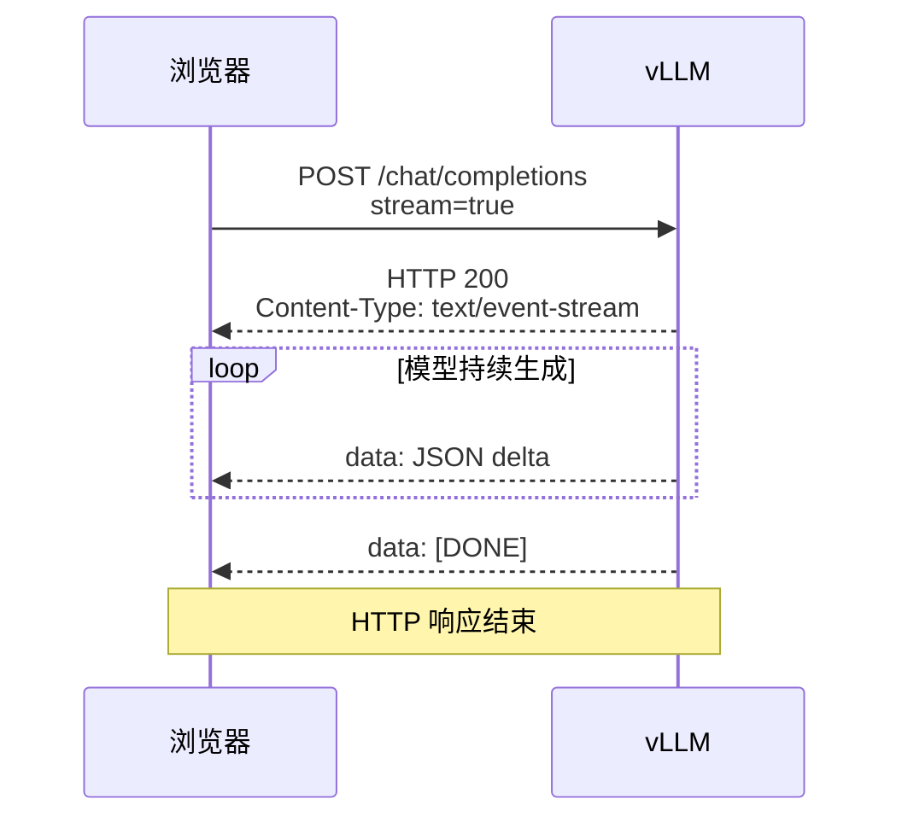

它的关键点是：**一次 HTTP 请求，对应一个持续返回的数据流**。不是每生成一个字就重新发起一次请求。

### SSE 报文长什么样

标准 SSE 使用 UTF-8 文本，每个事件由若干字段行组成，空行表示一个事件结束：

```text
event: message
id: 42
retry: 3000
data: 第一行数据
data: 第二行数据

```

常见字段：

| 字段 | 含义 |
|---|---|
| `data:` | 事件数据；多行 `data:` 属于同一事件时应以换行拼接 |
| `event:` | 可选事件类型，默认是 `message` |
| `id:` | 可选事件 ID，可用于断线恢复 |
| `retry:` | 可选重连等待时间 |
| `:` 开头 | 注释或 heartbeat，不交给业务处理 |
| 空行 | 当前事件结束 |

vLLM 的 OpenAI 兼容流通常使用简化形式：

```text
data: {"choices":[{"delta":{"content":"你"}}]}

data: {"choices":[{"delta":{"content":"好"}}]}

data: [DONE]

```

其中：

- `data:` 是 SSE 标准字段；
- JSON 是 OpenAI 兼容的 Chat Completion Chunk；
- `delta.content` 是本次增量文本；
- `[DONE]` 是 OpenAI 流式协议的结束约定，不是 SSE 标准本身；
- 实际响应通常还包含 `id`、`model`、`finish_reason`、usage 等字段。

### 为什么聊天适合 SSE

大模型生成天然是从前到后逐步产生 token。若等待全部生成完成再返回：

- 用户长时间看不到任何内容；
- 无法尽早阅读答案；
- 很难展示 Agent 当前步骤；
- 中途停止的体验较差。

SSE 允许应用在完整答案尚未完成时展示已有增量，从而改善感知延迟。

SSE 不会让模型本身计算得更快。它主要把“等待完整答案的时间”转换为“尽早看到部分答案”。

### 为什么本工程不用 WebSocket

| 方案 | 通信方向 | 请求方式 | 适合场景 |
|---|---|---|---|
| 普通 JSON HTTP | 请求后一次性响应 | GET/POST | 短请求、无需流式 |
| SSE | 主要是服务端持续推送 | HTTP | 日志、通知、LLM 流式回答 |
| WebSocket | 客户端和服务端双向持续通信 | 升级协议 | 游戏、协作编辑、双向实时控制 |

本工程的聊天链路是：

1. 浏览器通过 POST 一次性发送 messages；
2. vLLM 单向持续返回生成结果；
3. 用户需要停止时取消 HTTP 请求。

因此不需要建立完整的双向 WebSocket 会话。SSE 还能继续使用常规 HTTP 状态码、代理和抓包工具。

### 为什么不用浏览器原生 `EventSource`

浏览器提供了 `EventSource` API，但它主要面向 GET 请求，不方便发送本工程需要的 POST JSON、模型参数和自定义请求控制。

本工程采用：

```text
fetch(POST)
  -> Response.body
  -> ReadableStream<Uint8Array>
  -> TextDecoder
  -> SSE 行解析
  -> delta.content
```

这样可以：

- 使用 POST 请求体；
- 设置 `Content-Type: application/json`；
- 传入 `AbortSignal`；
- 检查 HTTP 状态码；
- 自己控制 OpenAI chunk 的解析逻辑。

### 四个不能混淆的“数据块”

| 层次 | 是什么 | 是否一一对应 |
|---|---|---|
| 模型 token | 模型内部生成单位 | 不保证等于一个汉字或单词 |
| OpenAI delta | API 一次增量 JSON 中的 content | 可能包含零个、一个或多个 token 的文本 |
| SSE event | 一个以空行结束的事件 | 通常承载一个 chunk，但由协议实现决定 |
| 网络 chunk | 浏览器底层一次读到的字节 | 可能是半个事件，也可能包含多个事件 |

例如，模型逻辑上生成了“你好”，网络可能这样到达：

```text
网络 chunk 1:
data: {"choices":[{"delta":{"cont

网络 chunk 2:
ent":"你"}}]}\n\ndata: {"choices":[

网络 chunk 3:
{"delta":{"content":"好"}}]}\n\n
```

因此不能对每个 `reader.read()` 的结果直接 `JSON.parse()`。

### SSE 为什么需要缓冲区

一个网络 chunk 不等于一个完整 SSE event。JSON 可能在任意字节位置被拆开：

```text
chunk 1: data: {"choices":[{"delta":{"cont
chunk 2: ent":"你"}}]}
```

[`web/src/api/stream.ts`](./web/src/api/stream.ts) 用 `TextDecoder` 和 `buf` 保存未完成行，只对完整 `data:` 行调用 `JSON.parse()`。

核心过程可以简化为：

```ts
const reader = body.getReader();
const decoder = new TextDecoder();
let buffer = "";

while (true) {
  const { value, done } = await reader.read();
  if (done) break;

  buffer += decoder.decode(value, { stream: true });
  const lines = buffer.split("\n");
  buffer = lines.pop() ?? "";

  for (const line of lines) {
    // 这里只处理已经完整到达的行
  }
}
```

`TextDecoder` 的 `{ stream: true }` 同样重要。一个 UTF-8 中文字符可能被拆到两个字节 chunk 中，流式 decoder 会保留未完成字节，避免乱码。

当前 [`parseSSELine()`](./web/src/api/stream.ts) 是针对 vLLM/OpenAI 常见格式的轻量解析器：

- 只处理 `data:` 行；
- 忽略 heartbeat 和非数据行；
- 忽略 `[DONE]`；
- JSON 无效时跳过；
- 从 `choices[0].delta.content` 提取文字。

它不是通用完整 SSE 实现。若未来服务使用多行 `data:`、`event:`、`id:` 或断线重连语义，应升级为按“空行事件边界”解析，而不是继续只按单行处理。

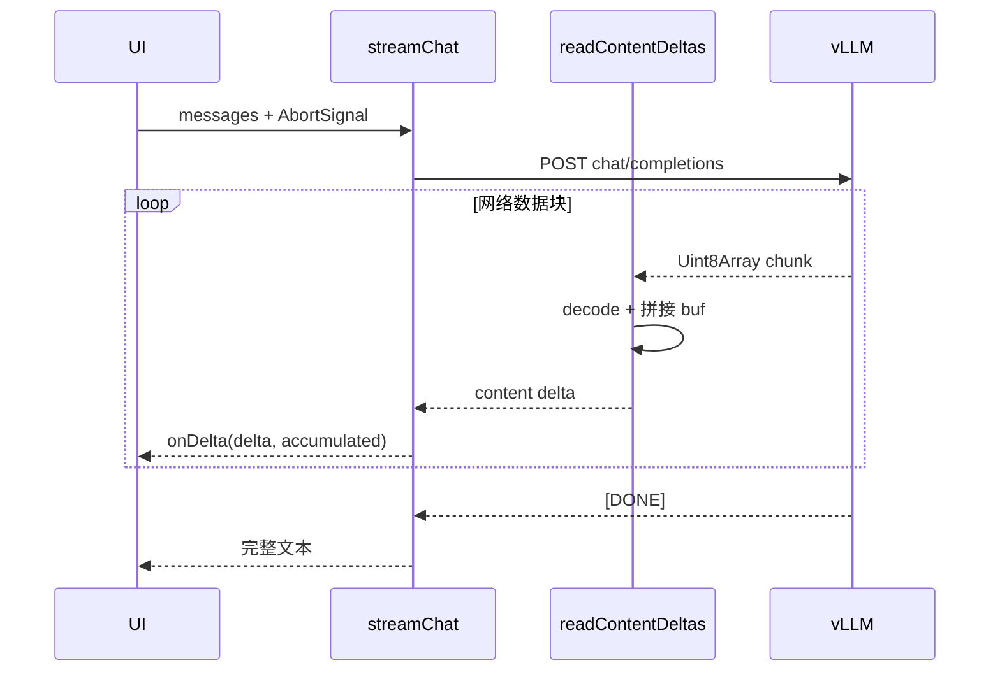

### 缓冲和代理为什么会让“流式”看起来不流式

即使 vLLM 正在逐步写入，以下环节也可能缓存数据：

- 命令行客户端的 stdout 缓冲；
- 反向代理的响应缓冲；
- 压缩中间件等待更多数据；
- 浏览器或网络栈合并较小数据包；
- UI 为降低重绘频率主动批量更新。

排查顺序：

1. 使用 `curl -N` 直接请求 vLLM；
2. 检查响应 `Content-Type` 是否为 `text/event-stream`；
3. 绕过反向代理对比；
4. 检查代理是否启用了 response buffering；
5. 在 Network 面板观察响应到达时间；
6. 区分“服务未及时发送”和“UI 未及时渲染”。

### SSE 的错误和结束

- HTTP 4xx/5xx 通常发生在流开始之前，本工程先检查 `res.ok`；
- 流开始后的错误无法再改写为新的 HTTP 状态码，通常表现为连接断开或协议内错误；
- `[DONE]` 表示 OpenAI 数据流正常结束；
- `ReadableStream` 的 `done` 表示底层响应结束；
- 用户停止时，`AbortController.abort()` 使 Fetch 抛出 `AbortError`；
- 客户端取消后，服务端何时释放推理资源还取决于代理和服务端断连检测。

### 课堂实验

1. 用 `curl` 比较 `stream: false` 与 `stream: true`。
2. 不加 `-N` 执行一次，再使用 `curl -N`，比较输出时机。
3. 在 `parseSSELine()` 前后增加临时断点。
4. 观察 heartbeat、`[DONE]` 和正常 delta。
5. 打印每次 `reader.read()` 的字节长度，证明网络 chunk 不等于 SSE event。
6. 将浏览器网络切换为慢速模式，确认中文字符不会乱码。
7. 生成过程中点击停止，确认错误类型为 `AbortError`。

### 扩展练习

为 SSE parser 编写单元测试，至少覆盖：

- 非 `data:` 行；
- `[DONE]`；
- 非法 JSON；
- 一个 chunk 中多行；
- JSON 被两个 chunk 拆分。
- 一个 UTF-8 中文字符的字节被两个 chunk 拆分；
- 多个 SSE event 在一个网络 chunk 中到达。

### 本章验收问题

1. SSE 全称是什么，它建立在哪个协议上？
2. `data:` 和 `[DONE]` 哪个属于 SSE 标准，哪个属于 OpenAI 约定？
3. 为什么一个网络 chunk 不能直接视为一个模型 token？
4. 为什么本工程用 Fetch，而不是直接使用 `EventSource`？
5. SSE 与 WebSocket 的通信方向有什么不同？
6. 为什么服务端正常流式发送，页面仍可能一次出现一大段文字？

---

## 第 4 章：多模态消息与无框架 UI

### 学习目标

- 理解 OpenAI 多模态 message content；
- 管理附件预览和输入状态；
- 将流式数据映射为可更新组件。

### UI 组件

| 组件 | 职责 |
|---|---|
| [`Header.ts`](./web/src/ui/Header.ts) | 地址、模型、会话、Agent 模式和管理入口 |
| [`Composer.ts`](./web/src/ui/Composer.ts) | 文本、图片、mention 菜单和提交 |
| [`ChatView.ts`](./web/src/ui/ChatView.ts) | 消息列表与空状态 |
| [`Message.ts`](./web/src/ui/Message.ts) | 普通消息、推理块和子 Agent 结果 |
| [`AgentTrace.ts`](./web/src/ui/AgentTrace.ts) | ReAct 步骤展示 |

普通聊天支持文字和图片。图片以 Data URL 进入本轮消息，但 Agent 模式会禁用附件，避免把多模态输入与当前文本 ReAct 协议混在一起。

### 状态流

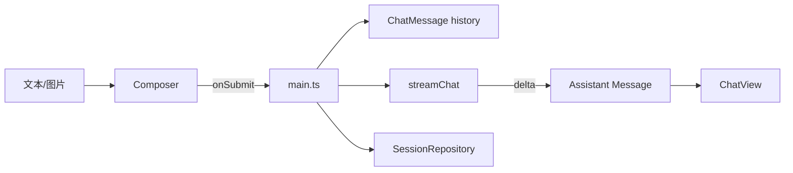

### 课堂实验

1. 在普通模式发送一张图片并提问；
2. 观察请求体中的 `text` 与 `image_url` content part；
3. 对比普通 Assistant 消息和子 Agent 消息的 CSS class；
4. 修改 [`tokens.css`](./web/src/styles/tokens.css) 中的颜色变量，观察整个界面如何同步变化。

### 验收标准

- 图片可预览、移除和发送；
- 流式消息只更新当前 Assistant 占位节点；
- 切换 Agent 模式后图片入口被禁用。

---

## 第 5 章：从聊天升级为 ReAct Agent

### 学习目标

- 理解 ReAct 的 Thought、Action、Observation、Final Answer；
- 实现模型与工具之间的多步循环；
- 将 Runtime 状态建模为事件。

### 文本协议

当前模型服务未依赖原生 tool calling，因此 Runtime 使用严格文本协议：

```text
Thought: 分析下一步
Action: web_search
Action Input: {"query":"vLLM latest release"}
```

Runtime 执行工具后追加：

```text
Observation: 工具返回结果
```

模型最终输出：

```text
Thought: 已获得足够信息
Final Answer: 面向用户的完整答案
```

### ReAct 循环

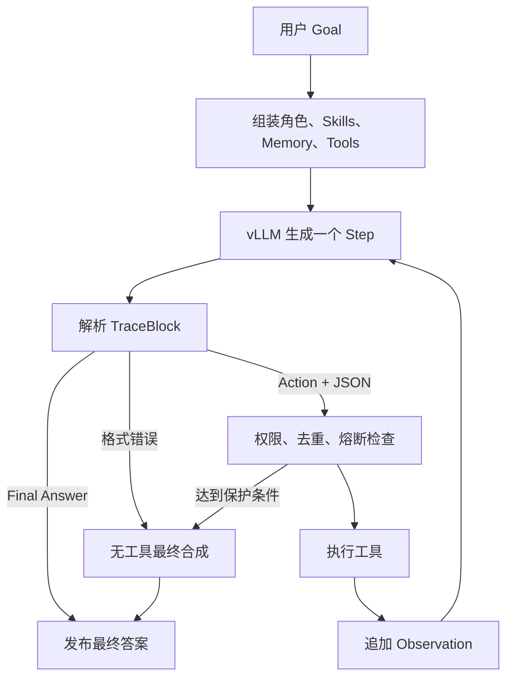

### 事件而不是 DOM

[`web/src/agent/runner.ts`](./web/src/agent/runner.ts) 通过 discriminated union 输出：

```ts
type AgentEvent =
  | { type: "context"; memories; skills; tools }
  | { type: "step-start"; step }
  | { type: "stream"; step; trace; preambles }
  | { type: "observation"; step; trace; preambles; html? }
  | { type: "final"; answer }
  | { type: "error"; message; aborted? }
  | { type: "max-steps" };
```

这使同一个 Runner 可以被主对话、子 Agent、测试代码或未来服务端任务执行器复用。

### 课堂实验

使用 Agent 模式输入：

```text
计算 1 到 100 的平方和，并说明计算方法
```

观察：

1. 激活了哪些 Skills；
2. Runtime 暴露了哪些工具；
3. 模型是否选择 `run_js`；
4. Observation 如何进入下一轮 prompt；
5. Final Answer 是否引用了计算结果。

### 思考题

1. 为什么不能让模型自己编造 Observation？
2. 为什么每轮只允许一个 Action？
3. 为什么 `maxSteps` 同时需要 prompt 约束和代码上限？

---

## 第 6 章：Tools、能力边界与可靠性

### 学习目标

- 设计统一 Tool Definition；
- 理解工具权限必须在执行期再次校验；
- 处理超时、重复调用和网络故障。

### 内置工具

| 工具 | 用途 | 类型 |
|---|---|---|
| `web_search` | 网页搜索，支持降级链路 | 网络 |
| `github_search` | GitHub 仓库、tag 和 release | 网络 |
| `fetch_url` | 抓取网页正文 | 网络 |
| `run_js` | 确定性计算和数据转换 | 本地 |
| `get_time` | 当前时间与时区 | 本地 |
| `render_mermaid` | 生成 Mermaid 图 | 本地/UI |
| `memory_search` | 主动召回 Memory | 本地存储 |
| `memory_save` | 保存稳定事实 | 本地存储 |

实现位于 [`web/src/agent/tools.ts`](./web/src/agent/tools.ts) 和 [`web/src/memory/tools.ts`](./web/src/memory/tools.ts)。

### 可靠性保护

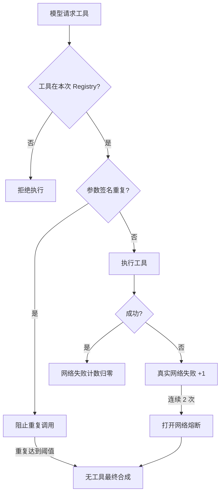

这里的关键是“真实网络失败”。本地 duplicate guard 拦截不应错误增加网络失败计数。

### 课堂实验

新增一个本地工具 `string_stats`：

```ts
{
  name: "string_stats",
  desc: "统计字符串的字符数、单词数和行数",
  args: { text: "string" },
  async run(args) {
    // 返回 { text: JSON.stringify(...) }
  }
}
```

要求：

- 校验 `args.text`；
- 不访问网络；
- 返回稳定 JSON；
- 只在指定 Skill 激活时可见。

### 验收标准

- 未授权时，工具既不出现在 prompt 中，也无法执行；
- 同参数重复调用会被阻止；
- Abort 后不会继续发布结果；
- 工具错误不会直接成为面向用户的 Final Answer。

---

## 第 7 章：Skills 与 Capability-based 工具门控

### 学习目标

- 区分 Skill、Tool 和 Agent Profile；
- 根据用户 Goal 激活 Skills；
- 用代码生成本轮唯一可执行的工具集合。

### 三个概念的边界

| 概念 | 回答的问题 |
|---|---|
| Tool | Runtime 能执行什么原子操作？ |
| Skill | 某类任务应遵循什么规范，允许哪些 Tools？ |
| Agent Profile | 谁来完成任务，使用什么角色 Prompt、模型和 Skills？ |

Skill Manifest：

```ts
type SkillManifest = {
  id: string;
  name: string;
  description: string;
  version: string;
  triggers: string[];
  prompt: string;
  allowedTools: string[];
  enabled: boolean;
  always?: boolean;
};
```

### 激活与门控

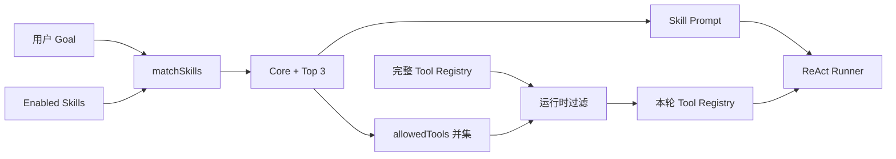

[`web/src/skills/matcher.ts`](./web/src/skills/matcher.ts) 负责匹配与权限并集，Runner 只接收过滤后的 Registry。

### 课堂实验

创建 `Text Quality` Skill：

- triggers：`润色`、`改写`、`校对`；
- prompt：要求保留原意、列出修改理由；
- allowedTools：仅允许 `string_stats`；
- 验证普通搜索任务不会激活该 Skill。

### 思考题

为什么只在 Prompt 中写“禁止使用某工具”不够安全？

---

## 第 8 章：Local Memory OS

### 学习目标

- 区分 preference、fact 和 episode；
- 理解语义、关键词和时效混合检索；
- 实现后台巩固、去重和时序版本。

### Memory 数据模型

```ts
type MemoryRecord = {
  kind: "preference" | "fact" | "episode";
  scope: "user" | "project" | "agent";
  namespace: string;
  title: string;
  content: string;
  importance: number;
  confidence: number;
  validFrom: string;
  validTo?: string;
  supersedes?: string;
  embedding?: number[];
  accessCount: number;
};
```

### 前台检索与后台巩固

```mermaid
flowchart TB
    Turn[一次用户/Agent 对话]

    subgraph Foreground[前台回答路径]
        Query[用户 Goal] --> Embed[本地 E5 embedding]
        Query --> Lexical[关键词分词]
        Embed --> Rank[混合排序]
        Lexical --> Rank
        Support[重要度/置信度/时效/访问频率] --> Rank
        Rank --> Context[Top-K Memory Context]
    end

    subgraph Background[后台巩固路径]
        Answer[回答完成] --> Extract[vLLM 抽取稳定事实]
        Extract --> Filter[敏感/临时信息过滤]
        Filter --> Dedup[精确与语义去重]
        Dedup --> Temporal[强化或 supersede]
        Temporal --> IDB[(IndexedDB)]
    end

    Turn --> Query
    Turn --> Answer
```

语义模型可用时：

```text
score = semantic * 0.58
      + lexical  * 0.27
      + support  * 0.15
```

模型不可用时自动退化：

```text
score = lexical * 0.78 + support * 0.22
```

### 为什么使用 Web Worker

`Xenova/multilingual-e5-small` 通过 Transformers.js 和 ONNX/WASM 在浏览器运行。embedding 计算放在 [`embedding.worker.ts`](./web/src/memory/embedding.worker.ts)，避免阻塞输入和流式渲染。

### 时序事实

如果用户先说“项目使用模型 A”，后来纠正为“项目改用模型 B”：

1. 旧记录保留，但写入 `validTo`；
2. 新记录写入 `validFrom`；
3. 新记录的 `supersedes` 指向旧记录；
4. 默认检索只返回当前有效事实。

这比直接覆盖更适合审计和历史解释。

### 课堂实验

1. 新建会话并输入“请记住，我偏好中文回答”；
2. 打开 Memory 面板确认生成 `preference`；
3. 提问“我偏好什么语言”，观察 Memory Context；
4. 将偏好修正为英文，检查旧记录是否失效；
5. 加载本地语义模型并重建向量；
6. 用不同措辞检索同一偏好，比较语义模型前后的结果。

### 安全边界

Memory 不应保存：

- 密码、token、私钥；
- 一次性验证码；
- 临时计算结果；
- 整段网页抓取内容；
- 公开新闻等快速过期事实。

深入设计见 [`MEMORY_ARCHITECTURE.md`](./MEMORY_ARCHITECTURE.md)。

---

## 第 9 章：Sessions、IndexedDB 与数据隔离

### 学习目标

- 使用版本化 IndexedDB；
- 保存并恢复聊天历史；
- 防止异步任务跨会话串写。

数据库 `vllm-agent` 当前包含：

| Store | 内容 |
|---|---|
| `memories` | Memory 与 embedding |
| `skills` | 内置覆盖和自定义 Skills |
| `sessions` | 会话元数据与聊天历史 |
| `agentProfiles` | 内置覆盖和自定义角色 |

### 会话 namespace

```text
session/{sessionId}/{scope}
```

```mermaid
flowchart TD
    User[单个用户]
    User --> S1[Session A]
    User --> S2[Session B]
    S1 --> M1[user/project/agent Memory]
    S2 --> M2[user/project/agent Memory]
    User --> Shared[共享 Skills 与 Agent Profiles]
```

关键规则：

- Memory 的查询、统计、去重和清空都限制在当前 namespace；
- Skills 和 Agent Profiles 跨会话共享；
- 子 Agent 提交时捕获 `sessionId`；
- 即使用户切换会话，任务结果也写回原会话；
- IndexedDB 升级必须在 `onupgradeneeded` 中创建 store 和 index。

### 课堂实验

1. 会话 A 保存一个偏好；
2. 新建会话 B，确认无法召回 A 的 Memory；
3. 切回 A，确认历史聊天和 Memory 恢复；
4. 在 A 启动子 Agent，立刻切到 B；
5. 任务结束后切回 A，确认结果没有出现在 B。

---

## 第 10 章：`@角色` 与多 Agent Scheduler

### 学习目标

- 设计 Agent Profile；
- 解析安全、明确的路由 mention；
- 实现有界并发、排队、取消和进度订阅。

### Agent Profile

一个 Profile 包含：

- `name`、`displayName` 和 `aliases`；
- `rolePrompt`；
- 可选模型；
- `skillIds` 与 `allowedTools`；
- `maxSteps`；
- enabled 和 builtin 状态。

内置角色位于 [`web/src/agents/builtins.ts`](./web/src/agents/builtins.ts)：

- `@researcher`：网页、GitHub 和技术资料调研；
- `@coder`：代码分析、计算和实现方案；
- `@reviewer`：风险、遗漏和质量审查。

### Mention 解析

[`mention-parser.ts`](./web/src/agents/mention-parser.ts) 只解析消息开头的 `@` 或 `＠`，支持：

```text
@researcher 调研 vLLM
@研究员：整理最新资料
＠代码员 修复这个问题
```

正文中间的 `@` 不触发任务，避免邮件地址和引用文本意外派发 Agent。

### Scheduler 状态机

```mermaid
stateDiagram-v2
    [*] --> queued: submit
    queued --> running: 并发槽位可用
    queued --> cancelled: 取消排队任务
    running --> cancelling: 用户停止
    cancelling --> cancelled: Abort 完成
    running --> completed: 返回结果
    running --> failed: 抛出异常
    completed --> [*]: remove
    failed --> [*]: remove
    cancelled --> [*]: remove
```

### 并发模型

```mermaid
flowchart LR
    Input[连续 @角色 任务] --> Queue[Task Queue]
    Queue --> Limit{active < 3?}
    Limit --> A[Runner A<br/>AbortController A]
    Limit --> B[Runner B<br/>AbortController B]
    Limit --> C[Runner C<br/>AbortController C]
    A --> Events[Task Events]
    B --> Events
    C --> Events
    Events --> Workspace[Tasks Workspace]
    Events --> Session[原 Session 结果回写]
```

[`AgentTaskScheduler`](./web/src/agents/scheduler.ts) 不依赖具体 ReAct 实现。执行器通过 `AgentTaskRunner` 注入，因此 Scheduler 可以独立测试。

### 课堂实验

连续提交：

```text
@researcher 查找一个技术主题的最新资料
@coder 给出该主题的最小 TypeScript 示例
@reviewer 审查示例中的风险
```

然后增加第 4 个任务，观察它是否排队。单独停止其中一个运行任务，确认其他任务继续执行。

### 验收标准

- 默认最多 3 个任务并行；
- 每个任务使用独立 `AbortController`；
- 取消一个任务不会中止其他任务；
- 事件序号单调递增；
- 任务完成后释放槽位并启动队首任务；
- Listener 抛错不会破坏 Scheduler。

---

## 第 11 章：可观察性、降级与真实故障

### 学习目标

- 将 Agent 内部状态转成用户可理解的进度；
- 区分模型错误、工具错误和网络错误；
- 在失败时生成诚实的最终回答。

Tasks 面板展示：

- queued、running、cancelling、completed、failed、cancelled；
- 运行耗时；
- 当前 ReAct Step；
- 工具调用阶段；
- 流式接收字符数；
- 15 秒无事件提示；
- 最终结果或错误。

### 为什么需要 Final Synthesis

以下情况不能把原始 Runtime 文本直接展示给用户：

- 模型输出格式不合法；
- 模型重复相同工具调用；
- 网络熔断；
- 达到最大步数；
- Observation 是错误信息。

Runner 会进入一个禁止工具的最终合成阶段：

```mermaid
flowchart LR
    Trace[执行 Trace] --> Synthesis[Final Synthesis]
    Reason[终止原因] --> Synthesis
    Goal[原始任务] --> Synthesis
    Synthesis --> Answer[仅输出 Final Answer]
```

合成器必须：

- 优先使用成功 Observation；
- 不泄露 Runtime notice 和内部指令；
- 无法获取新信息时明确说明限制；
- 不编造事实。

### 课堂故障演练

1. 把一个网络工具地址改成不可达地址；
2. 观察第一次和第二次真实网络失败；
3. 确认熔断后不再执行网络工具；
4. 构造模型重复工具调用；
5. 确认 duplicate guard 不增加网络失败计数；
6. 检查最终回答是否隐藏内部错误文本。

### 工程讨论

当前 Tasks 存在页面内存中，刷新后丢失。生产级演进通常需要：

- 任务持久化；
- 服务端队列；
- 跨页面恢复；
- tracing ID；
- 指标与结构化日志；
- 重试的幂等语义。

---

## 第 12 章：综合项目

### 项目目标

实现一个“技术方案评审小组”，包含：

1. `@architect`：负责架构拆解；
2. `@implementer`：负责最小实现；
3. `@security`：负责安全审查；
4. 一个 `Architecture Review` Skill；
5. 一个新的确定性本地 Tool。

### 功能要求

- 三个角色均可通过 `@` 菜单选择；
- Profile 具有不同 Role Prompt、Skills 和工具权限；
- 至少两个角色可并行运行；
- Tasks 面板显示实时进度；
- 最终结果回写正确会话；
- 新 Tool 未授权时不可见且不可执行；
- 刷新后自定义 Profile 和 Skill 仍存在；
- Memory 不跨新会话召回；
- `npm run build` 通过。

### 推荐实现步骤

```mermaid
flowchart TD
    A[定义任务与验收标准] --> B[设计 Tool Contract]
    B --> C[创建 Skill Manifest]
    C --> D[创建 Agent Profiles]
    D --> E[验证单 Agent]
    E --> F[验证并发与取消]
    F --> G[验证 Memory/Session 隔离]
    G --> H[故障注入]
    H --> I[代码评审与演示]
```

### 评分标准

| 维度 | 比例 | 评价重点 |
|---|---:|---|
| 正确性 | 25% | 工具、角色、调度和结果回写符合要求 |
| 架构 | 20% | 分层清晰，不把领域逻辑塞进 UI |
| 安全 | 15% | 运行时权限、参数校验和敏感信息处理 |
| 可靠性 | 15% | Abort、超时、错误和降级路径 |
| 可观察性 | 10% | 状态、耗时、步骤和错误清晰 |
| 测试 | 10% | Parser、Matcher、Scheduler 等纯逻辑覆盖 |
| 文档 | 5% | 使用方法、边界和设计决策完整 |

---

## 教学组织建议

### 每章课堂结构

建议每个 2 学时单元按以下节奏：

1. 15 分钟：问题场景和失败案例；
2. 25 分钟：核心概念；
3. 25 分钟：源码导读；
4. 35 分钟：结对实验；
5. 15 分钟：验收与代码评审；
6. 5 分钟：总结和课后任务。

### 教师演示原则

- 先演示失败，再解释保护机制；
- 使用浏览器 Network、Application 和 Performance 面板；
- 不直接给出所有实现，让学习者先定义接口和不变量；
- 每章结束时要求学习者画出数据流或状态机；
- 将“Prompt 能否保证”改问为“Runtime 如何强制保证”。

### 推荐代码评审问题

1. 这个模块拥有哪类状态？
2. 它是否依赖了不该依赖的上层模块？
3. 模型输出被当作不可信输入了吗？
4. 权限是在 Prompt 中声明，还是在代码中强制？
5. 中止后是否仍可能产生副作用？
6. 异步任务是否捕获了正确的 session？
7. 错误是否会被误发布成最终答案？
8. 刷新、断网和模型格式异常时会发生什么？

## 测试路线

当前 `package.json` 以构建验证为主：

```bash
cd web
npm run build
```

课程中建议逐步引入 Vitest，并优先覆盖纯逻辑模块：

| 优先级 | 模块 | 关键用例 |
|---|---|---|
| P0 | `api/stream.ts` | 拆包、非法 JSON、`[DONE]` |
| P0 | `agent/parser.ts` | Action、Observation、Final Answer |
| P0 | `agents/mention-parser.ts` | 中英文 mention、边界、未知角色 |
| P0 | `agents/scheduler.ts` | 并发、排队、取消、失败、idle |
| P1 | `skills/matcher.ts` | always、触发分数、工具并集 |
| P1 | `memory/repository.ts` | namespace、排序、去重、supersede |
| P2 | UI 组件 | 自动补全、Tasks 状态、结果回写 |

端到端测试至少覆盖：

1. 普通流式聊天；
2. 图片输入；
3. Agent 工具调用；
4. 两个子 Agent 并行；
5. 运行中取消一个任务；
6. 切换会话后的结果回写；
7. Memory 隔离；
8. 页面刷新后的 Session、Skill 和 Profile 恢复。

## 常见误区

### 误区 1：Agent 就是更长的 Prompt

Agent 的核心是 Runtime 循环、工具执行、状态和约束。Prompt 只是协议的一部分。

### 误区 2：工具白名单写进 Prompt 就足够

模型可能忽略指令。真正的权限必须通过本轮 Tool Registry 在执行期强制。

### 误区 3：所有聊天记录都应该进入 Memory

聊天历史不等于长期记忆。稳定偏好、明确事实和任务 Episode 应采用不同生命周期。

### 误区 4：多 Agent 就是同时调用多次模型

完整多 Agent 还需要 Profile、路由、并发控制、独立取消、进度事件、会话归属和结果合并。

### 误区 5：失败时把 Trace 原样返回

Trace 可能包含内部协议、错误 Observation 和不完整推理。面向用户的答案需要独立合成和清理。

## 进一步阅读

- [项目总览](./README.md)
- [网页使用说明](./README_chat.md)
- [完整系统架构](./ARCHITECTURE.md)
- [Memory 架构专题](./MEMORY_ARCHITECTURE.md)
- [OpenAI API 客户端](./web/src/api/openai.ts)
- [ReAct Runner](./web/src/agent/runner.ts)
- [Skill Matcher](./web/src/skills/matcher.ts)
- [Memory Repository](./web/src/memory/repository.ts)
- [Agent Scheduler](./web/src/agents/scheduler.ts)
- [应用 Composition Root](./web/src/main.ts)

## 课程完成检查表

- [ ] 能独立启动 vLLM 和 Web 工程；
- [ ] 能解释模型权重、vLLM 和 OpenAI 兼容 API 的边界；
- [ ] 能解释 Prefill、Decode、KV Cache、TTFT 和 TPOT；
- [ ] 能区分 `max_tokens`、`max_model_len` 和上下文窗口；
- [ ] 能说明 dtype、Tensor Parallel 和显存利用率参数的影响；
- [ ] 能解释 SSE 拆包与增量渲染；
- [ ] 能画出 ReAct 循环；
- [ ] 能新增一个受权限控制的 Tool；
- [ ] 能新增一个 Skill Manifest；
- [ ] 能解释 Memory 混合检索公式；
- [ ] 能验证 Memory 的 session 隔离；
- [ ] 能创建自定义 Agent Profile；
- [ ] 能解释 Scheduler 的并发和取消语义；
- [ ] 能通过 Tasks 面板诊断一次失败；
- [ ] 能完成综合项目并通过生产构建；
- [ ] 能明确说明该浏览器端架构的适用边界。

完成以上内容后，学习者掌握的不只是这个项目的使用方法，而是一套可以迁移到其他模型、前端框架和服务端 Agent 平台的 Runtime 设计方法。
