# From vLLM Chat to Multi-Agent Runtime: Browser-Side Agent Engineering Practice Course

[中文](./CLASS_README.md) | **English**

> A project-based course designed based on the source code of this repository  
> Suggested duration: 12 chapters, 26 to 30 hours  
> Tech stack: TypeScript, Vite, vLLM, SSE, IndexedDB, Web Worker, Transformers.js, Mermaid

## Course Overview

This is not a course that only covers Prompts, but an Agent system development course with a real-world engineering focus.

Learners will start from a minimal OpenAI-compatible chat request and gradually implement streaming conversations, ReAct tool loops, runtime permissions, Memory, Skills, session isolation, multi-agent scheduling, and a visual task panel. The final output of the course is the browser-side multi-agent Runtime in this repository.

The course emphasizes three principles:

1. **The model is responsible for inference, and code is responsible for constraints.** Tool whitelisting, duplicate call interception, timeouts, circuit breaking, and concurrency limits are all implemented by the Runtime.
2. **Establish clear boundaries first, then add capabilities.** UI, protocols, Agents, Memory, Skills, and storage evolve separately.
3. **Every concept must be runnable, observable, and verifiable.** Each chapter has source code entry points, experimental steps, and acceptance criteria.

## What You Will Learn

Upon completing the course, learners should be able to independently explain and implement:

- Distinguishing between model weights, Tokenizer, vLLM inference engine, and Web App;
- Explaining Prefill, Decode, KV Cache, TTFT, and throughput;
- Understanding vLLM's context, precision, and parallel parameters based on VRAM and load;
- Selecting local models and deployment methods based on tasks, hardware, licenses, and empirical results;
- OpenAI-compatible `/models` and `/chat/completions` protocols;
- Incremental SSE parsing and browser-side streaming rendering;
- Text-protocol-based ReAct loop;
- Tool Registry, timeouts, cancellation, deduplication, and network circuit breaking;
- Skill Manifest and capability-based tool gating;
- IndexedDB versioned storage;
- Local embedding, hybrid retrieval, Memory consolidation, and temporal facts;
- Single-user multi-session data isolation;
- `@role` routing, Agent Profile, and bounded concurrency Scheduler;
- Event-driven observable Tasks interface;
- Agent degradation strategies for real-world failures.

## Target Audience

- Front-end engineers with a foundation in JavaScript or TypeScript;
- Developers who want to understand Agent Runtime, not just call framework APIs;
- AI application developers who need to connect to local or private vLLM;
- Architects who want to learn about Memory, Skills, and multi-agent engineering boundaries.

Suggested prerequisites:

- Promise, `async/await`, Fetch API;
- TypeScript types and discriminated union;
- DOM events and basic CSS;
- HTTP, JSON, and browser storage basics;
- Prior knowledge of vLLM is not required; the following sections will explain from tokens, inference, and model services.

## Course Deliverables Preview

### Role Selection

After inputting `@`, the Composer provides role candidates based on the Agent Profile:


### Multi-Agent Parallel Tasks

Multiple sub-Agents run in independent Schedulers, without occupying the generation state of the main conversation:


### Result Write-Back

After sub-Agents complete, the final answer is written back to the session where the task was initiated:


## Learning Path

```mermaid
flowchart LR
    A[Chapter 1<br/>Run Project] --> B[Chapter 2<br/>Engineering Layers]
    B --> C[Chapter 3<br/>OpenAI API & SSE]
    C --> D[Chapter 4<br/>Multimodal Chat UI]
    D --> E[Chapter 5<br/>ReAct Runtime]
    E --> F[Chapter 6<br/>Tools & Reliability]
    F --> G[Chapter 7<br/>Skills Permission Gating]
    G --> H[Chapter 8<br/>Memory OS]
    H --> I[Chapter 9<br/>Session Isolation]
    I --> J[Chapter 10<br/>Multi-Agent Scheduling]
    J --> K[Chapter 11<br/>Observability & Fault Handling]
    K --> L[Chapter 12<br/>Comprehensive Project]
```

## Course Schedule

| Chapter | Topic | Suggested Hours | Core Deliverable |
|---|---|---:|---|
| 1 | vLLM Basics, Model Services, and Project Run | 3 | Accessible Local Chat Page |
| 2 | Vite + TypeScript Layered Architecture | 2 | Module Dependency Diagram |
| 3 | OpenAI-Compatible API and SSE | 2 | Streaming Text Client |
| 4 | Multimodal Messages and Framework-Free UI | 2 | Text/Image Chat Interface |
| 5 | ReAct Agent Runtime | 3 | Executable Tool Loop |
| 6 | Tools, Security, and Reliability | 2 | Cancellable Tool Layer with Circuit Breaking |
| 7 | Skills and Capability Gating | 2 | Skill-Driven Tool Whitelist |
| 8 | Local Memory OS | 3 | Local Hybrid Retrieval and Memory Consolidation |
| 9 | Sessions and Data Isolation | 1.5 | Recoverable Historical Sessions |
| 10 | `@role` and Multi-Agent Scheduler | 2.5 | Parallel Sub-Agents |
| 11 | Observability and Fault Diagnosis | 1.5 | Tasks Progress and Degraded Answers |
| 12 | Comprehensive Project and Review | 1.5 | Custom Roles, Skills, and Tools |
## vLLM Primer: Understanding "Model Serving" First

This section does not require a machine learning background. The goal is to build a clear mental map first, avoiding confusion between "Large Language Models," "vLLM," "OpenAI API," and "chat web apps."

### 1. What are Large Models, vLLM, and This Project?

The entire system can be analogized to a restaurant:

| Technical Concept | Analogy | Actual Responsibility |
|---|---|---|
| Model Weights | Recipes and the chef's knowledge | Determines what the model can understand and generate |
| Tokenizer | Chopping rules | Converts text or image-related inputs into numbers the model can process |
| vLLM | Kitchen and serving system | Loads models, manages GPUs, schedules requests, and performs token-by-token inference |
| OpenAI-Compatible API | Ordering window | Receives requests using a unified HTTP/JSON format |
| This Web App | Front desk and waiters | Collects input, displays streaming responses, executes Agent tools, and manages Memory |

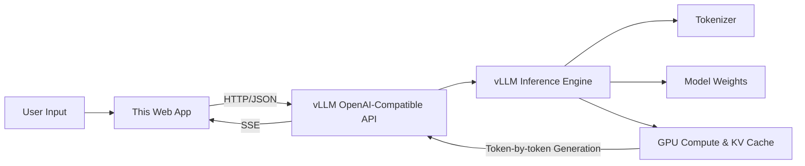

Several key conclusions to remember:

1. **The model file itself is not a service.** After downloading the model, it must be loaded by an inference engine.
2. **vLLM is not a model.** It is a high-performance large language model inference and serving framework.
3. **This project is not responsible for training models.** It consumes the inference API exposed by vLLM and implements the Agent Runtime in the browser.
4. **OpenAI compatibility does not mean requests are sent to OpenAI.** It only indicates that the HTTP paths and JSON structures follow a similar protocol.
5. **Model capabilities and service capabilities are distinct.** Whether a model understands images depends on the model and its processor; the service must also correctly enable multimodal input.

### 2. What is "Inference"?

Training is the process of a model learning parameters from data, while inference is the process of using those trained parameters to answer questions. This course focuses solely on inference.

A minimal text inference involves:

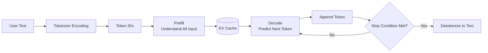

#### What is a Token?

Models do not read strings directly, but rather token IDs. A token can be:

- an English word;
- a part of a word;
- a Chinese character or a common word fragment;
- punctuation, spaces, or special control characters.

Therefore, the number of tokens corresponding to "100 Chinese characters" is not fixed and must be determined by the model's current tokenizer.

The number of tokens directly affects:

- whether the request exceeds the context window;
- how long the prefill takes;
- how much VRAM the KV Cache occupies;
- API billing and throughput statistics;
- how much history the Agent Trace can retain.

#### Prefill and Decode

**Prefill** processes existing inputs in a single pass, typically favoring large-scale parallel computation. The longer the input, the slower the Prefill.

**Decode** predicts one new token at a time, continuously reusing the KV Cache. The streaming output observed by users primarily originates from the Decode phase.

This explains a common phenomenon:

```text
Send long document -> Wait a while for the first character -> Subsequent text flows continuously
```

The time waiting for the first character is commonly referred to as **TTFT (Time To First Token)**; the average time between subsequent tokens is often described by **TPOT (Time Per Output Token)**.

### 3. Why vLLM is Better Suited as a Service than "Running the Model Directly"

The simplest inference scripts typically process only one request at a time. Real-world services receive multiple requests of varying lengths simultaneously. If executed simply in a serial manner, both GPU utilization and user experience will suffer.

vLLM primarily addresses the following engineering issues:

- Efficient management of KV Cache;
- Continuous batching for different requests;
- Scheduling between throughput, latency, and VRAM;
- Exposing an OpenAI-compatible HTTP service;
- Support for multi-GPU tensor parallelism;
- Support for streaming output, model aliases, and service parameters.

#### What is KV Cache?

When a Transformer generates the $N$-th token, it needs to reference previous tokens. If calculated from scratch every time, the cost is high. KV Cache stores intermediate results from the context, allowing Decode to reuse them.

Characteristics of KV Cache:

- The longer the context, the larger the occupancy;
- The more concurrent requests, the larger the occupancy;
- The more available VRAM, the more concurrent sequences it can typically accommodate;
- After a request ends, the corresponding cache can be reclaimed.

vLLM's PagedAttention approach is similar to virtual memory paging: it divides KV Cache into blocks for management, reducing waste and fragmentation caused by allocating large contiguous blocks. Beginners do not need to master its mathematical details first, but should understand that it solves the **VRAM management problem in inference services**.

#### What is Continuous Batching?
Traditional static batching must wait for the entire batch of requests to complete, where short requests are held up by long ones. Continuous Batching dynamically adds new requests and removes completed requests between decoding iterations.

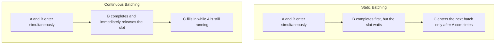

Real-world scheduling is more complex than depicted in the diagram, but the core objective remains the same: minimizing GPU idle time and maximizing overall throughput.

### 4. Essential Vocabulary for Beginners

| Term | Beginner Explanation | Position in This Engineering Context |
|---|---|---|
| Prompt | Input sent to the model | Standard message or ReAct system prompt |
| Message | A segment of content containing `role` | `system`, `user`, `assistant` |
| Token | The discrete unit processed by the model | Influenced by the tokenizer |
| Context Window | The total token capacity accommodated in a single request | Shared among input, history, Trace, and output |
| Sampling | Selecting the next token from candidate tokens | Influenced by parameters such as temperature |
| Streaming | Generate and send as soon as a portion is produced | This project receives via SSE |
| SSE | Server-Sent Events, the server continuously pushes events over a single HTTP response | vLLM returns streaming `data:` |
| Throughput | Total tokens or requests processed per unit time | Overall service processing capacity |
| Latency | Time required for a request to wait and generate | Speed directly perceived by users |
| KV Cache | Intermediate state saved for historical tokens | Occupies GPU VRAM |
| Chat Template | Template that converts messages into the actual model prompt | Determined by model/tokenizer configuration |
| Served Model Name | Model name exposed by the API | `/models` is returned and used for requests |

### 5. The Context Window Is Not "Infinite Memory"

Assume the service's maximum model length is `N`:

```text
System Prompt
+ User and Assistant history
+ Relevant Memory
+ Skill instructions
+ Agent Trace and Observation
+ Tokens planned for generation in this round
<= N

```

Please note:

- `max_model_len` is the upper limit of context allowed by the service, not implying that every request will use the full capacity;
- `max_tokens` limits the maximum number of tokens generated in this round;
- When the input is already long, the available output space decreases;
- The Agent carries a Trace at each step, which typically grows faster than ordinary chat;
- The number of characters displayed in the browser does not equal the number of tokens.

This project is controlled via [`web/src/config.ts`](./web/src/config.ts):

```ts
AGENT_MAX_STEPS = 8
AGENT_STEP_TOKENS = 1200
CHAT_TOKENS = 2048

```

These are client-side limits; the server will still enforce its own model length and generation constraints.

### 6. Starting a vLLM service from scratch

vLLM typically runs in a Linux + NVIDIA GPU environment. A common practice for macOS developers is to run the Web App locally and deploy vLLM on a Linux host with a GPU.

Below is the minimal workflow for instructional purposes. Compatibility among CUDA, PyTorch, drivers, and vLLM changes with versions; actual installation should refer to the official documentation for the specific vLLM version in use.

```bash
nvidia-smi
python3 -m venv .venv
source .venv/bin/activate
pip install vllm

```

Prioritize instruction models with Instruct or Chat tags. Base models primarily learn "text continuation" and may not reliably follow system/user conversational instructions.

Some models require accepting a license or logging into the model repository. Access tokens should only be placed in protected environment variables or local credential stores, and must not be written into startup scripts, README files, or Git.

Using Hugging Face model IDs:

```bash
vllm serve your-org/your-instruct-model \
  --served-model-name course-model \
  --host 0.0.0.0 \
  --port 8000

```

Using model directories already downloaded locally:

```bash
vllm serve /path/to/model \
  --served-model-name course-model \
  --host 0.0.0.0 \
  --port 8000

```

`0.0.0.0` indicates that the service listens on all network interfaces, not the hostname that the browser should access. The local client uses `127.0.0.1`, while other machines use the server's reachable domain name or address. Before exposing externally, the exposure risk must be evaluated in conjunction with the firewall, reverse proxy, and authentication.

After successful startup, do not open the web page immediately; instead, verify using the command line:

```bash
curl -s http://127.0.0.1:8000/v1/models

```

The expected response structure is similar to:

```json
{
  "object": "list",
  "data": [
    {
      "id": "course-model",
      "object": "model"
    }
  ]
}
```

`id` is the `model` in the client request body. It may be `--served-model-name`, and does not necessarily equal the disk directory name.

### 7. How to understand common startup parameters

Parameter names and default values may vary across versions; execute `vllm serve --help` to check the currently installed version.

| Parameter | Beginner Explanation | Main Impact |
|---|---|---|
| Model ID or Path | Weights and configuration to load | Model capabilities, VRAM requirements |
| `--served-model-name` | Alias displayed externally by the API | `/models` and `model` in requests |
| `--host` | Network interface address the service listens on | Whether other machines can access it |
| `--port` | HTTP port | Client Base URL |
| `--dtype` | Weight/computation precision, e.g., auto, float16, bfloat16 | Compatibility, VRAM, precision |
| `--tensor-parallel-size` | Number of GPUs used to shard a single model | Whether one GPU can hold it, communication overhead |
| `--max-model-len` | Maximum context length allowed by the service | KV Cache VRAM and long-text capability |
| `--gpu-memory-utilization` | Target GPU VRAM ratio available to vLLM | KV Cache capacity and OOM risk |
| `--enforce-eager` | Uses eager execution, disabling some graph optimizations | More direct compatibility, potentially lower performance |
| `--trust-remote-code` | Allows custom Python code in the model repository | Required for some models, but carries security risks |
| `--limit-mm-per-prompt` | Limits the number of multi-modal inputs (e.g., images) per request | VRAM usage and abuse protection |

#### How to choose `dtype`

- `auto`: Let vLLM choose based on model configuration; suitable for first-time attempts;
- `float16`: Supported by many GPUs, common in older or consumer-grade GPUs;
- `bfloat16`: Better dynamic range, but requires hardware support;
- If dtype or hardware capability errors occur at startup, first confirm the GPU architecture and model requirements, rather than modifying blindly.

#### How to choose `tensor-parallel-size`

When a model cannot fit into a single GPU, model tensors can be sharded across multiple GPUs:

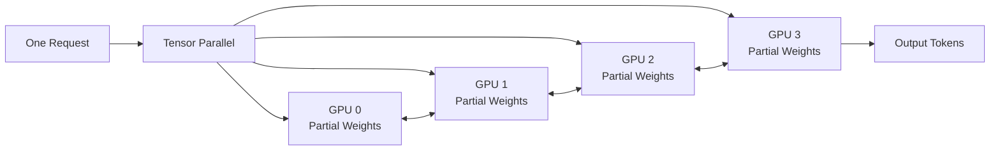

It is not that "each GPU independently processes one request," but rather that multiple GPUs collaborate to complete the computation for the same model. More GPUs do not necessarily provide linear acceleration because communication between GPUs is also required.

#### `max-model-len` Why it should not be blindly increased

A longer upper limit brings higher VRAM pressure for long contexts and KV Cache. Even if a model claims to support long contexts, it does not necessarily mean that the current hardware can economically utilize that length under high concurrency.

Suggested debugging order:

1. Start with the model's default or a more conservative length;
2. Confirm that single requests work correctly;
3. Then gradually increase the context;
4. Simultaneously observe VRAM usage, TTFT, and concurrency capabilities;
5. Do not only verify that it "can start," but also verify the target load.

#### `gpu-memory-utilization` is not an absolute safety limit

It is one of vLLM's VRAM planning targets, meaning the process does not guarantee it will never exceed this ratio. Model loading, CUDA context, temporary tensors, graph capture, and other processes may also consume VRAM.

### 8. Where is the main VRAM consumption?

Beginners often mistakenly believe that "if the model file size is smaller than the VRAM, it can definitely run." In reality, VRAM includes at least:

```text
Model Weights
+ KV Cache
+ CUDA / Communication Overhead
+ Activations and Temporary Workspace
+ Graph Capture or Compilation-Related Caches
```

Rough understanding:

- The larger the model, the larger the weight VRAM;
- The longer the context, the larger the KV Cache;
- The higher the concurrency, the more KV Caches exist simultaneously;
- Multimodal inputs also increase visual encoding overhead;
- Quantization may reduce weight usage, but it requires joint support from the model, hardware, and inference backend.

### 9. First Chat API Call

Start with a non-streaming request, which is convenient for beginners to observe the complete JSON:

```bash
curl -s http://127.0.0.1:8000/v1/chat/completions \
  -H 'Content-Type: application/json' \
  -d '{
    "model": "course-model",
    "messages": [
      {"role": "user", "content": "Please explain vLLM in one sentence"}
    ],
    "temperature": 0.2,
    "max_tokens": 128,
    "stream": false
  }'
```

Change to streaming request:

```bash
curl -N http://127.0.0.1:8000/v1/chat/completions \
  -H 'Content-Type: application/json' \
  -d '{
    "model": "course-model",
    "messages": [
      {"role": "user", "content": "Please explain streaming output in three points"}
    ],
    "temperature": 0.2,
    "max_tokens": 256,
    "stream": true
  }'
```
`curl -N` closes the client output buffer, facilitating SSE observation:

```text
data: {"choices":[{"delta":{"content":"First"}}]}
data: {"choices":[{"delta":{"content":"Point"}}]}
...
data: [DONE]
```

SSE stands for **Server-Sent Events**. It keeps an HTTP response open on the server side and continuously sends events over the same connection. Each line above is not a new HTTP request. Chapter 3 will provide a complete explanation starting from message format, packet parsing, and browser APIs.

### 10. How Request Parameters Affect Responses

#### `messages`

Common roles:

- `system`: Defines overall behavior and protocol;
- `user`: User input;
- `assistant`: Model historical responses.

vLLM combines the model's Chat Template to convert structured messages into the token sequence the model actually sees.

#### `temperature`

`temperature` controls the randomness of the sampling distribution. Intuitively:

- Lower: More stable and deterministic, suitable for code, extraction, and Agent protocols;
- Higher: More diverse, suitable for creative generation;
- It is not a "correctness knob" and cannot fix insufficient model knowledge.

This project's Agent emphasizes format stability, so it uses a lower temperature.

#### `max_tokens`

Limits the maximum number of tokens generated. It is not a required length for the response; the model may stop early due to end tokens, stop conditions, or service limits.

#### `stop`

Stops generation when encountering specified strings. This project's ReAct Step uses `Observation:` as a stop condition to prevent the model from fabricating tool results.

#### `stream`

- `false`: Waits for the complete response and returns a single JSON;
- `true`: Returns deltas incrementally via SSE.

Streaming output primarily improves perceived user latency, not necessarily the total generation time.

### 11. Why Chat Templates Matter

Different models use different conversation formats during training, such as role markers, start/end tokens, and assistant prefixes. The Chat Template's responsibility is to convert the unified:

```json
{"role":"user","content":"Hello"}
```

into the internal format familiar to that model.

Template mismatches may manifest as:

- The model repeating the user's question;
- Confused roles;
- Inability to stop normally;
- Outputting a large number of special tokens;
- Significantly degraded instruction following.

Therefore, API compatibility only unifies external requests and does not automatically ensure consistent internal behavior across all models.

### 12. The "Thinking Content" of Reasoning Models

Some models output `<think>...</think>` or other reasoning content. This project renders reasoning blocks and final responses separately.

It is necessary to distinguish:

- vLLM is responsible for transmitting the tokens generated by the model;
- Whether reasoning is generated is mainly determined by the model, template, and request parameters;
- "Asking the model to answer in one sentence" does not guarantee that the model won't output thinking content first;
- Applications cannot treat hidden thinking as a stable API protocol; true Agent protocols still require protection from parsers and the Runtime.

### 13. Multimodal Input Does Not Equal Image Generation

The project's "image support" refers to accepting images as input, allowing Vision-Language Models (VLMs) to understand them:

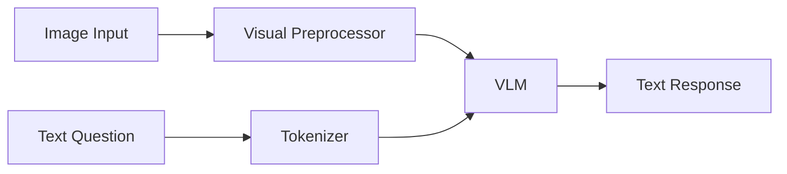

This does not mean the model can generate images. Image generation typically requires diffusion models or specialized image generation models with APIs.

For successful image input, the following conditions must be met simultaneously:

1. The model itself supports vision;
2. The vLLM version supports the multimodal architecture of that model;
3. Image input is not disabled when the service starts;
4. The request content format is correct;
5. Image size and quantity do not exceed limits.

### 14. Which Metrics to Watch for Performance

| Metric | Meaning | User Perception |
|---|---|---|
| TTFT | From sending the request to the first token | "How long until the answer starts" |
| TPOT | Average time between output tokens | "Typing speed" |
| Throughput | Total output tokens per second or completed requests | Overall service capacity |
| Queue Time | Time requests wait in the scheduling queue | Congestion during high concurrency |
| GPU Memory | Occupancy of weights, KV Cache, etc. | Ability to increase context and concurrency |
| Error Rate | Proportion of failures (timeouts, OOM, format, etc.) | Service stability |

When optimizing, clarify the goals first:

- Single-user interaction cares more about TTFT and TPOT;
- Batch offline tasks care more about throughput;
- Multi-Agent concurrency increases both request count and KV Cache pressure;
- Do not judge experience solely by GPU utilization.

### 15. Common vLLM Troubleshooting

| Symptom | Common Causes | Beginner Troubleshooting Order |
|---|---|---|
| `Connection refused` | Service not started, host/port error | Check process, listening port, and startup logs |
| `/models` 404 | Base URL missing or duplicate `/v1` | Check the final request URL |
| Page requests blocked by CORS | Service does not allow page Origin | Check browser Console, don't just look at service logs |
| `Address already in use` | Port already in use by another process | Check PID occupying the port, avoid duplicate startups |
| CUDA/Driver Errors | Incompatibility between driver, CUDA, PyTorch/vLLM | Verify version matrix and startup environment variables |
| OOM at Startup | Model weights or initialization overhead too large | Reduce parallelism/length planning, check other GPU processes |
| OOM at Runtime | High concurrency, long context, or large multimodal input | Reduce context, concurrency, or input limits |
| Request Prompt Length Exceeded | Input + reserved output exceeds limit | Shorten history, Trace, Memory, or `max_tokens` |
| Model Name Not Found | Request `model` differs from served name | Rely on `id` returned by `/models` |
| First Request Slow | Model loading, graph capture, or cache warming | Check logs and distinguish between cold start and stable state |
| Garbled Response or Role Anomaly | Chat Template mismatch | Check model tokenizer/template configuration |
| Image Request Failure | Model or service does not support current multimodal format | Verify plain text first, then verify single small image |
Troubleshooting Principles:

1. Verify `/models` first, then verify non-streaming chat;
2. After non-streaming succeeds, verify SSE;
3. After pure text succeeds, verify images;
4. After a single request succeeds, increase context and concurrency;
5. Record the complete startup command and environment variables to avoid the "same model works today but not tomorrow" issue.

### 16. vLLM Parameter Mapping for This Project

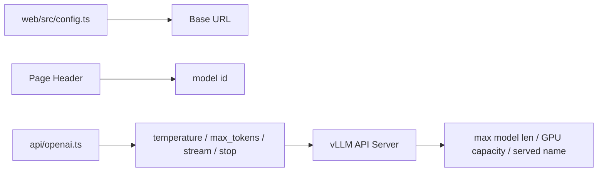

| Engineering Field | Sent to vLLM | Corresponding Server Concept |
|---|---|---|
| `baseUrl` | Request URL Prefix | `host`, `port`, and `/v1` |
| `currentModel` | `model` | served model name |
| `CHAT_TOKENS` | `max_tokens` | Maximum Output Length Constraint |
| `AGENT_STEP_TOKENS` | `max_tokens` per ReAct Step | Single-Step Generation Budget |
| `stop` | stop strings | Server Generation Stop Conditions |
| `AbortSignal` | Client Cancels HTTP | Client stops waiting; server release speed is also affected by proxy and disconnection detection |

### 17. vLLM Prerequisite Experiments

#### Experiment A: Understanding Tokens and Context

1. Send a single sentence and a long text separately;
2. Compare TTFT;
3. Change `max_tokens` from 64 to 512;
4. Observe whether it changes the "upper limit" or the "fixed output length";
5. Record why character count and token count cannot be directly equated.

#### Experiment B: Non-streaming vs. Streaming

1. Send `stream: false` using `curl`;
2. Save the complete JSON and locate `choices[0].message.content`;
3. Change to `stream: true` and `curl -N`;
4. Identify delta and `[DONE]`;
5. Explain why the browser side requires an SSE buffer.

#### Experiment C: Parameters and Stability

1. Apply low and high temperatures to the same problem separately;
2. Repeat the request three times;
3. Compare output consistency;
4. Explain why the Agent protocol favors lower temperature.

#### Experiment D: Service Capacity

Gradually increase in a permissioned teaching environment:

- Input length;
- Number of concurrent requests;
- Output limit.

Record TTFT, TPOT, GPU memory usage, and error rate. Do not perform stress tests on shared production services.

### 18. Pre-class Acceptance Questions

Learners should be able to answer without jargon:

1. What is the difference between vLLM and model weights?
2. Why is the output generated token by token?
3. What do Prefill and Decode do respectively?
4. Why is the KV Cache affected by both context and concurrency?
5. Why is the ID returned by `/models` more important than the disk directory name?
6. What is the difference between `max_tokens` and `max_model_len`?
7. Why is Tensor Parallelism not necessarily linearly accelerating?
8. Why does streaming output improve the perceived TTFT without guaranteeing a reduction in total generation time?
9. Why are image understanding and image generation considered two distinct capabilities?
10. Why should troubleshooting start with non-streaming, then streaming, and text before images?

---

## Local Model Selection and Deployment Guide

The most common mistake in local deployment is downloading a model "known to be powerful" first, then attempting to fit it into existing machines. A more reliable sequence is:

```text
Business Tasks
-> Input/Output Formats
-> Quality and Latency Goals
-> Data and License Boundaries
-> Hardware Budget
-> Model Candidates
-> Local Evaluation
-> Capacity Testing
-> Determine Deployment Method
```

Model selection is not just about comparing leaderboard scores, and deployment is not considered complete just because the service starts. The ultimate goal is to stably complete tasks with acceptable cost on the target data, target concurrency, and target hardware.

### 1. Write Requirements First, Don't Look at Model Leaderboards First

Answer the following questions first.

#### What is the Task

| Task | Key Capabilities | Common Model Directions |
|---|---|---|
| Daily Q&A and Summarization | Instruction following, Language quality | Instruct/Chat models |
| Chinese Knowledge Assistant | Chinese understanding, Factual quality | Instruct models with verified Chinese capabilities |
| Code Assistant | Code generation, completion, debugging | Code Instruct models |
| Agent Tool Calling | Format compliance, JSON, Tool selection | Models with stable instructions and good tool-calling evaluation |
| Complex Reasoning | Math, Planning, Multi-step analysis | Reasoning or reasoning-enhanced models |
| Image Understanding | Visual encoding, OCR, Image-text Q&A | VLMs, Multimodal models |
| Text Vectorization | Semantic retrieval | Embedding models, not Chat models |
| Document Reranking | Retrieval result ranking | Reranker models |
| Image Generation | Text-to-image | Diffusion or image generation models, not VLMs |

The main interface of this project is `/v1/chat/completions`, so at least one Instruct/Chat model capable of stable conversation is required. If image uploading is needed, a VLM supported by the current version of vLLM must also be selected.

#### What is the Input

- Is it mainly Chinese, English, or multilingual?
- Is it single-turn questions or long conversations?
- Does it include code, tables, JSON, images, or scanned documents?
- How long is the input typically?
- Is support for 32K, 64K, or longer contexts required?
Do not assume that a business needs 128K context just because the model has a nominal 128K context. Long context increases Prefill time and KV Cache pressure; retrieval or summarization may be more cost-effective.

#### What are the output requirements

- Is creative freedom allowed, or must it be stable and reproducible?
- Is strict JSON output required?
- Is the ReAct `Thought/Action/Action Input` protocol required?
- Is displaying reasoning content allowed?
- How quickly must the answer start appearing?
- What is the maximum number of tokens generated at once?

#### What is the load

- Is there only one developer, or multiple concurrent users?
- Do normal chat and multi-Agent run simultaneously?
- What is the peak concurrency?
- Approximately how many requests per minute?
- Is single-request latency or total throughput more important?

This project defaults to the Scheduler supporting up to 3 parallel sub-Agents. Combined with the main conversation and background Memory consolidation, a single browser can generate multiple model requests simultaneously.

#### What are the hard constraints

- Available GPU models, quantities, and VRAM;
- Host memory and disk space;
- Is downloading models from the internet allowed?
- Can data leave the local machine or intranet?
- Does the model license allow the target use case?
- Is executing remote code from the model repository allowed?
- Budget, power consumption, and operational capabilities.

### 2. Understanding different model types

#### Base models

Base models primarily learn "the next token" from large-scale text. They are suitable for continued training and research but may not reliably follow chat instructions.

#### Instruct or Chat models

These models are fine-tuned for instructions or optimized for preferences, making them more suitable for:

- system/user/assistant conversations;
- Q&A, summarization, and rewriting;
- formatted output;
- Agent tool protocols.

This course prioritizes Instruct/Chat versions.

#### Reasoning models

Reasoning models lean towards multi-step analysis, but considerations typically include:

- Higher output token counts;
- Longer TTFT or complete response times;
- Reasoning formats may require specialized parsing;
- Costs for simple tasks may outweigh benefits;
- They may not necessarily be better at format adherence than similarly sized Instruct models.

#### Code models

Code models are enhanced for code corpora, repository context, or completion tasks. When selecting, do not just test algorithmic problems; also test what this project truly needs:

- TypeScript;
- API usage;
- Multi-file modifications;
- Error localization;
- JSON and tool parameter generation.

#### VLM

Vision-Language models accept images and output text. Validation is required for:

- Whether vLLM supports the architecture;
- Whether the model processor can load;
- Limits on image count and resolution;
- Actual performance in OCR, charts, and natural images;
- The impact of multimodal requests on VRAM and latency.

#### Embedding and Reranker models

They are not chat models:

- Embedding maps text to vectors for retrieval;
- Reranker re-scores candidate documents;
- Chat models generate answers based on context.

This project uses the browser-side multilingual-e5 to generate Memory embeddings, so the main Chat model does not need to double as a vector model.

### 3. Parameter scale, Dense, and MoE

#### Parameter scale is not absolute quality

More parameters usually mean higher capacity, but also higher:

- Weight VRAM;
- Loading time;
- Inference cost;
- Multi-GPU communication requirements.

However, model data, training methods, task adaptation, and quantization quality are equally important. A smaller model optimized for the target task may outperform a larger general-purpose model.

#### Dense models

Dense models typically use all network parameters during each inference. The parameter scale marked on the model card has a more direct relationship with the main computation per token.

#### MoE models

Mixture of Experts models contain multiple experts, with only a subset activated per token. Model cards may provide both:

- Total parameter count;
- Active parameter count.

Distinctions must be made:

- **Computation** is closer to active parameters;
- **Weight loading VRAM** is usually still affected by the total parameter count;
- MoE may also incur expert routing and cross-GPU communication overhead.

Do not prepare machines based on Dense 3B weight VRAM just because "only 3B are activated per token."

### 4. Rough VRAM estimation first

Whether a model can be deployed depends first on weights, then leaving space for KV Cache and runtime overhead.

#### First approximation of weight VRAM

```text
Weight bytes ≈ Parameters × Bytes per parameter
```

Common rough values:

| Precision | Approx. bytes per parameter | Notes |
|---|---:|---|
| FP32 | 4 | Rarely chosen for inference, high VRAM |
| FP16/BF16 | 2 | Common unquantized inference precision |
| INT8/FP8 | ~1 | Includes scale, metadata, and implementation overhead |
| INT4 | ~0.5 | Actual files and VRAM are usually higher than theoretical values |

Rough estimate based on BF16/FP16 weights alone:

| Parameter Scale | Weight-only theoretical value | Deployment implications |
|---:|---:|---|
| 3B | ~6 GB | Still need space for KV Cache and runtime |
| 7B | ~14 GB | 16 GB cards are often very tight |
| 14B | ~28 GB | Often require larger VRAM or quantization |
| 32B | ~64 GB | Commonly high-VRAM single GPU or multi-GPU |
| 70B | ~140 GB | Usually require multiple high-VRAM GPUs or quantization |

This table cannot be directly taken as a purchasing conclusion, because in practice, you also need:

```text
Model weights
+ KV Cache
+ Activations and temporary tensors
+ CUDA context
+ Communication buffers
+ CUDA Graphs or compilation caches
+ Multimodal encoder overhead
```

#### Why "just fitting the weights" is still not enough to serve

If weights occupy 23 GB of 24 GB VRAM, the remaining space struggles to support:

- Long context;
- Multiple concurrent sequences;
- Temporary workspaces;
- Graph capture;
- Visual input.
Local selection should retain safety margins and be tested under real concurrency and real context conditions.

#### Why KV Cache is Hard to Estimate with a Single General Table

KV Cache depends on:

- Model layers;
- hidden/head structure;
- Number of KV heads;
- KV cache dtype;
- Number of tokens;
- Number of concurrent sequences;
- vLLM's cache and scheduling configurations.

The reliable method is:

1. Check model configuration and vLLM startup logs;
2. Start with the target `max-model-len`;
3. Observe the KV Cache capacity reported by vLLM;
4. Perform stress testing with target concurrency and length.

### 5. What to Check Besides GPU

| Resource | Why It Matters |
|---|---|
| System Memory | May be needed for downloading, loading, deserialization, or CPU offload |
| Disk Capacity | Model weights, multiple quantized versions, and caches can grow rapidly |
| Disk Speed | Affects initial model loading and container startup |
| PCIe/NVLink | Affects multi-GPU communication |
| Network | Affects remote Web calls and model downloads |
| Power and Cooling | Continuous inference is a high-load workload |
| Drivers/CUDA | Determine compatibility with PyTorch and vLLM |

At least record the following before deployment:

```bash
nvidia-smi
df -h
free -h
python3 --version
```

When macOS lacks an NVIDIA CUDA environment, vLLM is typically deployed to a Linux GPU host. This project only requires the model endpoint to expose an OpenAI-compatible API, so it can also connect to other local compatible services; however, different inference engines have different parameters and performance characteristics.

### 6. When to Consider Quantization

Quantization represents weights with lower bit-widths, primarily reducing weight VRAM and memory bandwidth pressure.

#### Potential Benefits of Quantization

- Larger models can fit into existing GPUs;
- Leaves more space for KV Cache;
- May improve throughput on certain hardware;
- Reduces disk and loading pressure.

#### Quantization is Not a Free Lunch

- May reduce accuracy or format stability;
- Different tasks have varying sensitivity to quantization;
- The quantized format must be supported by the current vLLM and GPU;
- Certain kernels may be slower on specific hardware;
- Multimodal modules may not be fully quantized;
- Online dynamic quantization and pre-quantized models behave differently.

Common formats include AWQ, GPTQ, FP8, etc. When choosing, check the support matrix of the current vLLM version; do not assume direct loadability just because the model filename contains `4bit`.

#### Recommended Order for Beginners

1. If possible, use BF16/FP16 first to establish a quality baseline;
2. Prioritize pre-quantized versions provided by the publisher with complete documentation;
3. Compare original precision and quantized versions on the same test set;
4. Record quality, TTFT, TPOT, throughput, and VRAM simultaneously;
5. Only adopt the quantized version if actual measurements meet the targets.

### 7. Context Length and Concurrency Must Be Selected Together

Model selection should not only ask "what is the maximum supported K," but also "how many K can be stably supported under target concurrency."

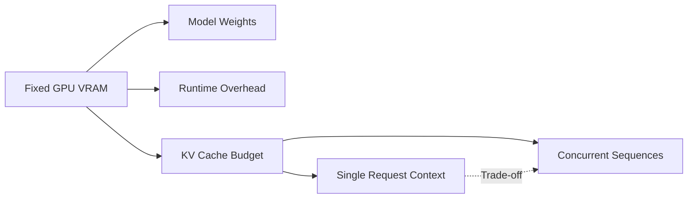

When the model and hardware are fixed, the following trade-offs usually exist:

- Longer context means larger KV Cache per request;
- More concurrency means larger total KV Cache;
- Longer output means requests occupy scheduling slots for longer;
- Multi-Agent amplifies concurrency and context requirements.

Configure based on business design goals, not just model advertised values:

| Scenario | Priority Should Be |
|---|---|
| Single-user long-form analysis | Context and TTFT |
| Multi-user short Q&A | Concurrency and throughput |
| Code repository analysis | Retrieval, context, and coding capabilities |
| Multi-Agent research | Concurrency, tool format stability, and total output budget |
| Image Q&A | Visual capabilities, image limits, and VRAM |

### 8. License, Security, and Compatibility Screening

#### Model Licenses

Read the Model Card and LICENSE before downloading:

- Whether commercial use is allowed;
- Whether specific uses are restricted;
- Whether attribution or notice retention is required;
- Whether redistribution is restricted or managed services are provided;
- Whether fine-tuned and derivative models have additional terms.

"Can be downloaded" does not equal "can be used for any product."

#### vLLM Compatibility

Confirm:

- The current vLLM version supports the model architecture;
- Tokenizer and Chat Template are complete;
- Quantized formats are supported;
- Multimodal processors are supported;
- Whether `--trust-remote-code` is required;
- Whether there are known kernel, dtype, or driver limitations.

#### `trust_remote_code`

When enabled, custom Python code in the model repository may execute on the server. Use only with trusted sources, fix the revision, review the code, and restrict execution permissions.

#### Data Security

Local deployment reduces the need to send data to third-party services, but does not automatically equal security:

- Service ports may be exposed to the public internet;
- Logs may record Prompts;
- Browser Memory may retain sensitive content;
- Tool calls may access external networks;
- The model itself may output unsafe content.

### 9. Three-Stage Model Selection Method

#### Stage 1: Hard Constraint Filtering

Exclude the following candidates:

- License does not match the use case;
- Current hardware cannot support it;
- vLLM does not support the architecture or quantized format;
- Does not support necessary input types;
- Insufficient context;
- Must execute untrusted remote code online.

#### Stage 2: Establish 2 to 4 Candidates

Do not evaluate more than a dozen models at once. Candidates should cover different trade-offs:

- Small models with low latency;
- Medium models balancing quality and cost;
- Larger models with higher quality ceilings;
- One quantized version for capacity comparison.
#### Phase 3: Empirical Testing with Local Task Set

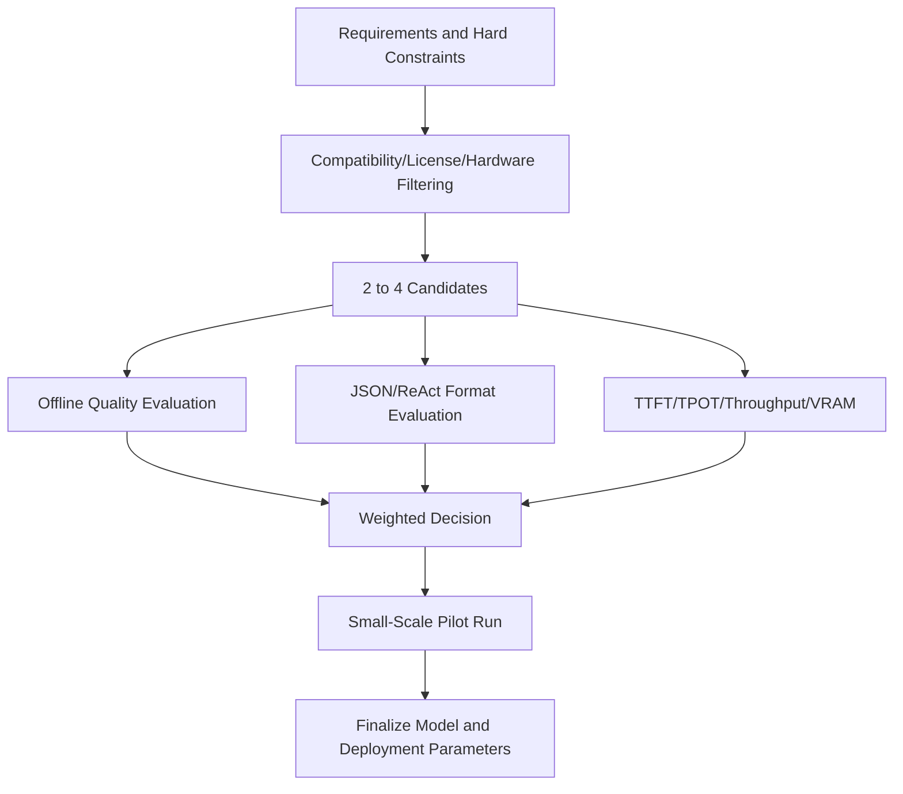

### 10. Design the Evaluation Dataset for This Project

General leaderboards provide only clues; this project focuses more on real-world workflows.

Prepare 30 to 100 fixed test cases, versioned and saved, but exclude real credentials or sensitive business data.

| Category | Example Target | Evaluation |
|---|---|---|
| Chinese QA | Clearly and accurately explain concepts | Correctness, Expression |
| Long Text Summarization | Extract facts without missing constraints | Recall, Hallucination |
| TypeScript | Modify or explain actual modules | Executability |
| JSON | Strict output schema | Parsing success rate |
| ReAct | Generate valid Action Input | Protocol success rate |
| Tool Selection | Select correct tools for GitHub issues | Routing accuracy |
| Error Recovery | Honest degradation after tool failure | Robustness |
| Multi-turn Dialogue | Correctly leverage history without confusion | Contextual capability |
| Image Understanding | OCR, charts, or UI descriptions | Multimodal quality |
| Security Boundaries | Refuse to leak sensitive information | Security |

#### Not just "gut feeling" scores

Record quantifiable metrics:

```text
Task Success Rate
Strict JSON Parsing Success Rate
ReAct Protocol Completion Rate
Duplicate Tool Invocation Rate
Average Tool Steps
TTFT P50/P95
TPOT P50/P95
Request Throughput
Peak VRAM
Error Rate

```

#### A simple decision table

| Dimension | Example Weight | Candidate A | Candidate B | Candidate C |
|---|---:|---:|---:|---:|
| Task Quality | 35% |  |  |  |
| Agent Format Stability | 20% |  |  |  |
| Latency | 15% |  |  |  |
| Throughput | 10% |  |  |  |
| GPU Memory Cost | 10% |  |  |  |
| License and Operations | 10% |  |  |  |

Weights should be determined by business requirements. For example, offline document analysis can reduce the latency weight, while interactive code assistants should increase the TTFT weight.

### 11. Deployment Method 1: Single GPU Native Precision

Suitable for scenarios where model weights, KV Cache, and runtime overhead can be stably accommodated within a single GPU.

```bash
vllm serve /path/to/instruct-model \
  --served-model-name local-chat \
  --host 127.0.0.1 \
  --port 8000 \
  --dtype auto \
  --max-model-len 8192 \
  --gpu-memory-utilization 0.85

```

During the teaching phase, first listen on `127.0.0.1` to avoid accidental service exposure. When remote clients need access, open it through a controlled intranet address or an authenticated reverse proxy.

Startup strategy:

1. Use a more conservative `max-model-len`;
2. Establish the baseline using `dtype auto`;
3. First, validate single-text requests;
4. Then, increase context and concurrency;
5. Finally, validate multi-Agent load.

### 12. Deployment Method 2: Multi-GPU Tensor Parallelism

When a single GPU cannot accommodate the model or more KV Cache space is required, multiple GPUs can be used:

```bash
vllm serve /path/to/instruct-model \
  --served-model-name local-chat \
  --host 127.0.0.1 \
  --port 8000 \
  --tensor-parallel-size 4 \
  --dtype bfloat16 \
  --max-model-len 16384 \
  --gpu-memory-utilization 0.85

```

Confirmation is required:

- The number of GPUs matches `tensor-parallel-size`;
- The status of each GPU is normal;
- The topology and bandwidth between GPUs meet the requirements;
- The model's structure, such as attention heads, can be reasonably partitioned by this parallelism degree;
- The multi-GPU communication library and driver environment are correct.

The primary value of multi-GPU is often "fitting larger models and providing sufficient cache"; throughput and latency should not be assumed to scale linearly with the number of GPUs.

### 13. Deployment Method 3: Quantized Models

Quantization parameters vary by format and version. The following represents the command structure only:

```bash
vllm serve /path/to/quantized-model \
  --served-model-name local-chat-quantized \
  --host 127.0.0.1 \
  --port 8000 \
  --quantization FORMAT_NAME \
  --max-model-len 8192

```

Replace `FORMAT_NAME` with the format currently supported by both vLLM and the model. Some pre-quantized models can automatically identify the format from the model configuration, without requiring explicit `--quantization`. Refer to the model release notes and the current `vllm serve --help` for accuracy.
Pre-launch quality evaluation must be re-executed, with special attention to:

- JSON format errors;
- Missing ReAct tags;
- Unparseable Action Input;
- Decline in code accuracy;
- Omission of facts in long context;
- Changes in multimodal quality.

### 14. Deployment Method 4: Docker

Docker is suitable for fixed runtime environments and simplified machine migration. When using official images, pin a verified version and do not unconditionally follow `latest` in production.

```bash
docker run --rm \
  --gpus all \
  --ipc=host \
  -p 127.0.0.1:8000:8000 \
  -v /path/to/model:/models/local-chat:ro \
  vllm/vllm-openai:TESTED_VERSION \
  --model /models/local-chat \
  --served-model-name local-chat \
  --host 0.0.0.0 \
  --port 8000
```

Replace `TESTED_VERSION` with the verified image version. Here, the container listens on `0.0.0.0`, but the host port is bound only to `127.0.0.1`.

Docker additional checks:

- NVIDIA Container Toolkit;
- `--ipc=host` or sufficient shared memory;
- Read-only mount of the model directory;
- Container log rotation;
- Image version and digest;
- Container user permissions;
- GPU device visibility.

### 15. Deployment Method 5: Remote GPU, Local Web

When the development machine lacks a suitable GPU, the following approach can be adopted:

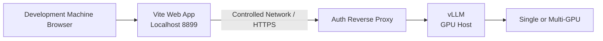

Launch Web locally:

```bash
cd web
VITE_VLLM_BASE_URL=https://your-model-domain.example/v1 npm run dev
```

Do not expose the unauthenticated vLLM port directly to the public internet. At least consider:

- TLS;
- Authentication;
- Request size limits;
- Concurrency and rate limits;
- CORS allowlist;
- Access log sanitization;
- Network egress controls.

### 16. If Only CPU or Apple Silicon

The mainstream deployment path for vLLM targets supported acceleration hardware. Pure CPU or Apple Silicon local development often uses other inference engines.

Since this project invokes an OpenAI-compatible API, as long as the alternative engine provides a compatible:

```text
GET  /v1/models
POST /v1/chat/completions
```

it can establish a basic connection. However, the following must be re-verified:

- SSE chunk format;
- multimodal content format;
- stop parameter;
- Chat Template;
- maximum context;
- concurrency and cancellation behavior.

"Same API path" does not imply that all boundary behaviors are identical.

### 17. From Development Commands to Production Services

A shell command in the development environment lacks the lifecycle management required for production services.

Production deployment requires at least:

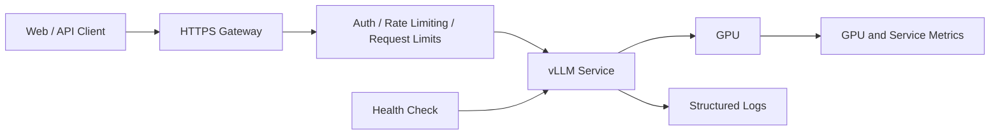

Needs to be supplemented:

- systemd, container orchestration, or other process supervisors;
- Automatic restart on crash, with backoff to prevent rapid infinite restarts;
- Startup timeout and graceful shutdown;
- Model warm-up;
- Health checks;
- Log collection and data masking;
- Monitoring of GPU, queues, latency, and error rates;
- Version rollback;
- Model weight validation;
- Access control and TLS.

#### Health Check Stratification

| Layer | Check | What it detects |
|---|---|---|
| Process | PID Exists | Process Exited |
| Port | 8000 Listening | Network Service Not Started |
| API | `/v1/models` | HTTP Routing and Model Registration |
| Inference | Minimal Chat Completion | Model Can Truly Generate |
| Business | ReAct/Image Smoke Test | Target Capabilities Normal |

Checking ports alone is insufficient. When a port exists, the model may still be loading or inference may have failed.

### 18. Using This Repository's Smoke Test

[`test_vllm_server.py`](./test_vllm_server.py) Uses only the Python standard library to verify model lists, text chat, and image input.

Text and Vision:

```bash
VLLM_BASE_URL=http://127.0.0.1:8000/v1 \
python3 test_vllm_server.py
```

Text Only:

```bash
VLLM_BASE_URL=http://127.0.0.1:8000/v1 \
python3 test_vllm_server.py --skip-vision
```

Specify Model and Timeout:

```bash
python3 test_vllm_server.py \
  --base-url http://127.0.0.1:8000/v1 \
  --model local-chat \
  --timeout 120
```
Verification sequence:

1. `/models` returns at least one model;
2. Send a text request using the returned `id`;
3. After text succeeds, send an image;
4. Record latency and full errors;
5. Finally, connect Web and Agent.

### 19. Capacity Tuning Sequence

Adjust one type of variable at a time:

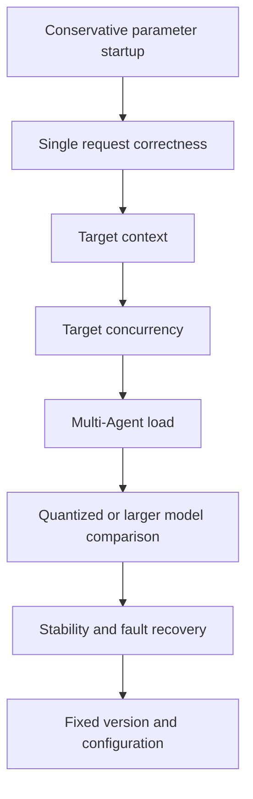

Recommended to Log Each Experiment:

```text
Model and revision
vLLM / PyTorch / driver version
GPU model and quantity
dtype and quantization format
tensor parallel size
max model len
gpu memory utilization
Input/output tokens
Concurrency
TTFT / TPOT / throughput
Peak VRAM
Errors and logs
```

If version and load are not recorded, the performance data of the two models are not comparable.

### 20. Typical Selection Examples

#### Scenario A: Personal Chinese Development Assistant

Priority:

1. Chinese and code quality;
2. Low TTFT;
3. Capable of running on a single GPU;
4. Stable ReAct and JSON;
5. Practical context window from 8K to 32K.

Strategy: First establish a baseline with small-to-medium Instruct/Code models that can run stably at native precision, then compare with larger or quantized candidates.

#### Scenario B: Local Multi-Agent Research

Priority:

1. Tool selection and protocol format;
2. Stability with more than 3 concurrent requests;
3. Sufficient KV Cache;
4. Degradation quality after network failures;
5. Total throughput.

Strategy: Do not rely solely on single-turn QA leaderboards. Must run `@researcher`, `@coder`, and `@reviewer` concurrent tests.

#### Scenario C: Image and Document QA

Priority:

1. VLM architecture compatibility;
2. OCR, chart, and UI understanding;
3. Image size and quantity;
4. Visual encoding latency;
5. Text response quality.

Strategy: Evaluate using real image samples; do not rely on a single simple image to prove "visual capability is available."

#### Scenario D: Low VRAM Devices

Priority:

1. Service stability;
2. Small models or supported quantization;
3. Conservative context;
4. Low concurrency;
5. Switch inference engines or use remote GPUs when necessary.

Strategy: Avoid forcing models far beyond hardware capabilities with extreme offloading and expecting an interactive experience.

### 21. Final Decision Checklist

#### Model

- [ ] It is Instruct/Chat, not mistakenly selected as Base;
- [ ] Target language, code, or vision capabilities have been locally tested;
- [ ] ReAct and JSON format success rates meet requirements;
- [ ] Context length meets real-world task needs;
- [ ] Model license permits the target use case;
- [ ] Chat Template and tokenizer are complete;
- [ ] vLLM supports the current architecture and quantization format;
- [ ] Remote code risks have been assessed.

#### Hardware

- [ ] Weights do not just barely fit into VRAM;
- [ ] KV Cache can support the target context and concurrency;
- [ ] System memory and disk space are sufficient;
- [ ] Multi-GPU interconnect and parallelism are verified;
- [ ] Driver, CUDA, PyTorch, and vLLM versions are matched;
- [ ] Power consumption and thermal dissipation can sustain continuous load.

#### Deployment

- [ ] Fixed model revision and vLLM version;
- [ ] Reproducible startup parameters are saved;
- [ ] `/models`, text, streaming, and visual smoke tests passed;
- [ ] Process supervision, logging, and monitoring are in place;
- [ ] External services support TLS, authentication, rate limiting, and CORS restrictions;
- [ ] Sensitive information in prompts and logs is protected;
- [ ] Upgrade, rollback, and fault recovery plans are available.

#### This Project

- [ ] `VITE_VLLM_BASE_URL` points to the correct `/v1`;
- [ ] The page model name is derived from `/models`;
- [ ] Standard chat streaming works normally;
- [ ] The Agent can complete at least one tool call;
- [ ] The service remains stable when three sub-Agents run concurrently;
- [ ] Background Memory consolidation does not overwhelm main requests;
- [ ] `npm run build` passed.

---

## Chapter 1: Running the Model and Web Engineering

### Learning Objectives

- Understand the deployment relationship between the browser, Vite application, and vLLM;
- Verify the OpenAI-compatible model service;
- Start the development server and complete the first chat.

### System Topology

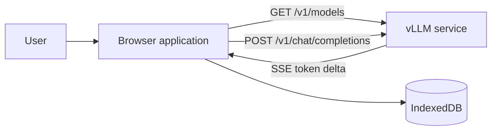

There is no additional application backend. The browser directly requests vLLM, so the model service must allow CORS requests from the current Web Origin.

### Environment Preparation

- Node.js 18 or higher;
- npm;
- An accessible OpenAI-compatible vLLM service;
- A modern browser that supports IndexedDB, Web Worker, and WASM.

### Launch Project

```bash
cd web
npm install
npm run dev
```

The default Web address is `http://127.0.0.1:8899/`, and the default model address is `http://127.0.0.1:8000/v1`.
You can also specify the service address at startup:

```bash
VITE_VLLM_BASE_URL=http://your-vllm-host:8000/v1 npm run dev
```

Verify the model service:

```bash
curl -s "${VLLM_BASE_URL:-http://127.0.0.1:8000/v1}/models"
```

### Source Entry Points

- [`web/src/config.ts`](./web/src/config.ts): Default address, token, and step limit;
- [`web/vite.config.ts`](./web/vite.config.ts): Development server and proxy;
- [`web/src/main.ts`](./web/src/main.ts): Application startup and dependency assembly.

### Classroom Exercises

1. Start vLLM and Vite.
2. Open the page and confirm the status changes to Connected.
3. Select a model from the model dropdown.
4. Turn off Agent mode and send "Reply only if connection is successful."
5. Open the browser Network panel and locate `/models` and `/chat/completions`.

### Acceptance Criteria

- The page can retrieve the model list;
- Responses appear in a streaming manner;
- `stream: true` can be seen in the Network panel;
- The stop button can interrupt generation.

### Reflection Questions

1. What are the advantages and risks of connecting the browser directly to vLLM compared with adding an application backend?
2. Why should production environments generally avoid placing permissioned model keys directly in the browser?

---

## Chapter 2: Understanding Engineering Layers and Composition Root

### Learning Objectives

- Identify the UI, domain logic, and infrastructure layers;
- Understand why `main.ts` is the unique Composition Root;
- Learn to control complexity using dependency direction.

### Directory Structure

```text
web/src/
├── api/          # OpenAI Protocol and SSE
├── agent/        # Single Agent ReAct Runtime
├── agents/       # Agent Profile, mention, and Scheduler
├── memory/       # Memory Retrieval, Vector, and Consolidation
├── sessions/     # Session History
├── skills/       # Skill Manifest, Matching, and Persistence
├── storage/      # IndexedDB Infrastructure
├── ui/           # DOM Components
├── styles/       # tokens, base, layout, components
└── main.ts       # State, Assembly, and Cross-Module Orchestration
```

### Layer Relationships

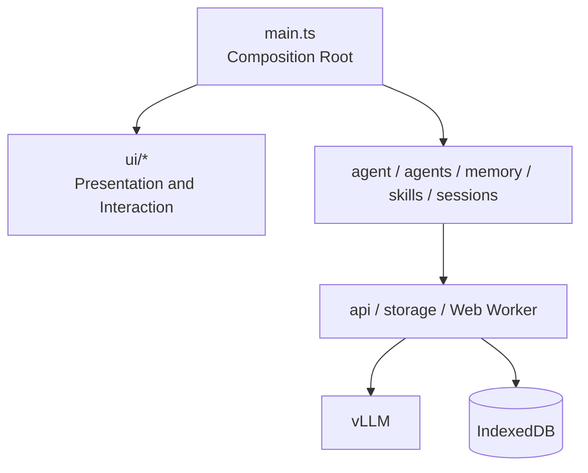

Key Dependency Rules:

1. UI does not directly request models or operate IndexedDB;
2. `agent/runner.ts` does not operate the DOM, only emits `AgentEvent`;
3. Memory and Skills do not depend on UI;
4. The API layer only handles protocols;
5. `main.ts` is responsible for assembling objects, maintaining page state, and connecting events.

### Why Not Use Large Frontend Frameworks

This project constructs components using `create*() -> { el, update }`'s factory functions. This allows courses to directly observe the relationships between state, events, and the DOM, without being obscured by framework lifecycles. Real-world large projects can also migrate the domain layer as-is to React, Vue, or Svelte.

### Classroom Experiment

Draw a "click to send" call chain, marking at least:

```text
Composer -> main.ts -> streamChat -> readContentDeltas -> ChatView
```

Then try to answer:

- Which layer knows the currently selected model?
- Which layer knows the `data:` format of SSE?
- Which layer is responsible for updating the DOM?

### Acceptance Criteria

Learners can explain why the task panel DOM cannot be directly manipulated within `AgentTaskScheduler`.

---

## Chapter 3: OpenAI-Compatible API and SSE Streaming Output

### Learning Objectives

- Construct OpenAI-compatible requests;
- Correctly handle SSE lines across chunks;
- Use `AbortSignal` to abort the request.

### Core Interface

[`web/src/api/openai.ts`](./web/src/api/openai.ts) provides two boundary functions:

```ts
listModels(baseUrl, signal): Promise<string[]>
streamChat(baseUrl, options): Promise<string>
```

`streamChat()` sends:

```json
{
  "model": "your-model",
  "messages": [],
  "stream": true,
  "temperature": 0.3,
  "max_tokens": 1500
}
```
### What Exactly Is SSE

SSE stands for **Server-Sent Events**. It is a unidirectional streaming transmission mechanism built on top of HTTP:

1. The client initiates an HTTP request;
2. The server returns response headers but does not close the response immediately;
3. The server continues writing events to this response as new data becomes available;
4. The client processes data as it receives it;
5. The connection ends when the server completes, the client cancels, or the network disconnects.

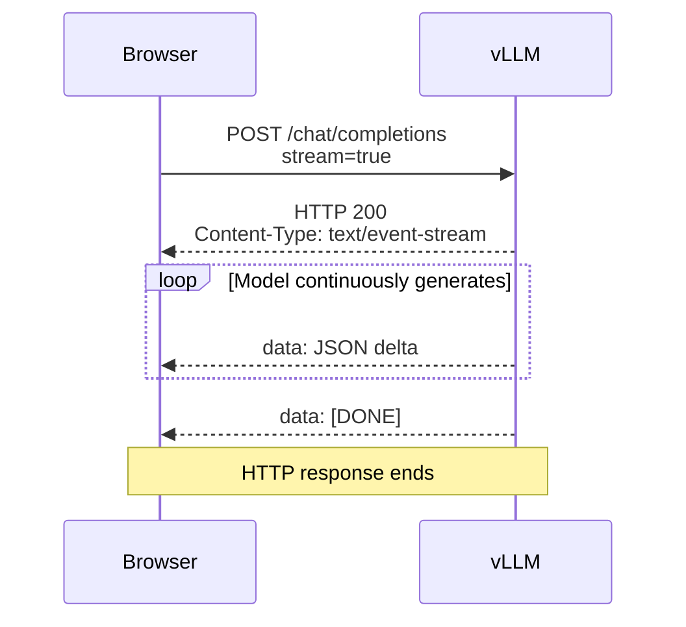

Its key point is: **one HTTP request corresponds to a continuous data stream**. It does not re-initiate a request for every generated character.

### What an SSE Message Looks Like

Standard SSE uses UTF-8 text, where each event consists of several field lines, and an empty line indicates the end of an event:

```text
event: message
id: 42
retry: 3000
data: First line of data
data: Second line of data

```

Common fields:

| Field | Meaning |
|---|---|
| `data:` | Event data; multi-line `data:` belonging to the same event should be concatenated with newlines |
| `event:` | Optional event type, default is `message` |
| `id:` | Optional event ID, which can be used for reconnection recovery |
| `retry:` | Optional Reconnection Wait Time |
| `:` Prefix | Comments or heartbeat, not processed by business logic |
| Empty Line | End of current event |

vLLM's OpenAI-compatible streaming typically uses a simplified format:

```text
data: {"choices":[{"delta":{"content":"You"}}]}

data: {"choices":[{"delta":{"content":"Good"}}]}

data: [DONE]

```

Where:

- `data:` is the standard SSE field;
- JSON is the OpenAI-compatible Chat Completion Chunk;
- `delta.content` is the incremental text for this event;
- `[DONE]` is the termination convention of the OpenAI streaming protocol, not inherent to SSE itself;
- Actual responses typically also include `id`, `model`, `finish_reason`, usage, and other fields.

### Why Chat is Suitable for SSE

Large language models naturally generate tokens sequentially from start to finish. If waiting for all generation to complete before returning:

- The user sees no content for an extended period;
- Unable to read the answer as early as possible;
- Difficult to display the Agent's current step;
- Poor experience when stopping midway.

SSE allows applications to display incremental updates before the complete answer is finished, thereby improving perceived latency.

SSE does not make the model itself compute faster. It primarily converts the "time waiting for the complete answer" into "seeing partial answers earlier."

### Why This Project Does Not Use WebSocket

| Solution | Communication Direction | Request Method | Suitable Scenarios |
|---|---|---|---|
| Standard JSON HTTP | One-time response after request | GET/POST | Short requests, no streaming required |
| SSE | Primarily continuous server push | HTTP | Logs, notifications, LLM streaming responses |
| WebSocket | Continuous bidirectional communication between client and server | Protocol upgrade | Games, collaborative editing, bidirectional real-time control |

The chat link in this project is:

1. The browser sends the messages in a single POST request.
2. vLLM continuously returns the generated results in a unidirectional stream.
3. The user cancels the HTTP request when they need to stop.

Therefore, a full bidirectional WebSocket session is not required. SSE can still leverage standard HTTP status codes, proxies, and packet capture tools.

### Why not use the browser's native `EventSource`

The browser provides the `EventSource` API, but it is primarily designed for GET requests, making it inconvenient to send the POST JSON, model parameters, and custom request controls required by this project.

This project adopts:

```text
fetch(POST)
  -> Response.body
  -> ReadableStream<Uint8Array>
  -> TextDecoder
  -> SSE line parsing
  -> delta.content
```

This allows:

- Use of POST request bodies;
- Setting `Content-Type: application/json`;
- Passing `AbortSignal`;
- Checking HTTP status codes;
- Control the parsing logic of OpenAI chunks yourself.

### Four "Data Blocks" That Should Not Be Confused

| Level | What It Is | One-to-One Correspondence? |
|---|---|---|
| Model token | The internal generation unit of the model | Not guaranteed to equal one Chinese character or one word |
| OpenAI delta | The content in one incremental JSON from the API | May contain zero, one, or multiple tokens of text |
| SSE event | An event ending with an empty line | Usually carries one chunk, but determined by the protocol implementation |
| Network chunk | Bytes read once at the browser's underlying layer | May be half an event or may contain multiple events |

For example, if the model logically generates "Hello", the network may deliver it as follows:

```text
Network chunk 1:
data: {"choices":[{"delta":{"cont

Network chunk 2:
ent":"Hel"}}]}\n\ndata: {"choices":[

Network chunk 3:
{"delta":{"content":"lo"}}]}\n\n
```
Therefore, the results of each `reader.read()` cannot be directly `JSON.parse()`.

### Why SSE Needs a Buffer

A network chunk is not equivalent to a complete SSE event. JSON may be split at any byte position:

```text
chunk 1: data: {"choices":[{"delta":{"cont
chunk 2: ent":"Hello"}}]}
```

[`web/src/api/stream.ts`](./web/src/api/stream.ts) uses `TextDecoder` and `buf` to save incomplete lines, calling `JSON.parse()` only for complete `data:` lines.

The core process can be simplified as:

```ts
const reader = body.getReader();
const decoder = new TextDecoder();
let buffer = "";

while (true) {
  const { value, done } = await reader.read();
  if (done) break;

  buffer += decoder.decode(value, { stream: true });
  const lines = buffer.split("\n");
  buffer = lines.pop() ?? "";

  for (const line of lines) {
    // Here, only process lines that have arrived completely
  }
}
```

`TextDecoder`'s `{ stream: true }` is equally important. A UTF-8 Chinese character may be split across two byte chunks; the streaming decoder retains incomplete bytes to avoid garbled text.

The current [`parseSSELine()`](./web/src/api/stream.ts) is a lightweight parser tailored for common vLLM/OpenAI formats:

- Only processes `data:` lines;
- Ignores heartbeats and non-data lines;
- Ignores `[DONE]`;
- Skips invalid JSON;
- Extracts text from `choices[0].delta.content`.

It is not a general-purpose, complete SSE implementation. If future services use multi-line `data:`, `event:`, `id:`, or disconnection reconnection semantics, it should be upgraded to parse based on "empty line event boundaries" rather than continuing to handle only single lines.

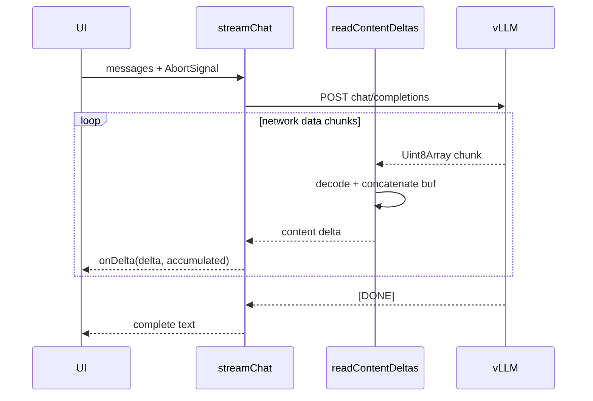

### Why Buffering and Proxies Make "Streaming" Look Non-Streaming

Even if vLLM is writing incrementally, the following stages may buffer data:

- stdout buffering in CLI clients;
- response buffering in reverse proxies;
- compression middleware waiting for more data;
- browsers or network stacks merging smaller packets;
- UI proactively batching updates to reduce repaint frequency.

Troubleshooting order:

1. Use `curl -N` to request vLLM directly;
2. Check if the response `Content-Type` is `text/event-stream`;
3. Bypass the reverse proxy for comparison;
4. Check if the proxy has response buffering enabled;
5. Observe response arrival times in the Network panel;
6. Distinguish between "service not sending in time" and "UI not rendering in time."

### SSE Errors and Endings

- HTTP 4xx/5xx usually occur before the stream starts; this project first checks `res.ok`;
- Errors after the stream starts cannot be rewritten as new HTTP status codes, usually manifesting as connection drops or protocol-level errors;
- `[DONE]` indicates normal end of the OpenAI data stream;
- `ReadableStream`'s `done` indicates the underlying response has ended;
- When the user stops, `AbortController.abort()` causes Fetch to throw `AbortError`;
- After client cancellation, when the server releases inference resources depends on proxy and server disconnection detection.

### Classroom Exercises

1. Use `curl` to compare `stream: false` with `stream: true`.
2. Execute once without `-N`, then use `curl -N`, and compare output timing.
3. Add temporary breakpoints before and after `parseSSELine()`.
4. Observe heartbeats, `[DONE]`, and normal deltas.
5. Print the byte length of each `reader.read()` to prove that network chunks are not equal to SSE events.
6. Switch the browser network to slow mode to confirm that Chinese characters do not become garbled.
7. Click stop during generation to confirm the error type is `AbortError`.

### Extension Exercises

Write unit tests for the SSE parser, covering at least:

- Non-`data:` lines;
- `[DONE]`;
- Invalid JSON;
- Multiple lines in one chunk;
- JSON split across two chunks.
- Bytes of a single UTF-8 Chinese character split across two chunks;
- Multiple SSE events arriving in one network chunk.
### Chapter Acceptance Questions

1. What is the full name of SSE, and on which protocol is it built?
2. Which of `data:` and `[DONE]` belongs to the SSE standard, and which belongs to the OpenAI convention?
3. Why can't a network chunk be directly considered a model token?
4. Why does this project use Fetch instead of directly using `EventSource`?
5. What is the difference in communication direction between SSE and WebSocket?
6. Why might a large block of text appear at once on the page even when the server is streaming normally?

---

## Chapter 4: Multimodal Messages and Framework-less UI

### Learning Objectives

- Understand OpenAI multimodal message content;
- Manage attachment previews and input states;
- Map streaming data to updatable components.

### UI Components

| Component | Responsibility |
|---|---|
| [`Header.ts`](./web/src/ui/Header.ts) | Address, model, session, Agent mode, and management entry |
| [`Composer.ts`](./web/src/ui/Composer.ts) | Text, images, mention menu, and submission |
| [`ChatView.ts`](./web/src/ui/ChatView.ts) | Message list and empty state |
| [`Message.ts`](./web/src/ui/Message.ts) | Regular messages, reasoning blocks, and sub-Agent results |
| [`AgentTrace.ts`](./web/src/ui/AgentTrace.ts) | ReAct step display |

Regular chat supports text and images. Images enter the current message round as Data URLs, but Agent mode disables attachments to avoid mixing multimodal input with the current text ReAct protocol.

### State Flow

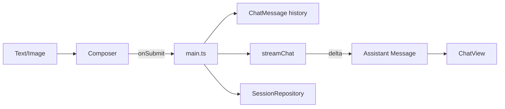

### Classroom Experiment

1. Send an image and ask a question in normal mode;
2. Observe the `text` and `image_url` content parts in the request body;
3. Compare the CSS classes of standard Assistant messages and sub-Agent messages;
4. Modify the color variables in [`tokens.css`](./web/src/styles/tokens.css) and observe how the entire interface synchronizes.

### Acceptance Criteria

- Images can be previewed, removed, and sent;
- Streaming messages update only the current Assistant placeholder node;
- The image entry is disabled after switching to Agent mode.

---

## Chapter 5: Upgrading Chat to a ReAct Agent

### Learning Objectives

- Understand ReAct's Thought, Action, Observation, and Final Answer;
- Implement multi-step loops between models and tools;
- Model Runtime state as events.

### Text Protocol

The current model service does not rely on native tool calling, so the Runtime uses a strict text protocol:

```text
Thought: Analyze next step
Action: web_search
Action Input: {"query":"vLLM latest release"}
```

After the Runtime executes a tool, it appends:

```text
Observation: Tool returns result
```

Model final output:

```text
Thought: Sufficient information obtained
Final Answer: Complete answer for the user
```

### ReAct Loop

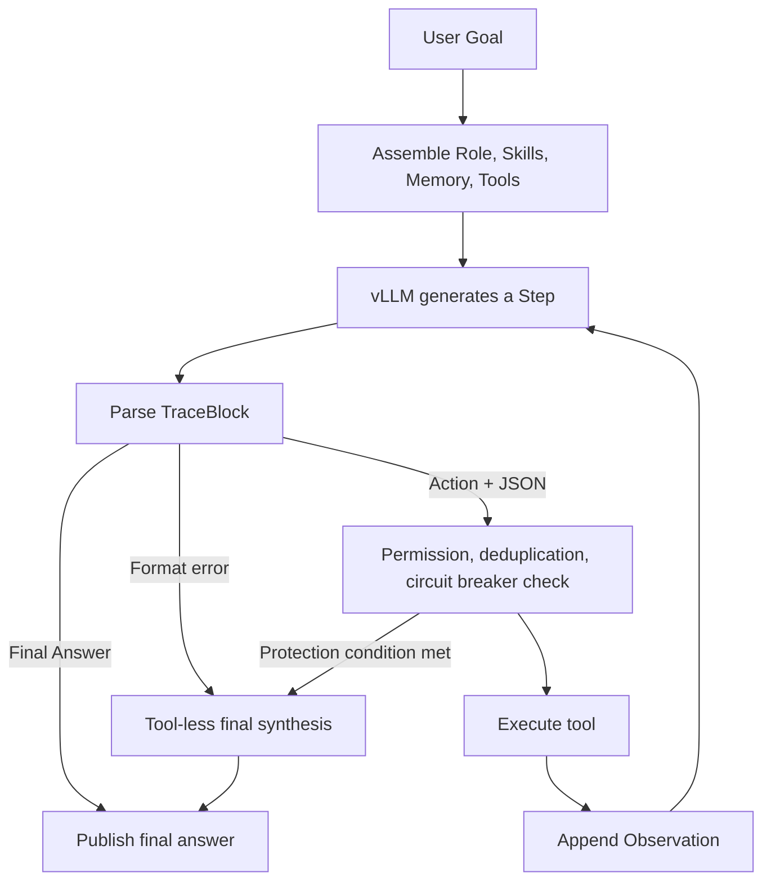

### Events instead of DOM

[`web/src/agent/runner.ts`](./web/src/agent/runner.ts) outputs via discriminated union:

```ts
type AgentEvent =
  | { type: "context"; memories; skills; tools }
  | { type: "step-start"; step }
  | { type: "stream"; step; trace; preambles }
  | { type: "observation"; step; trace; preambles; html? }
  | { type: "final"; answer }
  | { type: "error"; message; aborted? }
  | { type: "max-steps" };
```
This allows the same Runner to be reused by the main conversation, sub-agents, test code, or future server-side task executors.

### Classroom Experiments

Input using the Agent pattern:

```text
Calculate the sum of squares from 1 to 100, and explain the calculation method.
```

Observe:

1. Which Skills are activated;
2. Which tools are exposed by the Runtime;
3. Whether the model selects `run_js`;
4. How Observations enter the next prompt;
5. Whether the Final Answer references the calculation results.

### Reflection Questions

1. Why can't the model fabricate Observations on its own?
2. Why is only one Action allowed per round?
3. Why does `maxSteps` require both prompt constraints and code limits?

---

## Chapter 6: Tools, Capability Boundaries, and Reliability

### Learning Objectives

- Design a unified Tool Definition;
- Understand that tool permissions must be re-validated at execution time;
- Handle timeouts, duplicate calls, and network failures.

### Built-in Tools

| Tool | Purpose | Type |
|---|---|---|
| `web_search` | Web search, supports fallback chain | Network |
| `github_search` | GitHub repositories, tags, and releases | Network |
| `fetch_url` | Fetch web page body content | Network |
| `run_js` | Deterministic computation and data transformation | Local |
| `get_time` | Current time and time zone | Local |
| `render_mermaid` | Generate Mermaid diagrams | Local/UI |
| `memory_search` | Proactively recall Memory | Local Storage |
| `memory_save` | Persist stable facts | Local Storage |

Implementations are located at [`web/src/agent/tools.ts`](./web/src/agent/tools.ts) and [`web/src/memory/tools.ts`](./web/src/memory/tools.ts).

### Reliability Protection

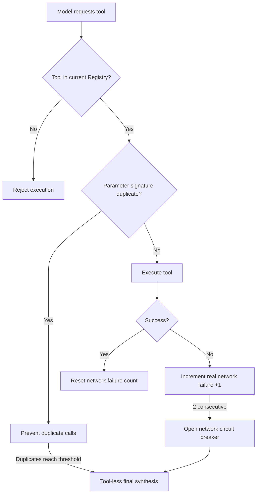

The key here is "real network failure." Local duplicate guard interceptions should not incorrectly increment the network failure count.

### Classroom Experiment

Add a new local tool `string_stats`:

```ts
{
  name: "string_stats",
  desc: "Count characters, words, and lines in a string",
  args: { text: "string" },
  async run(args) {
    // Returns { text: JSON.stringify(...) }
  }
}
```

Requirements:

- Validate `args.text`;
- No network access;
- Return stable JSON;
- Visible only when the specified Skill is active.

### Acceptance Criteria

- When unauthorized, the tool is neither present in the prompt nor executable;
- Duplicate calls with the same parameters are prevented;
- Results are not published further after Abort;
- Tool errors do not directly become the user-facing Final Answer.

---

## Chapter 7: Skills and Capability-based Tool Gating

### Learning Objectives

- Distinguish between Skill, Tool, and Agent Profile;
- Activate Skills based on the user's Goal;
- Generate the unique set of executable tools for this round using code.

### Boundaries of the Three Concepts

| Concept | Question Answered |
|---|---|
| Tool | What atomic operations can the Runtime execute? |
| Skill | What standards should a certain type of task follow, and which Tools are allowed? |
| Agent Profile | Who completes the task, and what Role Prompt, model, and Skills are used? |

Skill Manifest:

```ts
type SkillManifest = {
  id: string;
  name: string;
  description: string;
  version: string;
  triggers: string[];
  prompt: string;
  allowedTools: string[];
  enabled: boolean;
  always?: boolean;
};
```

### Activation and Gating

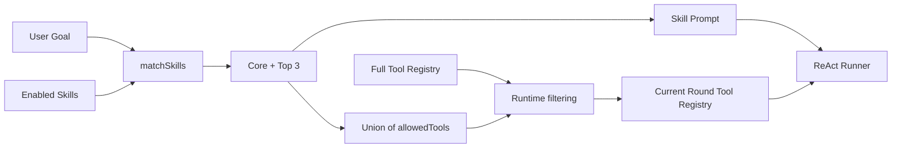
[`web/src/skills/matcher.ts`](./web/src/skills/matcher.ts) is responsible for matching and permission intersection; the Runner only receives the filtered Registry.

### Classroom Experiment

Create a `Text Quality` Skill:

- triggers: `polish`, `rewrite`, `proofread`;
- prompt: requires preserving the original meaning and listing the reasons for modification;
- allowedTools: only allows `string_stats`;
- verify that normal search tasks do not activate this Skill.

### Reflection Questions

Why is it not secure enough to simply write "disable a specific tool" in the Prompt?

---

## Chapter 8: Local Memory OS

### Learning Objectives

- Distinguish between preference, fact, and episode;
- Understand hybrid retrieval combining semantics, keywords, and timeliness;
- Implement background consolidation, deduplication, and temporal versioning.

### Memory Data Model

```ts
type MemoryRecord = {
  kind: "preference" | "fact" | "episode";
  scope: "user" | "project" | "agent";
  namespace: string;
  title: string;
  content: string;
  importance: number;
  confidence: number;
  validFrom: string;
  validTo?: string;
  supersedes?: string;
  embedding?: number[];
  accessCount: number;
};
```

### Foreground Retrieval and Background Consolidation

```mermaid
flowchart TB
    Turn[One User/Agent Conversation]

    subgraph Foreground[Foreground Answer Path]
        Query[User Goal] --> Embed[Local E5 embedding]
        Query --> Lexical[Keyword Tokenization]
        Embed --> Rank[Hybrid Ranking]
        Lexical --> Rank
        Support[Importance/Confidence/Timeliness/Access Frequency] --> Rank
        Rank --> Context[Top-K Memory Context]
    end

    subgraph Background[Background Consolidation Path]
        Answer[Answer Completed] --> Extract[vLLM Extracts Stable Facts]
        Extract --> Filter[Sensitive/Temporary Information Filtering]
        Filter --> Dedup[Exact and Semantic Deduplication]
        Dedup --> Temporal[Strengthen or supersede]
        Temporal --> IDB[(IndexedDB)]
    end

    Turn --> Query
    Turn --> Answer
```

When the semantic model is available:

```text
score = semantic * 0.58
      + lexical  * 0.27
      + support  * 0.15
```

Automatic degradation when the model is unavailable:

```text
score = lexical * 0.78 + support * 0.22
```

### Why Use Web Worker

`Xenova/multilingual-e5-small` Runs in the browser via Transformers.js and ONNX/WASM. Embedding computation is offloaded to [`embedding.worker.ts`](./web/src/memory/embedding.worker.ts), preventing input blocking and streaming rendering.

### Temporal Facts

If the user first says "The project uses Model A," and later corrects it to "The project switched to Model B":

1. The old record is retained but written to `validTo`;
2. The new record is written to `validFrom`;
3. The new record's `supersedes` points to the old record;
4. Default retrieval returns only the currently valid facts.

This is more suitable for auditing and historical explanation than direct overwriting.

### Classroom Experiment

1. Create a new session and input "Please remember, I prefer Chinese answers";
2. Open the Memory panel to confirm the generation of `preference`;
3. Ask "What language do I prefer," and observe the Memory Context;
4. Correct preferences to English and check if old records are invalidated;
5. Load the local semantic model and rebuild vectors;
6. Retrieve the same preference with different phrasings and compare results before and after the semantic model.

### Safety Boundaries

Memory should not store:

- Passwords, tokens, and private keys;
- One-time verification codes;
- Temporary calculation results;
- Entire web page scrape content;
- Public news and other rapidly expiring facts.

For in-depth design, see [`MEMORY_ARCHITECTURE.md`](./MEMORY_ARCHITECTURE.md).

---

## Chapter 9: Sessions, IndexedDB, and Data Isolation

### Learning Objectives

- Use versioned IndexedDB;
- Save and restore chat history;
- Prevent cross-session write conflicts in asynchronous tasks.

Database `vllm-agent` currently contains:

| Store | Content |
|---|---|
| `memories` | Memory and embeddings |
| `skills` | Built-in overrides and custom Skills |
| `sessions` | Session metadata and chat history |
| `agentProfiles` | Built-in overrides and custom roles |

### Session namespace

```text
session/{sessionId}/{scope}
```
```mermaid
flowchart TD
    User[Single User]
    User --> S1[Session A]
    User --> S2[Session B]
    S1 --> M1[user/project/agent Memory]
    S2 --> M2[user/project/agent Memory]
    User --> Shared[Shared Skills and Agent Profiles]
```

Key rules:

- Memory query, statistics, deduplication, and clearing are scoped to the current namespace;
- Skills and Agent Profiles are shared across sessions;
- Sub-Agent submission captures `sessionId`;
- Task results are written back to the original session even if the user switches sessions;
- IndexedDB upgrade must create the store and index within `onupgradeneeded`.

### Classroom Experiment

1. Session A saves a preference;
2. Create a new Session B and confirm that A's Memory cannot be retrieved;
3. Switch back to A and confirm that the chat history and Memory are restored;
4. Launch a sub-Agent in A and immediately switch to B;
5. After the task completes, switch back to A and confirm that the result does not appear in B.

---

## Chapter 10: `@role` and Multi-Agent Scheduler

### Learning Objectives

- Design the Agent Profile;
- Parse safe and unambiguous routing mentions;
- Implement bounded concurrency, queuing, cancellation, and progress subscription.

### Agent Profile

A Profile contains:

- `name`, `displayName`, and `aliases`;
- `rolePrompt`;
- Optional models;
- `skillIds` and `allowedTools`;
- `maxSteps`;
- enabled and builtin states.

Built-in roles are located at [`web/src/agents/builtins.ts`](./web/src/agents/builtins.ts):

- `@researcher`: Web, GitHub, and technical research;
- `@coder`: Code analysis, computation, and implementation plans;
- `@reviewer`: Risk, omission, and quality review.

### Mention Parsing

[`mention-parser.ts`](./web/src/agents/mention-parser.ts) parses only `@` or `＠` at the beginning of the message, supporting:

```text
@researcher Research vLLM
@researcher: Organize latest materials
@coder Fix this issue
```

`@` in the body does not trigger tasks, preventing email addresses and quoted text from being inadvertently dispatched to Agents.

### Scheduler State Machine

```mermaid
stateDiagram-v2
    [*] --> queued: submit
    queued --> running: Concurrency slot available
    queued --> cancelled: Cancel queued task
    running --> cancelling: User stops
    cancelling --> cancelled: Abort completes
    running --> completed: Return result
    running --> failed: Throw exception
    completed --> [*]: remove
    failed --> [*]: remove
    cancelled --> [*]: remove
```

### Concurrency Model

```mermaid
flowchart LR
    Input[Continuous @role tasks] --> Queue[Task Queue]
    Queue --> Limit{active < 3?}
    Limit --> A[Runner A<br/>AbortController A]
    Limit --> B[Runner B<br/>AbortController B]
    Limit --> C[Runner C<br/>AbortController C]
    A --> Events[Task Events]
    B --> Events
    C --> Events
    Events --> Workspace[Tasks Workspace]
    Events --> Session[Write back to original Session result]
```

[`AgentTaskScheduler`](./web/src/agents/scheduler.ts) is independent of specific ReAct implementations. The executor is injected via `AgentTaskRunner`, allowing the Scheduler to be tested independently.

### Classroom Experiments

Continuous submission:

```text
@researcher Find the latest materials on a technical topic
@coder Provide the minimal TypeScript example for the topic
@reviewer Review risks in the example
```

Then add a 4th task and observe whether it queues up. Stop one running task individually and confirm that other tasks continue to execute.

### Acceptance Criteria

- By default, up to 3 tasks run in parallel;
- Each task uses an independent `AbortController`;
- Cancelling one task does not abort other tasks;
- Event sequence numbers are monotonically increasing;
- Slots are released upon task completion, and the head-of-queue task starts;
- Listener errors do not disrupt the Scheduler.

---

## Chapter 11: Observability, Degradation, and Real-World Failures

### Learning Objectives

- Convert Agent internal states into user-understandable progress;
- Distinguish between model errors, tool errors, and network errors;
- Generate honest final responses upon failure.

The Tasks panel displays:

- queued, running, cancelling, completed, failed, cancelled;
- Elapsed time;
- Current ReAct Step;
- Tool invocation phase;
- Number of characters received via streaming;
- 15-second no-event notification;
- Final result or error.
### Why Final Synthesis is Needed

The following scenarios prevent raw Runtime text from being displayed directly to the user:

- The model output format is invalid;
- The model repeats the same tool calls;
- Network circuit breaking;
- Maximum steps reached;
- Observation is an error message.

The Runner enters a final synthesis phase where tool calls are disabled:

```mermaid
flowchart LR
    Trace[Execution Trace] --> Synthesis[Final Synthesis]
    Reason[Termination Reason] --> Synthesis
    Goal[Original Task] --> Synthesis
    Synthesis --> Answer[Output Only Final Answer]
```

The synthesizer must:

- Prioritize successful Observations;
- Not leak Runtime notices and internal instructions;
- Clearly state limitations when new information cannot be obtained;
- Do not fabricate facts.

### Classroom Fault Drill

1. Change a network tool address to an unreachable address;
2. Observe the first and second actual network failures;
3. Confirm that the network tool is no longer executed after circuit breaking;
4. Construct the model to repeat tool calls;
5. Confirm that the duplicate guard does not increase the network failure count;
6. Check whether the final answer hides internal error text.

### Engineering Discussion

Current Tasks exist in page memory and are lost after refresh. Production-grade evolution typically requires:

- Task persistence;
- Server-side queue;
- Cross-page recovery;
- tracing ID;
- Metrics and structured logging;
- Idempotent semantics for retries.

---

## Chapter 12: Comprehensive Project

### Project Objectives

Implement a "Technical Solution Review Committee," including:

1. `@architect`: Responsible for architecture decomposition;
2. `@implementer`: Responsible for minimal implementation;
3. `@security`: Responsible for security review;
4. A `Architecture Review` Skill;
5. A new deterministic local Tool.

### Functional Requirements

- All three roles can be selected via the `@` menu;
- Profiles have distinct Role Prompts, Skills, and tool permissions;
- At least two roles can run in parallel;
- The Tasks panel displays real-time progress;
- Final results are written back to the correct session;
- Unauthenticated new Tools are hidden and non-executable;
- Custom Profiles and Skills persist after refresh;
- Memory is not recalled across new sessions;
- `npm run build` is passed.

### Recommended Implementation Steps

```mermaid
flowchart TD
    A[Define Task and Acceptance Criteria] --> B[Design Tool Contract]
    B --> C[Create Skill Manifest]
    C --> D[Create Agent Profiles]
    D --> E[Validate Single Agent]
    E --> F[Validate Concurrency and Cancellation]
    F --> G[Validate Memory/Session Isolation]
    G --> H[Fault Injection]
    H --> I[Code Review and Demo]
```

### Scoring Criteria

| Dimension | Ratio | Evaluation Focus |
|---|---:|---|
| Correctness | 25% | Tools, roles, scheduling, and result write-back meet requirements |
| Architecture | 20% | Clear layering; domain logic is not embedded in the UI |
| Security | 15% | Runtime permissions, parameter validation, and sensitive data handling |
| Reliability | 15% | Abort, timeout, error, and degradation paths |
| Observability | 10% | Clear status, duration, steps, and errors |
| Testing | 10% | Coverage of pure logic components such as Parser, Matcher, and Scheduler |
| Documentation | 5% | Complete usage, edge cases, and design decisions |

---

## Teaching Organization Recommendations

### Classroom Structure per Chapter

It is recommended that each 2-hour unit follows this rhythm:

1. 15 minutes: Problem scenarios and failure cases;
2. 25 minutes: Core concepts;
3. 25 minutes: Source code walkthrough;
4. 35 minutes: Pair programming exercise;
5. 15 minutes: Acceptance and code review;
6. 5 minutes: Summary and post-class tasks.

### Teacher Demonstration Principles

- Demonstrate failure first, then explain the protection mechanism;
- Use the browser's Network, Application, and Performance panels;
- Do not provide all implementations directly; let learners define interfaces and invariants first;
- Require learners to draw data flow or state machines at the end of each chapter;
- Reframe the question from "Can the Prompt guarantee it?" to "How does Runtime enforce it?"

### Recommended Code Review Questions

1. What types of states does this module possess?
2. Does it depend on upper-layer modules it shouldn't?
3. Are model outputs treated as untrusted inputs?
4. Are permissions declared in the Prompt or enforced in the code?
5. Can side effects still occur after cancellation?
6. Do asynchronous tasks capture the correct session?
7. Can errors be mistakenly published as final answers?
8. What happens during refresh, network disconnection, and model format anomalies?

## Test Routes

Current `package.json` focuses primarily on build verification:

```bash
cd web
npm run build
```

The course suggests introducing Vitest incrementally, prioritizing pure logic modules:

| Priority | Module | Key Use Cases |
|---|---|---|
| P0 | `api/stream.ts` | Chunk boundaries, invalid JSON, `[DONE]` |
| P0 | `agent/parser.ts` | Action, Observation, Final Answer |
| P0 | `agents/mention-parser.ts` | Chinese/English mentions, boundaries, unknown roles |
| P0 | `agents/scheduler.ts` | Concurrency, queuing, cancellation, failure, idle |
| P1 | `skills/matcher.ts` | always, trigger score, tool union |
| P1 | `memory/repository.ts` | namespace, sorting, deduplication, supersede |
| P2 | UI Components | Auto-completion, Tasks status, result write-back |
End-to-end tests cover at least:

1. Standard streaming chat;
2. Image input;
3. Agent tool invocation;
4. Two sub-agents running in parallel;
5. Cancelling a task while running;
6. Result write-back after switching sessions;
7. Memory isolation;
8. Session, Skill, and Profile recovery after page refresh.

## Common Misconceptions

### Misconception 1: Agents are just longer Prompts

The core of an Agent is the Runtime loop, tool execution, state, and constraints. The Prompt is only part of the protocol.

### Misconception 2: Writing tool whitelists into the Prompt is sufficient

Models may ignore instructions. True permissions must be enforced during execution via the current Tool Registry.

### Misconception 3: All chat history should enter Memory

Chat history is not equivalent to long-term memory. Stable preferences, explicit facts, and task Episodes should adopt different lifecycles.

### Misconception 4: Multi-Agent means calling the model multiple times simultaneously

A complete Multi-Agent system also requires Profiles, routing, concurrency control, independent cancellation, progress events, session ownership, and result merging.

### Misconception 5: Returning the Trace as-is on failure

Traces may contain internal protocols, error Observations, and incomplete reasoning. User-facing answers require independent synthesis and cleanup.

## Further Reading

- [Project Overview](./README_EN.md)
- [Web Usage Guide (Chinese)](./README_chat.md)
- [Complete System Architecture](./ARCHITECTURE.md)
- [Memory Architecture Deep Dive](./MEMORY_ARCHITECTURE.md)
- [OpenAI API Client](./web/src/api/openai.ts)
- [ReAct Runner](./web/src/agent/runner.ts)
- [Skill Matcher](./web/src/skills/matcher.ts)
- [Memory Repository](./web/src/memory/repository.ts)
- [Agent Scheduler](./web/src/agents/scheduler.ts)
- [Application Composition Root](./web/src/main.ts)

## Course Completion Checklist

- [ ] Can independently start vLLM and the Web project;
- [ ] Can explain the boundaries between model weights, vLLM, and the OpenAI-compatible API;
- [ ] Can explain Prefill, Decode, KV Cache, TTFT, and TPOT;
- [ ] Can distinguish between `max_tokens`, `max_model_len`, and the context window;
- [ ] Can explain the impact of dtype, Tensor Parallel, and VRAM utilization parameters;
- [ ] Can explain SSE chunk parsing and incremental rendering;
- [ ] Can draw the ReAct loop;
- [ ] Can add a permission-controlled Tool;
- [ ] Can add a Skill Manifest;
- [ ] Can explain the Memory hybrid retrieval formula;
- [ ] Can verify Memory session isolation;
- [ ] Can create a custom Agent Profile;
- [ ] Can explain the Scheduler's concurrency and cancellation semantics;
- [ ] Can diagnose a failure via the Tasks panel;
- [ ] Can complete the capstone project and pass the production build;
- [ ] Can clearly articulate the applicable boundaries of this browser-side architecture.

After completing the above, learners will master not just how to use this project, but a Runtime design methodology that can be transferred to other models, frontend frameworks, and server-side Agent platforms.
