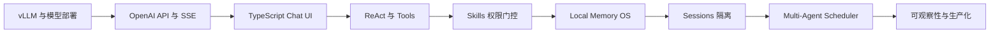
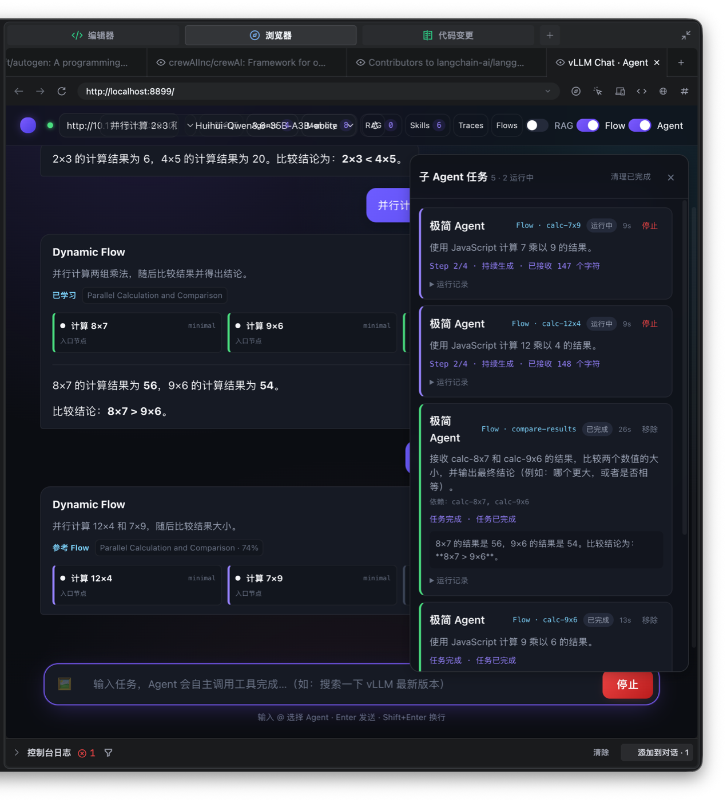
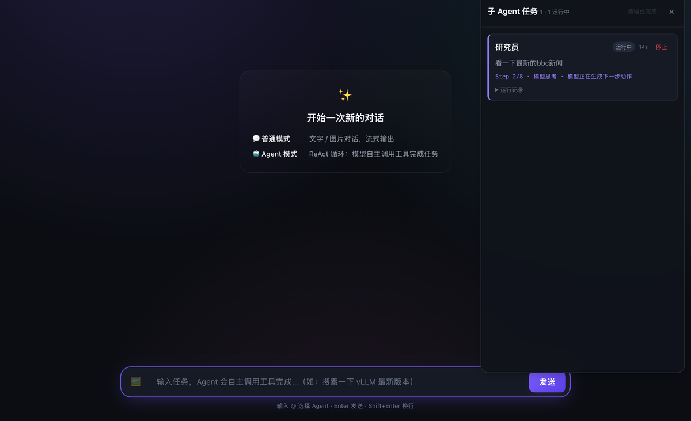
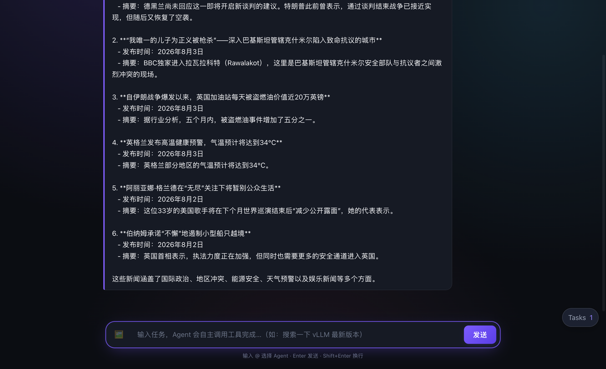

# vLLM Chat Agent: Local-First Multi-Agent Runtime

**中文** | [English](./README_EN.md)

[](https://github.com/lijiajia96/llm-local/stargazers)
[](https://github.com/lijiajia96/llm-local/network/members)
[](https://github.com/lijiajia96/llm-local/issues)
[](https://github.com/lijiajia96/llm-local/commits/main)


一个使用 Vite + TypeScript 构建的本地优先浏览器端 Agent Runtime，直连 OpenAI 兼容 vLLM，支持 SSE 流式聊天、图片输入、ReAct Tools、Local Memory、Skills、历史会话、`@角色` 多 Agent 并行任务，以及能够学习和召回成功编排经验的 Dynamic Flow。

A local-first, browser-based multi-agent runtime and hands-on vLLM tutorial covering OpenAI-compatible streaming, ReAct tools, agent memory, skills, sessions, and observable parallel agents.

> ⭐ 如果这个项目对你有帮助，欢迎点亮 **Star** 支持一下，也方便你随时找回本教程！


> 提示：可将上方静态截图替换为一段操作 GIF（录制 `@角色` 提交任务到结果回写的完整过程），动图对 Star 转化更友好。

> 从第一次启动 vLLM，到实现完整多 Agent Runtime：阅读 [《从 vLLM Chat 到多 Agent Runtime：浏览器端智能体工程实践课》](./CLASS_README.md)。

**技术主题：** vLLM、Local LLM Deployment、OpenAI Compatible API、SSE、TypeScript、ReAct Agent、Tool Calling、Agent Memory、Skills、Multi-Agent、IndexedDB、Web Worker、Transformers.js。

## 快速导航

- [完整中文教程](./CLASS_README.md)
- [快速启动](#启动)
- [核心优势](#核心优势)
- [Web 界面示例](#web-界面示例)
- [系统架构](./ARCHITECTURE.md)
- [Memory 架构](./MEMORY_ARCHITECTURE.md)
- [网页使用说明](./README_chat.md)

## 项目定位

本项目是一个面向单用户的、**本地优先的浏览器端多 Agent Runtime**。它直接连接 OpenAI 兼容的私有 vLLM 服务，在不引入业务后端和独立向量数据库的情况下，提供对话、工具调用、Memory、Skills、`@角色` 并行任务和可视化运行状态。

项目关注的不是替代 LangChain、AutoGen 或 CrewAI 的完整生态，而是用更短的部署链路实现一个隐私优先、过程透明、容易修改的本地 Agent 工作台。

## vLLM 本地部署与多 Agent 开发教程

本仓库提供一套与真实源码同步的完整中文教程：[CLASS_README.md](./CLASS_README.md)。

教程面向刚接触本地大模型和 Agent 工程的开发者，从“模型文件为什么不能直接提供服务”开始，逐步讲到 vLLM 推理、OpenAI 兼容 API、SSE 流式解析、ReAct Runtime、Memory、Skills 和多 Agent Scheduler。它不是独立于代码的概念文章，每一章都包含源码入口、动手实验、验收标准和思考题。

### 教程特点

- **从新手视角解释 vLLM**：模型权重、Tokenizer、Prefill、Decode、KV Cache、PagedAttention、Continuous Batching、TTFT 和 TPOT；
- **完整讲解本地模型选型**：Base/Instruct/Reasoning/VLM、Dense/MoE、显存估算、量化、上下文、并发和许可证；
- **覆盖常见部署路径**：单 GPU、多 GPU Tensor Parallel、量化模型、Docker、远程 GPU 与生产化网关；
- **深入 OpenAI 兼容协议**：`/models`、`/chat/completions`、messages、temperature、stop 和 Chat Template；
- **从零解释 SSE**：`data:` 报文、`[DONE]`、Fetch、EventSource、WebSocket、UTF-8 拆包和代理缓冲；
- **实现完整 ReAct Agent**：Thought、Action、Action Input、Observation、Final Answer 和事件驱动 Trace；
- **权限由 Runtime 强制执行**：Skill Manifest、Tool Registry、运行时白名单、重复调用拦截和网络熔断；
- **实现 Local Memory OS**：IndexedDB、multilingual-e5、本地 embedding、混合检索、后台巩固和时序事实；
- **实现可观察多 Agent**：`@角色` 路由、Agent Profile、有界并发、独立取消、Tasks UI 和结果回写；
- **实现可学习 Dynamic Flow**：Planner 生成 DAG、并行 fan-out/fan-in、Critic 成功校验、Flow Skill 语义召回与复用；
- **提供完整实践体系**：课堂实验、故障注入、测试路线、综合项目、评分标准和上线检查表。

### 学习路线



### 课程目录

| 阶段 | 学习内容 | 对应产物 |
|---|---|---|
| vLLM 新手预备课 | Token、推理、KV Cache、批处理、上下文、性能指标 | 能解释一次模型请求如何执行 |
| 本地模型选型 | 模型类型、Dense/MoE、显存、量化、许可证、本地评测 | 模型选型与容量决策表 |
| 本地与生产部署 | 单卡、多卡、Docker、远程 GPU、TLS、鉴权和监控 | 可复现的 vLLM 服务 |
| 第 1 章 | vLLM 服务验证与 Web 工程启动 | 可访问的本地聊天页面 |
| 第 2 章 | Vite + TypeScript 分层与 Composition Root | 清晰的模块依赖图 |
| 第 3 章 | OpenAI API、SSE 和 ReadableStream | 流式文本客户端 |
| 第 4 章 | 多模态消息与无框架 UI | 文字/图片聊天界面 |
| 第 5 章 | ReAct Agent Runtime | 可执行工具循环 |
| 第 6 章 | Tools、Abort、超时、去重与熔断 | 可靠工具层 |
| 第 7 章 | Skills 与 capability-based 工具门控 | Skill 驱动权限 |
| 第 8 章 | Memory 类型、embedding、混合检索与巩固 | Local Memory OS |
| 第 9 章 | IndexedDB Sessions 与 namespace 隔离 | 可恢复历史会话 |
| 第 10 章 | Agent Profile、mention parser 和 Scheduler | 并行子 Agent |
| 第 11 章 | Tasks 状态、Final Synthesis 与故障诊断 | 可观察运行界面 |
| 第 12 章 | 自定义角色、Skill、Tool 和综合评审 | 完整课程项目 |

### 教程与源码对应关系

| 想学习什么 | 先读教程 | 再看源码 |
|---|---|---|
| vLLM 与本地模型部署 | [vLLM 新手预备课](./CLASS_README.md#vllm-新手预备课先理解模型服务) | [`test_vllm_server.py`](./test_vllm_server.py) |
| 模型选型与容量规划 | [本地模型选型与部署指南](./CLASS_README.md#本地模型选型与部署指南) | [`web/src/config.ts`](./web/src/config.ts) |
| OpenAI API 与 SSE | [第 3 章](./CLASS_README.md#第-3-章openai-兼容-api-与-sse-流式输出) | [`api/openai.ts`](./web/src/api/openai.ts)、[`api/stream.ts`](./web/src/api/stream.ts) |
| ReAct Agent | [第 5 章](./CLASS_README.md#第-5-章从聊天升级为-react-agent) | [`agent/runner.ts`](./web/src/agent/runner.ts) |
| Tools 与可靠性 | [第 6 章](./CLASS_README.md#第-6-章tools能力边界与可靠性) | [`agent/tools.ts`](./web/src/agent/tools.ts) |
| Skills 权限门控 | [第 7 章](./CLASS_README.md#第-7-章skills-与-capability-based-工具门控) | [`skills/matcher.ts`](./web/src/skills/matcher.ts) |
| Local Memory | [第 8 章](./CLASS_README.md#第-8-章local-memory-os) | [`memory/repository.ts`](./web/src/memory/repository.ts) |
| 多 Agent 调度 | [第 10 章](./CLASS_README.md#第-10-章角色-与多-agent-scheduler) | [`agents/scheduler.ts`](./web/src/agents/scheduler.ts) |

### 适合哪些读者

- 想在本地或内网部署 vLLM，但不知道如何选择模型、显存和并行参数；
- 会写前端或 TypeScript，希望系统学习 LLM 流式应用；
- 使用过 Agent 框架，但希望理解 ReAct Runner、Tools 和 Scheduler 的底层实现；
- 需要隐私优先的 Memory、Skills 和多 Agent 工作台；
- 希望把一个 Agent Demo 演进为有权限、状态、故障处理和测试边界的真实工程。

完整课程正文、实验和检查表见 [CLASS_README.md](./CLASS_README.md)。

## 核心优势

### 私有模型与本地数据

- 直接连接本地或内网 vLLM，不依赖第三方 Agent 云服务；
- Memory、会话、Skills 和角色配置保存在浏览器 IndexedDB；
- multilingual-e5 在 Web Worker 中通过 ONNX/WASM 生成本地向量；
- 不需要远程数据库或独立向量数据库。

### 浏览器内完整 Agent 闭环

- TypeScript 前端负责 ReAct、工具执行、Memory 检索、Skill 匹配和任务调度；
- 支持文字、图片和 SSE 流式输出；
- Skill 与角色工具白名单共同约束运行时权限；
- 重复调用拦截、真实网络失败熔断和异常回答合成降低失控风险。

### `@角色` 并行工作

- 使用 `@researcher`、`@coder`、`@reviewer` 显式派发角色任务；
- Scheduler 提供有界并发、排队和独立取消；
- 子 Agent 不阻塞主对话，可继续派发其他任务；
- 完成结果自动写回任务所属主会话。

### 可观察、可诊断

- Tasks 面板展示排队、运行、完成、失败和取消状态；
- 实时显示 ReAct Step、耗时、流式心跳和工具调用；
- Agent、Memory 和 Skills 均提供可视化管理入口；
- 网络搜索支持 Jina、BBC/Bing RSS 和 GitHub REST API 降级链路。

### 可学习 Dynamic Flow

- Planner 根据目标和 Agent metadata 生成受控 DAG，最多 8 个节点、4 层依赖；
- 节点通过 `requiredSkillIds` 和 `requiredTools` 显式声明能力，不根据角色名称推断权限；
- Flow 完成后由独立 Critic 检查节点证据与最终答案，只有质量分不低于 `0.8` 才能沉淀；
- Flow Skill 保存自然语言描述、触发示例、DAG 示例和能力约束；
- 新任务通过 E5 语义检索、词法匹配、质量分与 MMR 召回最多 3 个 Flow Skill；
- 召回结果只作为 Planner 参考，任务参数、Agent 绑定和 DAG 合法性都会重新生成和校验。

#### Flow 如何存储和复用

Dynamic Flow 不保存为仓库中的 JSON 文件，而是写入浏览器 IndexedDB 数据库
`vllm-agent`。其中包含两个不同用途的 Object Store：

| Object Store | 内容 | 后续用途 |
|---|---|---|
| `workflowRuns` | 用户目标、实际 DAG、节点状态与输出、最终答案、质量评价、召回来源 | 查看和诊断一次具体执行 |
| `workflowTemplates` | 可复用描述、触发示例、DAG 示例、能力约束、Embedding、质量分和成功次数 | 为后续相似任务提供规划参考 |

一个实际的 Flow Skill 记录类似：

```json
{
  "id": "flow-template-uuid",
  "sourceRunId": "source-flow-run-id",
  "name": "Parallel Calculation and Comparison",
  "description": "两个独立计算并行执行，最后汇总并比较结果",
  "triggerExamples": [
    "分别计算两个表达式并比较结果",
    "并行处理两组数值后判断哪个更大"
  ],
  "exampleGoal": "并行计算 8×7 和 9×6，然后比较结果",
  "nodes": [
    {
      "id": "calculate-a",
      "goalExample": "计算第一个表达式",
      "requiredSkillIds": ["core-agent"],
      "requiredTools": ["run_js"],
      "dependsOn": []
    },
    {
      "id": "compare-results",
      "goalExample": "比较两个上游计算结果",
      "requiredSkillIds": ["core-agent"],
      "requiredTools": [],
      "dependsOn": ["calculate-a", "calculate-b"]
    }
  ],
  "embedding": ["384 维本地 E5 向量"],
  "qualityScore": 1,
  "successCount": 2,
  "enabled": true,
  "version": 1
}
```

完整链路如下：

```text
Flow 执行完成
→ Critic 核对目标、节点证据和最终答案
→ success=true 且 qualityScore>=0.8
→ 写入或强化 workflowTemplates
→ 新任务对描述、触发示例和示例目标进行混合检索
→ MMR 选择最多 3 个 Flow Skill
→ Planner 参考模板重新生成并校验当前 DAG
```

这里的 Flow Skill 不是可以直接执行的固定函数。它保存的是经过验证的编排经验；具体参数和
Agent 绑定仍由 Planner 根据当前请求与显式能力 metadata 重新生成，避免把历史参数或失效角色直接复制到新任务。

### Local Memory OS

- 支持 `preference`、`fact`、`episode` 三类记忆；
- Memory 按会话隔离；
- 结合语义、关键词、时效、重要度和置信度进行混合检索；
- 支持语义去重、事实强化、失效时间和 supersede 时序版本；
- 回答完成后由 vLLM 在后台抽取和巩固稳定记忆。

## 与常见 Agent 框架对比

| 维度 | 本项目 | LangChain / AutoGen / CrewAI 等 |
|---|---|---|
| 运行位置 | 浏览器 | 通常是 Python/Node 服务端 |
| 模型连接 | 直接连接私有 vLLM | 支持更多模型供应商 |
| 部署复杂度 | 低，无业务后端 | 通常需要服务端、任务系统和数据库 |
| 多 Agent | `@角色` 显式派发和并行运行 | 通常支持更复杂的自动协作 |
| 可观察性 | 原生 Tasks UI | 常依赖日志或外部 tracing 平台 |
| Memory | IndexedDB + 本地 embedding | 常依赖外部向量库或 Memory 服务 |
| 跨页面持续运行 | 暂不支持 | 服务端框架通常支持 |
| 生态规模 | 工具较少、权限易控制 | 集成丰富，但复杂度更高 |

## 适用边界

适合本地或内网 vLLM 验证、单用户研究与开发助手、隐私敏感场景，以及需要可视化并行 Agent 但不希望部署复杂后端的应用。

当前不适合多租户、跨设备同步、页面关闭后持续运行、大规模分布式调度，以及 Agent 自主组队和递归委派。后续重点是任务持久化、后端任务队列、Agent 私有 Memory 和受控委派。

## 主要能力

- OpenAI 兼容 vLLM API 与 SSE 流式输出
- 文字和图片输入
- ReAct Agent 与运行时工具权限控制
- 本地 Memory、混合检索与时序版本
- Skills 注册、匹配和可视化管理
- 单用户多会话隔离、历史保存和会话切换
- Web Worker + Transformers.js 本地 embedding

## Web 界面示例

在主输入框输入 `@` 会打开角色选择菜单。内置角色包括代码员、评审员和研究员，菜单同时展示角色名称、mention 和职责说明。


主对话不会被子 Agent 阻塞，可以连续提交多个任务：

```text
@coder 用三点总结本项目的工程优势
@reviewer 评审本项目当前最重要的两个风险，并给出具体改进方向
```

Scheduler 会在并发上限内同时运行任务。Tasks 面板独立展示每个任务的角色、状态、耗时、ReAct Step 和流式输出进度。


任务完成后，最终答案会以带角色标识的消息回写到原主会话；切换会话不会导致结果串写。


### Dynamic Flow 学习与召回测试

第一次运行“并行计算两个表达式并比较结果”时，没有历史模板，Planner 动态生成两个并行计算节点和一个汇总节点。Critic 根据节点结果和最终答案判定质量为 `100%`，随后将其沉淀为 `Parallel Calculation and Comparison` Flow Skill。

第二次使用不同数字提交同构任务时，本地 E5 混合检索命中该 Flow Skill，匹配度为 `74%`。Planner 参考其拓扑但重新生成当前参数对应的节点，完成 `12×4=48`、`7×9=63` 以及 `48 < 63` 的验证。模板成功次数更新为 2。



## 子 Agent 运行示例

在主输入框输入：

```text
@researcher 看一下最新的bbc新闻
```

输入中的 `@researcher` 会被解析为“研究员”角色任务。任务由 Scheduler 在后台运行，Tasks 面板实时展示当前步骤、流式输出心跳和耗时，主输入框仍可继续使用。



搜索链路优先尝试 Jina；连接超时时自动回退到 BBC 官方 RSS。任务完成后，结果以带角色标识的消息发布到任务所属主会话并持久化。



## 文档

- [完整中文教程：从 vLLM 部署到多 Agent Runtime](./CLASS_README.md)
- [使用说明](./README_chat.md)
- [项目架构与 Mermaid 流程图](./ARCHITECTURE.md)
- [Memory 架构](./MEMORY_ARCHITECTURE.md)

## 启动

```bash
cd web
npm install
npm run dev
```

默认连接 `http://127.0.0.1:8000/v1`。也可以通过环境变量配置服务地址：

```bash
VITE_VLLM_BASE_URL=http://your-vllm-host:8000/v1 npm run dev
```

生产构建：

```bash
cd web
npm run build
```

## Star 一下 ⭐

如果本项目或教程对你有帮助，欢迎点亮 [Star](https://github.com/lijiajia96/llm-local/stargazers)，也欢迎提 Issue、PR 或分享给需要的朋友。你的支持是持续更新的最大动力。
