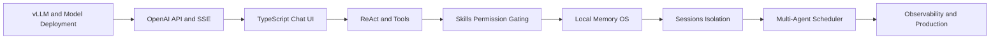

# vLLM Chat Agent: Local-First Multi-Agent Runtime

[中文](./README.md) | **English**

[](https://github.com/lijiajia96/llm-local/stargazers)
[](https://github.com/lijiajia96/llm-local/network/members)
[](https://github.com/lijiajia96/llm-local/issues)
[](https://github.com/lijiajia96/llm-local/commits/main)


A local-first, browser-based Agent Runtime built with Vite + TypeScript, directly connected to an OpenAI-compatible vLLM. It supports SSE streaming chat, image input, ReAct Tools, Local Memory, Skills, historical sessions, `@role` multi-agent parallel tasks, and Dynamic Flow that learns and retrieves successful orchestration patterns.

A local-first, browser-based multi-agent runtime and hands-on vLLM tutorial covering OpenAI-compatible streaming, ReAct tools, agent memory, skills, sessions, and observable parallel agents.

> ⭐ If this project helps you, please consider giving it a **Star** — it also makes this tutorial easy to find again!


> Tip: replace the static screenshot above with an animated GIF (record the full flow from submitting an `@role` task to results being written back). A GIF converts far better than a still image.

> From the first launch of vLLM to implementing a complete multi-agent Runtime: Read [From vLLM Chat to Multi-Agent Runtime: Browser-Side Agent Engineering Practice Course](./CLASS_README_EN.md).

**Technical Topics:** vLLM, Local LLM Deployment, OpenAI Compatible API, SSE, TypeScript, ReAct Agent, Tool Calling, Agent Memory, Skills, Multi-Agent, IndexedDB, Web Worker, Transformers.js.

## Quick Navigation

- [Full English Tutorial](./CLASS_README_EN.md)
- [Quick Start](#startup)
- [Core Advantages](#core-advantages)
- [Web Interface Demo](#web-interface-examples)
- [System Architecture](./ARCHITECTURE.md)
- [Memory Architecture](./MEMORY_ARCHITECTURE.md)
- [Web Usage Guide (Chinese)](./README_chat.md)

## Project Positioning

This project is a **local-first, browser-based multi-agent Runtime** designed for single users. It connects directly to a private OpenAI-compatible vLLM service, providing conversation, tool calling, Memory, Skills, `@role` parallel tasks, and visualized runtime status without introducing an application backend or a separate vector database.

The project focuses not on replacing the complete ecosystems of LangChain, AutoGen, or CrewAI, but on achieving a privacy-first, transparent, and easily modifiable local Agent workspace with a shorter deployment chain.

## vLLM Local Deployment and Multi-Agent Development Tutorial

This repository provides a complete English tutorial synchronized with the actual source code: [CLASS_README_EN.md](./CLASS_README_EN.md).

The tutorial is aimed at developers new to local large models and Agent engineering. Starting from "why model files cannot directly serve requests," it gradually covers vLLM inference, OpenAI-compatible API, SSE streaming parsing, ReAct Runtime, Memory, Skills, and the multi-Agent Scheduler. It is not a conceptual article independent of the code; each chapter includes source code entry points, hands-on experiments, acceptance criteria, and reflection questions.

### Tutorial Features

- **Explaining vLLM from a beginner's perspective**: Model weights, Tokenizer, Prefill, Decode, KV Cache, PagedAttention, Continuous Batching, TTFT, and TPOT;
- **Comprehensive guide to local model selection**: Base/Instruct/Reasoning/VLM, Dense/MoE, VRAM estimation, quantization, context, concurrency, and licenses;
- **Covers common deployment paths**: Single GPU, multi-GPU Tensor Parallel, quantized models, Docker, remote GPUs, and production-grade gateways;
- **Deep dive into the OpenAI-compatible protocol**: `/models`, `/chat/completions`, messages, temperature, stop, and Chat Template;
- **Explaining SSE from scratch**: `data:` messages, `[DONE]`, Fetch, EventSource, WebSocket, UTF-8 chunk boundaries, and proxy buffering;
- **Implementing a complete ReAct Agent**: Thought, Action, Action Input, Observation, Final Answer, and event-driven Trace;
- **Permissions enforced by the Runtime**: Skill Manifest, Tool Registry, runtime whitelists, duplicate call interception, and network circuit breaking;
- **Implementing Local Memory OS**: IndexedDB, multilingual-e5, local embedding, hybrid retrieval, background consolidation, and temporal facts;
- **Implementing observable multi-agents**: `@role` routing, Agent Profile, bounded concurrency, independent cancellation, Tasks UI, and result write-back;
- **Implementing learnable Dynamic Flow**: DAG planning, parallel fan-out/fan-in, Critic validation, and semantic Flow Skill retrieval;
- **Providing a complete practical system**: Classroom experiments, fault injection, test routes, comprehensive projects, grading criteria, and go-live checklists.

### Learning Path



### Course Directory

| Stage | Learning Content | Corresponding Deliverables |
|---|---|---|
| vLLM Beginner Prep | Token, Inference, KV Cache, Batching, Context, Performance Metrics | Able to explain how a model request is executed |
| Local Model Selection | Model types, Dense/MoE, VRAM, Quantization, Licenses, Local Evaluation | Model selection and capacity decision table |
| Local and Production Deployment | Single GPU, multi-GPU, Docker, Remote GPU, TLS, Authentication, and Monitoring | Reproducible vLLM service |
| Chapter 1 | vLLM Service Verification and Web Project Setup | Accessible local chat page |
| Chapter 2 | Vite + TypeScript Layering and Composition Root | Clear module dependency diagram |
| Chapter 3 | OpenAI API, SSE, and ReadableStream | Streaming text client |
| Chapter 4 | Multimodal Messages and Framework-less UI | Text/Image chat interface |
| Chapter 5 | ReAct Agent Runtime | Executable tool loop |
| Chapter 6 | Tools, Abort, Timeout, Deduplication, and Circuit Breaking | Reliable tool layer |
| Chapter 7 | Skills and capability-based Tool Gating | Skill-driven permissions |
| Chapter 8 | Memory Types, Embedding, Hybrid Retrieval, and Consolidation | Local Memory OS |
| Chapter 9 | IndexedDB Sessions and Namespace Isolation | Recoverable historical sessions |
| Chapter 10 | Agent Profile, Mention Parser, and Scheduler | Parallel sub-Agents |
| Chapter 11 | Tasks Status, Final Synthesis, and Fault Diagnosis | Observable runtime interface |
| Chapter 12 | Custom Roles, Skills, Tools, and Comprehensive Review | Complete course project |
### Tutorial and Source Code Mapping

| What to Learn | Read Tutorial First | Then View Source |
|---|---|---|
| vLLM and Local Model Deployment | [vLLM Beginner Prep Course](./CLASS_README_EN.md#vllm-primer-understanding-model-serving-first) | [`test_vllm_server.py`](./test_vllm_server.py) |
| Model Selection and Capacity Planning | [Local Model Selection and Deployment Guide](./CLASS_README_EN.md#local-model-selection-and-deployment-guide) | [`web/src/config.ts`](./web/src/config.ts) |
| OpenAI API and SSE | [Chapter 3](./CLASS_README_EN.md#chapter-3-openai-compatible-api-and-sse-streaming-output) | [`api/openai.ts`](./web/src/api/openai.ts), [`api/stream.ts`](./web/src/api/stream.ts) |
| ReAct Agent | [Chapter 5](./CLASS_README_EN.md#chapter-5-upgrading-chat-to-a-react-agent) | [`agent/runner.ts`](./web/src/agent/runner.ts) |
| Tools and Reliability | [Chapter 6](./CLASS_README_EN.md#chapter-6-tools-capability-boundaries-and-reliability) | [`agent/tools.ts`](./web/src/agent/tools.ts) |
| Skills Permission Gating | [Chapter 7](./CLASS_README_EN.md#chapter-7-skills-and-capability-based-tool-gating) | [`skills/matcher.ts`](./web/src/skills/matcher.ts) |
| Local Memory | [Chapter 8](./CLASS_README_EN.md#chapter-8-local-memory-os) | [`memory/repository.ts`](./web/src/memory/repository.ts) |
| Multi-Agent Scheduling | [Chapter 10](./CLASS_README_EN.md#chapter-10-role-and-multi-agent-scheduler) | [`agents/scheduler.ts`](./web/src/agents/scheduler.ts) |

### Target Audience

- Those who want to deploy vLLM locally or within an intranet but are unsure how to select models, VRAM, and parallelism parameters;
- Frontend or TypeScript developers who wish to systematically learn LLM streaming applications;
- Users of Agent frameworks who want to understand the underlying implementation of ReAct Runner, Tools, and Scheduler;
- Those needing privacy-first Memory, Skills, and a multi-Agent workspace;
- Those aiming to evolve an Agent Demo into a real-world engineering project with permissions, state, fault handling, and test boundaries.

The complete course content, experiments, and checklists are available in [CLASS_README_EN.md](./CLASS_README_EN.md).

## Core Advantages

### Private Models and Local Data

- Directly connects to local or intranet vLLM, without relying on third-party Agent cloud services;
- Memory, sessions, Skills, and role configurations are stored in the browser's IndexedDB;
- multilingual-e5 generates local vectors in a Web Worker via ONNX/WASM;
- No need for remote databases or standalone vector databases.

### Complete In-Browser Agent Loop

- The TypeScript frontend handles ReAct, tool execution, Memory retrieval, Skill matching, and task scheduling;
- Supports text, images, and SSE streaming output;
- Skill and role tool whitelists jointly constrain runtime permissions;
- Duplicate call interception, real network failure circuit breaking, and fallback answer synthesis reduce uncontrolled behavior.

### `@role` Parallel Work

- Uses `@researcher`, `@coder`, and `@reviewer` to explicitly dispatch role tasks;
- Scheduler provides bounded concurrency, queuing, and independent cancellation;
- Sub-Agents do not block the main conversation and can continue dispatching other tasks;
- Completed results are automatically written back to the main session to which the task belongs.

### Observable and Diagnostic

- The Tasks panel displays queued, running, completed, failed, and cancelled statuses;
- Real-time display of ReAct Steps, latency, streaming heartbeats, and tool calls;
- Agent, Memory, and Skills all provide visual management entry points;
- Network search supports Jina, BBC/Bing RSS, and GitHub REST API fallback chains.

### Learnable Dynamic Flow

- The Planner builds a validated DAG from the goal and explicit Agent capability metadata;
- A separate Critic checks execution evidence before a successful Flow can become a reusable Flow Skill;
- Flow Skills store descriptions, trigger examples, graph examples, and required Skill/Tool capabilities;
- E5 semantic retrieval, lexical matching, quality signals, and MMR select up to three references;
- Retrieved templates guide planning but never bypass parameter adaptation, capability binding, or DAG validation.

#### How Flows Are Stored and Reused

Dynamic Flows are stored in the browser's `vllm-agent` IndexedDB database rather than as JSON
files in the repository. Two Object Stores serve different purposes:

| Object Store | Contents | Purpose |
|---|---|---|
| `workflowRuns` | Goal, executed DAG, node states and outputs, final answer, quality evaluation, and retrieved references | Inspect and diagnose a specific run |
| `workflowTemplates` | Reusable description, trigger examples, graph example, capability requirements, embedding, quality score, and success count | Guide planning for similar future tasks |

An actual Flow Skill record looks like this:

```json
{
  "id": "flow-template-uuid",
  "sourceRunId": "source-flow-run-id",
  "name": "Parallel Calculation and Comparison",
  "description": "Run two independent calculations in parallel, then aggregate and compare them",
  "triggerExamples": [
    "Calculate two expressions separately and compare the results",
    "Process two values in parallel and determine which is larger"
  ],
  "exampleGoal": "Calculate 8×7 and 9×6 in parallel, then compare them",
  "nodes": [
    {
      "id": "calculate-a",
      "goalExample": "Calculate the first expression",
      "requiredSkillIds": ["core-agent"],
      "requiredTools": ["run_js"],
      "dependsOn": []
    },
    {
      "id": "compare-results",
      "goalExample": "Compare both upstream results",
      "requiredSkillIds": ["core-agent"],
      "requiredTools": [],
      "dependsOn": ["calculate-a", "calculate-b"]
    }
  ],
  "embedding": ["384-dimensional local E5 vector"],
  "qualityScore": 1,
  "successCount": 2,
  "enabled": true,
  "version": 1
}
```

The complete lifecycle is:

```text
Flow completes
→ Critic checks the goal, node evidence, and final answer
→ success=true and qualityScore>=0.8
→ create or reinforce an entry in workflowTemplates
→ hybrid-search descriptions, triggers, and example goals for a new task
→ MMR selects up to three Flow Skills
→ Planner adapts the references and validates a new DAG
```

A Flow Skill is not a directly executable function. It is validated orchestration experience.
The Planner still regenerates task parameters and Agent bindings from the current request and
explicit capability metadata, preventing stale roles or old task values from being copied.

### Local Memory OS

- Supports three types of memory: `preference`, `fact`, and `episode`;
- Memory is isolated by session;
- Combines semantic, keyword, temporal, importance, and confidence-based hybrid retrieval;
- Supports semantic deduplication, fact reinforcement, expiration times, and supersede temporal versions;
- After the response is completed, vLLM extracts and consolidates stable memories in the background.

## Comparison with Common Agent Frameworks

| Dimension | This Project | LangChain / AutoGen / CrewAI, etc. |
|---|---|---|
| Runtime Location | Browser | Typically Python/Node server-side |
| Model Connection | Direct connection to private vLLM | Supports more model providers |
| Deployment Complexity | Low, no application backend | Usually requires server, task system, and database |
| Multi-Agent | `@role` explicit dispatch and parallel execution | Usually supports more complex automatic collaboration |
| Observability | Native Tasks UI | Often relies on logs or external tracing platforms |
| Memory | IndexedDB + local embedding | Often relies on external vector stores or Memory services |
| Cross-Page Continuous Execution | Not yet supported | Server-side frameworks usually support it |
| Ecosystem Scale | Fewer tools, easier permission control | Rich integrations, but higher complexity |
## Applicable Boundaries

Suitable for local or intranet vLLM validation, single-user research and development assistants, privacy-sensitive scenarios, and applications that require visualized parallel Agents without deploying a complex backend.

Currently not suitable for multi-tenancy, cross-device synchronization, continuous operation after page closure, large-scale distributed scheduling, and Agent autonomous teaming and recursive delegation. Subsequent focus areas include task persistence, backend task queues, Agent private Memory, and controlled delegation.

## Key Capabilities

- OpenAI-compatible vLLM API with SSE streaming output
- Text and image input
- ReAct Agent with runtime tool permission control
- Local Memory, hybrid retrieval, and temporal versioning
- Skills registration, matching, and visual management
- Single-user multi-session isolation, history saving, and session switching
- Web Worker + Transformers.js local embedding

## Web Interface Examples

Entering `@` in the main input box opens the role selection menu. Built-in roles include Coder, Reviewer, and Researcher, with the menu displaying role names, mentions, and responsibility descriptions.


The main conversation is not blocked by sub-Agents, allowing multiple tasks to be submitted continuously:

```text
@coder Summarize the project's engineering advantages in three points
@reviewer Review the two most critical risks of the project and provide specific improvement directions
```

The Scheduler runs tasks concurrently within the upper limit. The Tasks panel independently displays each task's role, status, duration, ReAct Steps, and streaming output progress.


Upon task completion, the final answer is written back to the original main session as a message with a role identifier; switching sessions does not cause result mixing.


### Dynamic Flow Learning and Retrieval Test

The first run dynamically planned two parallel calculations followed by a comparison, passed the Critic at `100%`, and was saved as `Parallel Calculation and Comparison`. A second task with different values retrieved the Flow Skill at `74%`, regenerated the parameter-specific DAG, and reinforced the template to two successful uses.


## Sub-Agent Running Example

Enter the following in the main input box:

```text
@researcher Check the latest BBC news
```

The `@researcher` in the input is parsed as a "Researcher" role task. The task runs in the background via the Scheduler, with the Tasks panel displaying the current step, streaming output heartbeat, and duration in real-time, while the main input box remains usable.


The search chain prioritizes Jina; it automatically falls back to the BBC official RSS upon connection timeout. Upon completion, the results are published to the main session to which the task belongs as a message with a role identifier and persisted.


## Documentation

- [Complete English Tutorial: From vLLM Deployment to Multi-Agent Runtime](./CLASS_README_EN.md)
- [Usage Instructions (Chinese)](./README_chat.md)
- [Project Architecture and Mermaid Flowchart](./ARCHITECTURE.md)
- [Memory Architecture](./MEMORY_ARCHITECTURE.md)

## Startup

```bash
cd web
npm install
npm run dev
```

Connects to `http://127.0.0.1:8000/v1` by default. The service address can also be configured via environment variables:

```bash
VITE_VLLM_BASE_URL=http://your-vllm-host:8000/v1 npm run dev
```

Production build:

```bash
cd web
npm run build
```

## Give it a Star ⭐

If this project or the tutorial helps you, please consider leaving a [Star](https://github.com/lijiajia96/llm-local/stargazers). Issues, PRs, and shares are all welcome — your support keeps this project actively maintained.
